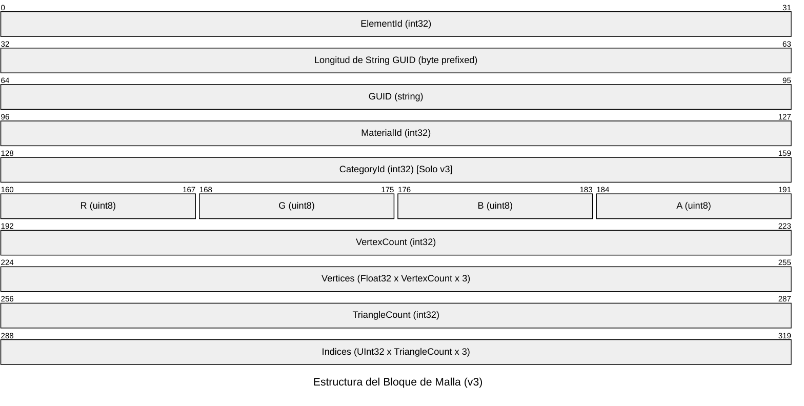

# Especificación de Formatos de Archivo

Este documento detalla la estructura a nivel binario y de texto de los archivos utilizados y generados por el pipeline.

---

## 1. Archivo de Entrada: `export.bin`

Es un formato secuencial binario en *little-endian* que almacena la geometría tridimensional en bruto de las caras de Revit. Soporta tres versiones autodetectables:

### Cabecera (Solo para Versiones $\ge 2$)
| Campo | Tipo | Tamaño (Bytes) | Valor / Descripción |
| :--- | :--- | :---: | :--- |
| `FormatMagic` | `int32` | 4 | `0x32544254` (ASCII "TBT2" en little-endian) |
| `FormatVersion` | `int32` | 4 | `2` o `3` |

*Nota: La versión 1 (legado) carece de esta cabecera y el archivo comienza directamente con el primer bloque de malla.*

### Bloque de Malla (Repetido secuencialmente hasta el fin del archivo)



#### Descripción Detallada de Campos:
1. **ElementId** (`int32`): Identificador único numérico del elemento en la base de datos de Revit.
2. **Guid** (`string`): Identificador único global (`UniqueId` de Revit, 45 caracteres, guardado en formato UTF-8 precedido por su longitud en bytes al estilo de serialización de `.NET`).
3. **MaterialId** (`int32`): ID del material asignado a la cara de Revit (-1 si no tiene).
4. **CategoryId** (`int32`): ID de la categoría (BuiltInCategory) del elemento. *Solo presente en v3*.
5. **R, G, B, A** (`uint8` × 4): Color superficial difuso y canal alpha (transparencia) del material. *Solo en v2 y v3*.
6. **VertexCount** (`int32`): Número de vértices en este bloque.
7. **Vertices** (`float` × `VertexCount` × 3): Coordenadas $X, Y, Z$ consecutivas en formato flotante de precisión simple (32 bits).
8. **TriangleCount** (`int32`): Número de triángulos (caras trianguladas).
9. **Indices** (`uint32` × `TriangleCount` × 3): Índices enteros de 32 bits apuntando a los vértices para formar los triángulos.

---

## 2. Archivo del Visor: `.tbv` (Viewer Binary)

Formato binario propietario optimizado para carga rápida y bajo consumo de memoria en visores web 3D. Emplea **deduplicación geométrica e instanciación espacial** y almacenamiento en enteros de 8 bits para las normales (`snorm`).

### Cabecera (Header)
Ocupa 36 bytes fijos al inicio del archivo:

| Campo | Tipo | Tamaño | Descripción |
| :--- | :--- | :---: | :--- |
| `Magic` | `int32` | 4 | `0x56544254` (ASCII "TBTV") |
| `Version` | `int32` | 4 | `1` |
| `MatCount` | `int32` | 4 | Cantidad de materiales únicos en la escena |
| `MeshCount` | `int32` | 4 | Cantidad de mallas geométricas únicas en el pool |
| `InstCount` | `int32` | 4 | Cantidad de instancias totales (piezas visibles) |
| `SceneMin` | `float[3]` | 12 | Límites mínimos de la bounding box global ($X, Y, Z$) |
| `SceneMax` | `float[3]` | 12 | Límites máximos de la bounding box global ($X, Y, Z$) |

---

### Bloque 1: Materiales (Repetido `MatCount` veces)
Define la paleta de colores de la escena:
* `MaterialId` (`int32`): ID original de Revit.
* `R, G, B, A` (`uint8` × 4): Color superficial.

---

### Bloque 2: Meshes del Pool (Repetido `MeshCount` veces)
Contiene las geometrías base sin posiciones absolutas (deduplicadas):
* `VertexCount` (`int32`): Número de vértices.
* `Idx16` (`uint8`): Bandera. `1` si los índices caben en enteros de 16 bits ($\le 65535$ vértices); `0` si requieren enteros de 32 bits.
* `TriCount` (`int32`): Cantidad de triángulos.
* `Positions` (`float` × `VertexCount` × 3): Coordenadas locales $X, Y, Z$.
* `Normals` (`int8` × `VertexCount` × 3): Vectores de normal normalizados y codificados en un rango entero con signo $[-127, 127]$ (`snorm`).
* `Indices` (Tipo variable × `TriCount` × 3): 
  * Si `Idx16 == 1`: se leen como `uint16` (2 bytes c/u).
  * Si `Idx16 == 0`: se leen como `uint32` (4 bytes c/u).

---

### Bloque 3: Instancias (Repetido `InstCount` veces)
Instancia las mallas del pool en sus posiciones globales de Revit, agregando la bounding box espacial individual para algoritmos de descarte de cámara (Frustum Culling):

| Campo | Tipo | Tamaño (Bytes) | Descripción |
| :--- | :--- | :---: | :--- |
| `MeshIndex` | `int32` | 4 | Índice de la malla en el pool a la que hace referencia |
| `ElementId` | `int32` | 4 | ID de Revit para selección y metadatos |
| `CategoryId` | `int32` | 4 | Categoría de Revit |
| `MaterialIndex` | `int32` | 4 | Índice del material asignado en la tabla de materiales |
| `Translation` | `float[3]` | 12 | Vector de traslación global ($T_x, T_y, T_z$) |
| `GMin` | `float[3]` | 12 | Bounding Box global mínima del elemento |
| `GMax` | `float[3]` | 12 | Bounding Box global máxima del elemento |
| `GuidLen` | `uint16` | 2 | Longitud en bytes de la cadena UTF-8 del GUID |
| `Guid` | `byte[GuidLen]` | Variable | GUID de Revit codificado en UTF-8 |

---

## 3. Archivo de Salida: `.glb` (glTF Binario)

El convertidor escribe un modelo estándar glTF 2.0 binario autocontenido. Posee las siguientes particularidades técnicas:
* **Batching**: Los elementos que comparten `MaterialId` en Revit hacen referencia a un único objeto `MaterialBuilder` en glTF, lo cual permite reducir las llamadas de dibujo (draw calls) en motores como Unity o Three.js.
* **Instanciación**: Si varias piezas son idénticas en topología y dimensiones locales pero se encuentran ubicadas en diferentes lugares (p.ej., ventanas repetidas o sillas idénticas), el glTF guarda la malla **una sola vez** en los búferes y crea múltiples nodos (`Node`) que referencian a dicha malla aplicando matrices de traslación.
* **Metadatos (Extras)**: Cada nodo lleva el GUID original de Revit como su nombre de nodo. Adicionalmente, el pipeline inyecta un bloque JSON personalizado en la propiedad `Extras` de cada nodo glTF para conservar la rastreabilidad BIM:
  ```json
  {
    "elementId": 123456,
    "categoryId": -2000011,
    "materialId": 789
  }
  ```

---

## 4. Archivo de Salida: `.obj` / `.mtl` (Opcional)

Exportador tradicional en texto plano compatible con software de modelado 3D clásico.
* Agrupa las mallas mediante la directiva `o [GUID]`.
* Asigna materiales con la directiva `usemtl MAT_[MaterialId]`.
* Exporta normales suavizadas recalculadas bajo la nomenclatura `vn`.
* Escribe las caras asociando vértices y normales mediante el formato tradicional de índices `f v//vn`.
