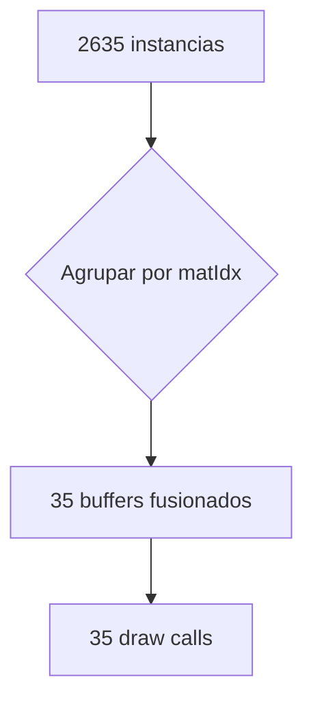

# Visor Web WebGL (`src/viewer.html` → `index.html`)

Este documento detalla el visor 3D del cliente web y su suite de pruebas automatizadas.

---

## 📦 Fuente y artefacto: `index.html` es generado

`index.html` **no se edita a mano**. Es el artefacto que produce [build.js](build.js) a partir de:

| Entrada | Rol |
| --- | --- |
| [src/viewer.html](src/viewer.html) | Código fuente real (HTML + CSS + JS del visor) |
| `vendor/three.min.js` | Three.js r128, embebido |
| `vendor/OrbitControls.js` | OrbitControls, embebido |
| `export.tbv` | Modelo, embebido como Base64 |

```bash
npm run build     # regenera index.html (~3.6 MB)
npm test          # build + suite Selenium con capturas
```

Todo queda **inline**: sin CDN, sin `fetch` de red, sin fuentes externas. El archivo abre por `file://`, desde un pendrive o sin internet — que es lo que la documentación siempre prometió y antes no cumplía (dependía de dos CDNs y de Google Fonts).

Editar `index.html` directamente hace que el próximo `npm run build` pise los cambios.

---

## 📥 Entradas y Salidas (IN / OUT)

* **Entrada (IN)**:
  * `<script id="embedded-tbv">` con el `.tbv` en Base64, decodificado con el decodificador nativo de data-URL (`fetch('data:…')`), con respaldo a `atob` si falla.
  * Si no hay modelo embebido, aparece una zona para **arrastrar** o **abrir** un `.tbv` desde el disco.
  * Ratón (orbitar/zoom/click), teclado (`WASD`, `Q`/`E`, `Shift`), y en móviles el joystick virtual y los botones de elevación.
  * Sliders de corte en los ejes X, Y y Z.
* **Salida (OUT)**:
  * Render WebGL con iluminación, transparencias y cortes reales.
  * Panel de propiedades BIM (`#info-panel`) tras hacer click en una pieza.
  * Minimapa en planta (`#minimap-box`) con la silueta del corte, el rectángulo de sección y un marcador de cámara.

---

## 🚀 Arquitectura de Render: fusión por material

El pool contiene **2 536 mallas distintas para 2 635 instancias** — una relación casi 1:1. Con `THREE.InstancedMesh` eso degenera en ~2 536 draw calls de **una sola instancia cada uno**: la instanciación no optimizaba nada.

El visor fusiona la geometría **agrupando por material**:



* Por cada material se construye un `BufferGeometry` único: posiciones trasladadas por `dx,dy,dz`, normales `Int8` normalizadas e índices `Uint32`.
* El modelo completo son ~154 000 triángulos y ~3 MB de VRAM. Es estático: no cuesta nada por frame.
* **35 draw calls** en lugar de ~2 536.

### Picking sin atributos extra
Para mapear un triángulo impactado de vuelta a su instancia se guardan dos arrays `Uint32` por malla (`faceStart`, `faceOwner`) y se hace **búsqueda binaria** sobre el `faceIndex` que devuelve el raycaster. No se sube ningún atributo por vértice a la GPU.

El raycaster **no conoce los planos de corte**, así que cada impacto se descarta si su punto cae fuera de la caja de sección. Sin esto se podría seleccionar geometría que la GPU ya recortó.

### Selección
La pieza seleccionada se dibuja como una malla amarilla aparte, con `polygonOffset` para que se apoye justo delante de la superficie fusionada. Sin re-subir buffers ni recompilar shaders.

---

## ✂️ Cortes reales (clipping planes)

Seis semiespacios cuya intersección es la caja de sección. En Three.js un fragmento sobrevive mientras `dot(normal, p) + constant >= 0`, de modo que para `x >= min` con normal `(1,0,0)` la constante es `-min`.

Ya **no hay culling por CPU**: los planos recortan exactamente y la geometría fusionada es estática. El contador de "elementos visibles" se calcula en CPU sobre los bounding boxes, sólo cuando se mueve un slider.

### Relleno rayado (capping / hatching)
En el fragment shader, tras `#include <clipping_planes_fragment>`, toda cara **trasera** que sobrevive al recorte es una superficie interior expuesta por el corte, y se rellena con un rayado a 45°:

```glsl
if ( ! gl_FrontFacing ) {
    float band = fract((vHatchPos.x + vHatchPos.y + vHatchPos.z) * uHatchScale);
    gl_FragColor = vec4(band > 0.5 ? vec3(0.42) : vec3(0.20), 1.0);
    return;
}
```

El `return` temprano se salta `encodings_fragment`, así que esos grises se escriben ya en espacio de pantalla.

---

## 🗺️ Minimapa

Se dibuja con `setViewport` + `setScissor` sobre el mismo canvas, en dos pasadas: la silueta plana del modelo sobre blanco, y encima el marcador y el rectángulo de sección.

Tres detalles que lo hacían fallar y ahora están resueltos:

1. **`#minimap-box` debe ser transparente.** Es un `div` con `z-index: 10` sobre el canvas (`z-index: 1`). Cuando tenía `background: #ffffff` tapaba por completo el render — el minimapa nunca se vio. El blanco lo pinta el propio WebGL.
2. **No se puede throttlear.** La pasada principal limpia todo el canvas, así que saltarse el minimapa un solo frame dejaría ver la escena 3D por su rectángulo. Se redibuja en cada frame que se renderiza.
3. **Es un corte horizontal, no una vista cenital.** Mirando hacia abajo toda la caja de sección sólo se vería la superficie superior (en la práctica, el terreno: una mancha sólida). El minimapa usa **sus propios planos**, con Y restringido a una losa fina bajo el techo de la sección. Así corta los muros y produce una planta de arquitectura real: mover el slider de elevación recorre los pisos.

La cámara ortográfica mira hacia abajo con `up = (0,0,-1)` (mirar recto hacia abajo es un caso degenerado para el `up` por defecto `+Y`). El marcador rojo sigue posición y rumbo de la cámara, y se **fija al borde** del mapa cuando la cámara orbita fuera de la planta, en vez de desaparecer.

---

## 🎨 Color

`renderer.outputEncoding = sRGBEncoding`, y r128 **no** tiene gestión de color automática. Todo color literal (`0x3b82f6`, el rojo del marcador, los RGB de los materiales) se convierte a lineal con `convertSRGBToLinear()` antes de asignarlo. Sin esto todo sale lavado: el navy del minimapa se veía gris azulado y el marcador rojo, rosa.

Los opacos usan `MeshLambertMaterial` (sin término especular, que es lo más caro de Phong en GPUs móviles). El vidrio usa `MeshPhongMaterial` con `depthWrite: false`; si Revit reporta un vidrio casi negro se le aplica un tinte azulado.

---

## ⚡ Rendimiento

* **Render bajo demanda.** `markDirty()` lo llama todo lo que puede cambiar un píxel (orbitar, amortiguación, caja de sección, movimiento, selección, resize, panel). Una escena quieta cuesta **cero** trabajo de GPU. Es la mayor ganancia de batería y temperatura en teléfonos.
* **Calidad adaptativa.** Los teléfonos y las CPUs débiles arrancan sin MSAA y con `pixelRatio` limitado a 1. Si el frame sostenido baja de 24 fps, el `pixelRatio` desciende por escalones hasta 0.6.
* **Movimiento por delta de tiempo**, escalado al tamaño del modelo — no depende del frame rate.
* **Encuadre por aspecto.** `fitCamera()` parte de la esfera envolvente y refina midiendo las 8 esquinas del bounding box en NDC. Un offset fijo recorta el edificio en un teléfono vertical. La cámara se reencuadra al rotar el dispositivo, pero **deja de hacerlo** en cuanto el usuario la mueve.

---

## 📱 UI y anclas

Cada panel es dueño de una esquina, y ninguno pisa a otro:

| | Escritorio | Teléfono (≤ 768 px) |
| --- | --- | --- |
| Controles | arriba-izquierda, 300 px | arriba-izquierda, colapsado; deja libre la esquina del minimapa |
| Minimapa | arriba-derecha, 250 px | arriba-derecha, 104 px; se **oculta** si se expanden los controles |
| Propiedades | abajo-derecha | hoja inferior a ancho completo |
| Joystick / elevación | ocultos | abajo-izquierda / abajo-derecha |

* La hoja de propiedades oculta el joystick mientras está abierta (`body.info-open`), en vez de superponerse.
* El estado colapsado se reevalúa al cruzar el breakpoint (rotación, resize), salvo que el usuario haya usado el botón.
* Todo respeta `env(safe-area-inset-*)`.
* El joystick calcula su radio desde el tamaño real del elemento (140 px en escritorio, 108 px en móvil), no desde una constante; tiene zona muerta, curva de aceleración y se recentra ante `pointercancel` / `lostpointercapture`.
* La UI táctil se detecta con `(hover: none) and (pointer: coarse)`, no con `maxTouchPoints > 0` — que da falsos positivos en portátiles táctiles y en Chrome headless. `?touch=1` la fuerza.

---

## 🧪 Pruebas Automatizadas (`test_viewer.js`)

**67 comprobaciones** con Selenium WebDriver sobre Chrome headless (`--use-angle=swiftshader` para WebGL por software; **nunca** `--disable-gpu`, que mata el contexto GL). El teléfono se emula por CDP (`Emulation.setDeviceMetricsOverride`), porque la ventana mínima de Chrome headless es más ancha que 412 px.

```bash
npm test
```

Cubre: arranque y contexto WebGL · decodificación Base64 (2 635 instancias, 35 materiales, 2 536 mallas) · presupuesto de draw calls · render bajo demanda (una escena quieta redibuja **0** veces) · anclas de UI sin solapamiento en ambos viewports · encuadre completo del modelo · cortes y su efecto en el conteo · picking, incluido que **respeta los planos de corte** · píxeles reales del minimapa (blanco/silueta/marcador/rectángulo) · joystick, botones de elevación, teclado · hoja de propiedades · y un barrido final de errores de consola.

Las capturas quedan en `screenshots/`.
