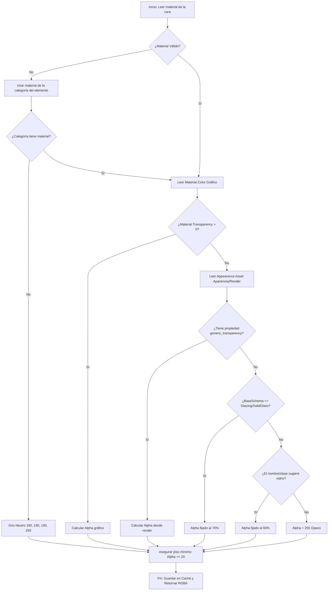

# Exportador de Revit (Macro y C#)

Este documento detalla la lógica, los algoritmos y la implementación del componente de exportación que se ejecuta en Revit 2021. Se encuentra en:
* Archivo de Macro: [MacroRevit.txt](file:///c:/.TBT/Proyectos/_Revit_EXE_Geometrias/codigo/MacroRevit.txt)
* Código de producción: [ExportarGeometria.cs](file:///c:/.TBT/Proyectos/_Revit_EXE_Geometrias/codigo/Revit/ExportarGeometria.cs)

---

## Propósito del Componente
El exportador actúa como puente entre los modelos BIM de Autodesk Revit y el pipeline de optimización de mallas. Su única responsabilidad es extraer la representación geométrica tridimensional de categorías clave, asociar metadatos esenciales de Revit (como GUIDs y materiales) y guardarlo de forma secuencial y ultra-rápida en el formato binario propietario `export.bin` (v3).

---

## Categorías BIM Filtradas
El recolector filtra de forma estricta los elementos del documento pertenecientes a las siguientes categorías estructurales y de diseño mediante `ElementMulticategoryFilter`:

| Categoría Revit (`BuiltInCategory`) | Descripción | Decimación Permitida |
| :--- | :--- | :---: |
| `OST_Walls` | Muros | ❌ **Protegido** |
| `OST_Floors` | Suelos / Pisos | ❌ **Protegido** |
| `OST_Roofs` | Techos / Cubiertas | ❌ **Protegido** |
| `OST_Doors` | Puertas |  |
| `OST_Windows` | Ventanas |  |
| `OST_StructuralColumns` | Columnas Estructurales |  |
| `OST_StructuralFraming` | Vigas / Armazón Estructural |  |
| `OST_Furniture` | Mobiliario |  |
| `OST_PlumbingFixtures` | Aparatos Sanitarios |  |

> [!NOTE]
> Las categorías protegidas son fundamentales para la estructura y el cerramiento espacial del edificio. Su decimado típico mediante QEM tiende a producir microfisuras o pérdidas de coplanaridad que se ven mal estéticamente, por lo que el conversor las aísla del proceso destructivo de decimación.

---

## Flujo de Extracción Geométrica

### 1. Inicialización y Selección
Se utiliza `FilteredElementCollector` excluyendo los tipos de familia (`WhereElementIsNotElementType`), obteniendo únicamente las instancias reales modeladas en la escena con un nivel de detalle alto (`ViewDetailLevel.Fine`).

### 2. Extracción de Sólidos Recursiva (`ObtenerTodosLosSolidos`)
Un objeto geométrico en Revit puede ser un sólido directo (`Solid`) o una instancia de un símbolo de familia (`GeometryInstance`). La clase recorre la jerarquía recursivamente para aplanar todas las instancias anidadas:
* Si el objeto es un `Solid` directo, se valida que tenga volumen (`Volume > 0`) y caras (`Faces.Size > 0`).
* Si es un `GeometryInstance`, se evalúa su geometría interna mediante `GetInstanceGeometry()`.

### 3. Triangulación de Caras
Cada cara (`Face`) del sólido se triangula usando la API interna de Revit:
```csharp
Mesh mesh = face.Triangulate();
```
Si la triangulación devuelve nulo, no tiene caras o no posee vértices, se descarta.

---

## Heurísticas Avanzadas de Color y Transparencia

Uno de los principales desafíos en el exportador es determinar correctamente qué materiales son de tipo vidrio o translúcidos para generar el sombreado correcto en WebGL (Unity/Three.js). El método `ObtenerColorMaterial` resuelve esto en 3 niveles de prioridad con caché intermedia:



### Reglas Críticas del Procesador de Transparencias:
1. **Transparencia Gráfica**: Se lee `Material.Transparency` (0-100).
2. **Appearance Asset**: Si la transparencia gráfica es cero (común en vidrios configurados solo para render), se explora el Rendering Asset. Se admiten esquemas genéricos (`generic_transparency`) y esquemas específicos de vidrios (`GlazingSchema` y `SolidGlassSchema`).
3. **Filtro Léxico**: Si no se declara transparencia pero el nombre o clase del material contiene palabras clave como `vidrio`, `glass`, `cristal`, `glazing` o `transparen`, se fuerza un `alpha` de 60%.
4. **Tinte de Vidrio**: Si el material es vidrio y tiene color gráfico negro, se reemplaza por un tono neutro translúcido `(r=170, g=200, b=210)` para evitar que las ventanas parezcan sólidas y oscuras.
5. **Piso de Transparencia (Alpha = 20)**: Para evitar que un vidrio 100% transparente desaparezca por completo del visor, se fuerza un límite inferior de opacidad (`alpha` de 20).

---

## Tolerancia a Fallos y Robustez
El bucle principal del exportador está envuelto en un bloque `try/catch` por cada `Element`:
```csharp
foreach (Element elem in collector)
{
    try { ExportarElemento(doc, elem, geomOptions, writer, colorCache); }
    catch { /* Un elemento con geometría corrupta no debe abortar el export completo */ }
}
```
Esto asegura que familias corruptas o geometrías inconsistentes que hagan fallar la API interna de Revit al triangular no impidan la exportación exitosa del resto de la escena 3D.
