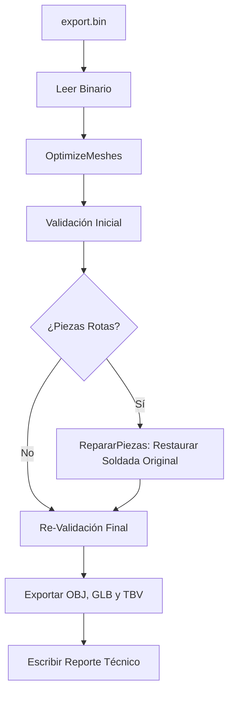
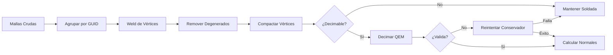

# Pipeline de Conversión y Optimización

Este documento detalla la arquitectura, procesos y filtros del pipeline del convertidor implementado en [Program.cs](file:///c:/.TBT/Proyectos/_Revit_EXE_Geometrias/codigo/ConvertidorGeometrias/Program.cs).

---

## Arquitectura General (`Program.Main`)

El pipeline está diseñado para recibir un archivo secuencial `export.bin` y transformarlo en múltiples salidas optimizadas para visores 3D ligeros y móviles. El flujo sigue 5 pasos estrictos:



---

## 1. Lectura del Binario (`LeerBinario`)
El lector procesa archivos binarios secuenciales (`BinaryReader`). Auto-detecta la versión leyendo la cabecera:
* **v3**: Cabecera `FormatMagic` (`TBT2`) + `version = 3`. Carga `ElementId`, `Guid`, `MaterialId`, `CategoryId`, color `RGBA` y geometría.
* **v2**: Cabecera `FormatMagic` + `version = 2`. Igual que v3 pero sin `CategoryId`.
* **v1 (legado)**: Sin cabecera. Carga `ElementId`, `Guid`, `MaterialId` y geometría. Asigna colores aleatorios y estables.

**Conversión de Coordenadas (Z-Up a Y-Up):**
Revit utiliza un sistema de coordenadas con el eje Z apuntando hacia arriba. Para la compatibilidad con Unity, WebGL y glTF (que usan Y-Up), los vértices se rotan al leerlos:
$$\begin{pmatrix} x_{final} \\ y_{final} \\ z_{final} \end{pmatrix} = \begin{pmatrix} x_{revit} \\ z_{revit} \\ -y_{revit} \end{pmatrix}$$

---

## 2. Pipeline de Optimización (`OptimizeMeshes`)

Cada malla es procesada unitariamente a través del siguiente sub-pipeline:



### Paso A: Agrupación por Elemento
Revit puede segmentar un solo elemento (por ejemplo, una baranda larga o un muro con aberturas) en múltiples sólidos o caras independientes. El pipeline agrupa todas las sub-mallas que tengan el mismo **GUID** y las fusiona en una sola estructura `MeshData` para que sean tratadas como un único objeto 3D.

### Paso B: Soldadura de Vértices (`WeldVertices`)
Revit suele exportar caras adyacentes con vértices duplicados que no comparten índice. El QEM requiere mallas continuas ("manifolds") para funcionar correctamente; de lo contrario, decima bordes independientes abriendo agujeros.
* **Tolerancia**: Rejilla de 1 mm.
* **Implementación**: Se utiliza un diccionario indexado por una tupla tridimensional de enteros rápidos:
  ```csharp
  var key = ((long)Math.Round(v.X * 1000.0),
             (long)Math.Round(v.Y * 1000.0),
             (long)Math.Round(v.Z * 1000.0));
  ```
  Esto mapea de forma exacta y sin errores de flotantes o strings los vértices que se encuentran a menos de 1 mm entre sí.

### Paso C: Limpieza de Triángulos Degenerados (`RemoveDegenerateTriangles`)
La soldadura puede fusionar vértices de triángulos muy pequeños, creando triángulos lineales o planos de área nula.
* **Filtros**: 
  1. Índices duplicados: $a = b$ o $b = c$ o $a = c$.
  2. Área nula: Se calcula el producto cruz de los vectores del triángulo. Si su longitud al cuadrado es inferior a $10^{-14}$, el triángulo se elimina.

### Paso D: Compactación de Vértices (`CompactVertices`)
Se eliminan los vértices huérfanos del búfer de datos que hayan quedado sin índices que los referencien después de la remoción de degenerados.

### Paso E: Decimación Selectiva e Inteligente
No todas las piezas se deciman. Se aplican las siguientes reglas de protección:
1. **Protección por Categoría**: Si el elemento pertenece a la lista de `CategoriasProtegidas` (Muros, Suelos, Techos), no se decima para evitar artefactos visuales en superficies arquitectónicas planas.
2. **Guarda Anti-Cubos**: Si la malla soldada tiene menos de 16 vértices o menos de 20 triángulos (como prismas, marcos de puertas simples, etc.), no se decima. Decimar mallas tan simples causa deformaciones severas.

### Paso F: Presupuesto de Triángulos Dinámico (`ComputeTarget`)
El porcentaje de reducción de triángulos se calcula dinámicamente según la complejidad original de la pieza:

| Triángulos Originales | Ratio de Triángulos Objetivo |
| :--- | :---: |
| $> 10,000$ | **25%** |
| $2,000$ a $10,000$ | **35%** |
| $500$ a $2,000$ | **50%** |
| $100$ a $500$ | **65%** |
| $< 100$ | **80%** (mínimo 16 triángulos) |

---

## 3. Validación Inicial y Reintentos (`TryDecimate`)

Una vez que el algoritmo de decimación entrega una malla reducida, se valida bajo 4 criterios geométricos antes de aceptarse:

1. **Robustez Numérica**: Se comprueba que ningún vértice resultante contenga valores `NaN` o `Infinity`.
2. **Ausencia de Spikes (Picos)**: Un vértice decimado no puede salir proyectado fuera del volumen original. Se calcula la Bounding Box original y la final. Si algún vértice final sobresale más del $0.5\%$ de la diagonal de la bounding box original ($+ 0.1\text{ mm}$), la malla se considera rota.
3. **Preservación del Área**: Si el área superficial de la malla decimada cambia más de un $\pm30\%$ respecto a la original soldada, significa que la malla colapsó geométricamente o se abrieron agujeros críticos.
4. **Bucle de Reintento**:
   * Si falla la validación inicial (por ejemplo, al 25%), el pipeline automáticamente **reintenta** con un presupuesto más conservador del **50%**.
   * Si el reintento también falla, se descarta el decimado y se realiza un **fallback** devolviendo la malla soldada limpia original (seguridad ante todo).

---

## 4. Normales Suavizadas Ponderadas por Área (`ComputeNormals`)

Para lograr un sombreado realista y limpio en WebGL sin usar mapas de normales pesados, el pipeline recalcula las normales de todos los vértices:
* El vector normal de cada triángulo se calcula mediante el producto cruz de sus aristas.
* Este vector no se normaliza inmediatamente; al sumarlo al búfer del vértice, su magnitud representa el área del triángulo.
* De este modo, los triángulos más grandes ejercen mayor influencia en la dirección final de la normal del vértice que los triángulos pequeños de detalle, evitando artefactos de iluminación en esquinas complejas.

---

## 5. Fase de Validación y Auto-Reparación (`ValidarPiezas` / `RepararPiezas`)

Al finalizar el procesamiento de todo el conjunto de mallas, se ejecuta un validador independiente que compara pieza por pieza contra sus originales soldados (almacenados en caché antes del decimado).

Si se detectan piezas perdidas, con vértices NaN, spikes, colapsos (encogimiento de diagonal mayor al 50%) o áreas fuera de rango ($\pm40\%$):
* Se registra la pieza en la lista de `PiezaRota` con su ElementId, GUID y descripción del error.
* Se inicia el motor de reparación, el cual **reemplaza por completo** la malla dañada por su versión original soldada limpia (sin decimar).
* Se recalculan sus normales suavizadas y se guarda un registro en el reporte.
> [!IMPORTANT]
> **Filosofía del pipeline**: Es preferible tener una pieza con geometría original y pesada en el visor 3D antes que una pieza rota, deformada o invisible.
