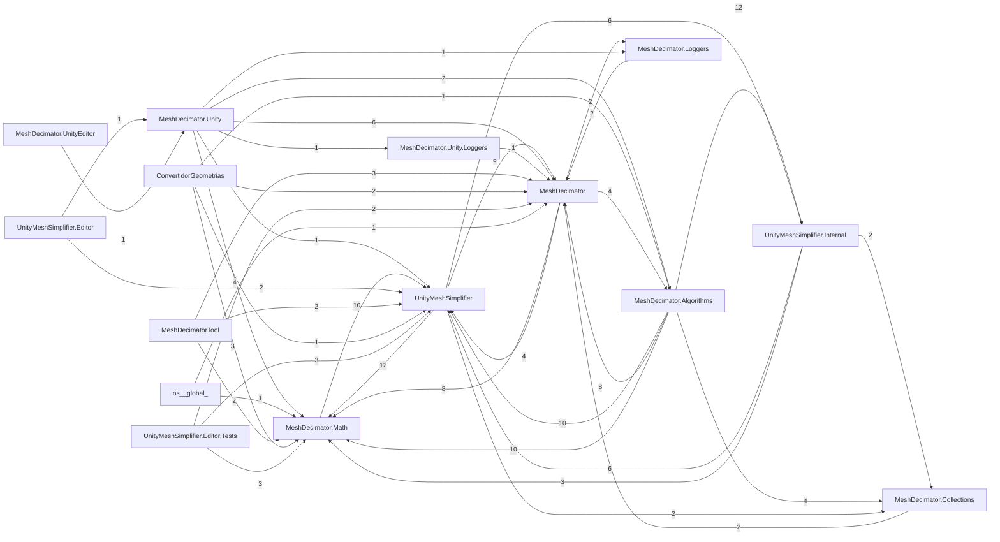

# 📘 Reporte global — _Revit_EXE_Geometrias

_Generado: 2026-07-28 19:26:18_

## Índice

1. [Métricas](#métricas)
2. [Diagramas](#diagramas)
3. [Documentación](#documentación)
4. [Volcado completo de Roslyn](#volcado-completo-de-roslyn)
5. [Tablas](#tablas)
6. [Otros formatos](#otros-formatos)

## Métricas

| Métrica | Valor |
|---------|------:|
| Archivos | 78 |
| Carpetas | 26 |
| Namespaces | 14 |
| Clases | 93 |
| Interfaces | 2 |
| Enums | 2 |
| Métodos | 790 |
| Propiedades | 167 |
| Campos | 537 |
| Eventos | 2 |
| Líneas totales | 28516 |

## Diagramas

### Mapa de dependencias entre clases

```mermaid
flowchart LR
    direction LR
    MeshSimplifier["MeshSimplifier"]
    LODGeneratorHelperEditor["LODGeneratorHelperEditor"]
    Mesh["Mesh"]
    Mesh["Mesh"]
    FastQuadricMeshSimplification["FastQuadricMeshSimplification"]
    FastQuadricMeshSimplification["FastQuadricMeshSimplification"]
    Program["Program"]
    ObjMesh["ObjMesh"]
    LODLevel["LODLevel"]
    MeshDecimatorUtility["MeshDecimatorUtility"]
    Vector3["Vector3"]
    Vector3["Vector3"]
    LODGenerator["LODGenerator"]
    Vector3d["Vector3d"]
    Vector3d["Vector3d"]
    Vector3d["Vector3d"]
    MathHelper["MathHelper"]
    Vector4d["Vector4d"]
    Vector4["Vector4"]
    Vector4d["Vector4d"]
    Vector4["Vector4"]
    MathHelper["MathHelper"]
    Vector2d["Vector2d"]
    Vector2["Vector2"]
    Triangle["Triangle"]
    Vector2["Vector2"]
    Vector2d["Vector2d"]
    PipelineStats["PipelineStats"]
    SymmetricMatrix["SymmetricMatrix"]
    SymmetricMatrix["SymmetricMatrix"]
    Vector4i["Vector4i"]
    SymmetricMatrix["SymmetricMatrix"]
    Triangle["Triangle"]
    Vector4i["Vector4i"]
    Triangle["Triangle"]
    Vector3i["Vector3i"]
    Vector3i["Vector3i"]
    Vector2i["Vector2i"]
    BoneWeight["BoneWeight"]
    BoneWeight["BoneWeight"]
    Vector2i["Vector2i"]
    MeshUtils["MeshUtils"]
    LODGeneratorHelper["LODGeneratorHelper"]
    DecimationAlgorithm["DecimationAlgorithm"]
    ResizableArray["ResizableArray"]
    DecimationAlgorithm["DecimationAlgorithm"]
    LODSettings["LODSettings"]
    ResizableArray["ResizableArray"]
    ResizableArray["ResizableArray"]
    Vertex["Vertex"]
    MeshData["MeshData"]
    MeshCombiner["MeshCombiner"]
    SimplificationOptions["SimplificationOptions"]
    Logging["Logging"]
    LODGenerator["LODGenerator"]
    DecimatedObjectEditor["DecimatedObjectEditor"]
    Logging["Logging"]
    ShowExample["ShowExample"]
    BlendShapeFrameContainer["BlendShapeFrameContainer"]
    MathHelper["MathHelper"]
    FaceIndex["FaceIndex"]
    Vertex["Vertex"]
    MeshUtilsTest["MeshUtilsTest"]
    Vertex["Vertex"]
    RendererInfo["RendererInfo"]
    DecimatedObject["DecimatedObject"]
    BlendShapeContainer["BlendShapeContainer"]
    MeshDecimation["MeshDecimation"]
    MeshDecimation["MeshDecimation"]
    UVChannels["UVChannels"]
    ExportarGeometria["ExportarGeometria"]
    UVChannels["UVChannels"]
    UVChannels["UVChannels"]
    ValidateSimplificationOptionsException["ValidateSimplificationOptio..."]
    BlendShapeFrame["BlendShapeFrame"]
    PiezaRota["PiezaRota"]
    ILogger(["ILogger"])
    ConsoleLogger["ConsoleLogger"]
    Ref["Ref"]
    BorderVertex["BorderVertex"]

    MeshSimplifier -->|usa| MeshUtils
    MeshSimplifier -->|usa| SimplificationOptions
    MeshSimplifier -->|usa| Triangle
    MeshSimplifier -->|usa| Vertex
    MeshSimplifier -->|usa| Ref
    MeshSimplifier -->|usa| Vector3
    MeshSimplifier -->|usa| Vector4
    MeshSimplifier -->|usa| Vector2
    MeshSimplifier -->|usa| BoneWeight
    MeshSimplifier -->|usa| BlendShapeContainer
    MeshSimplifier -->|usa| Mesh
    MeshSimplifier -->|usa| SymmetricMatrix
    MeshSimplifier -->|usa| Vector3d
    MeshSimplifier -->|usa| MathHelper
    MeshSimplifier -->|usa| BorderVertex
    MeshSimplifier -->|usa| ValidateSimplificationOptionsException
    MeshSimplifier -->|usa| ResizableArray
    MeshSimplifier -->|usa| UVChannels
    LODGeneratorHelperEditor -->|usa| LODGeneratorHelper
    LODGeneratorHelperEditor -->|usa| LODGenerator
    Mesh -->|usa| Vector3d
    Mesh -->|usa| Vector3
    Mesh -->|usa| Vector4
    Mesh -->|usa| Vector2
    Mesh -->|usa| BoneWeight
    Mesh -->|usa| MathHelper
    Mesh -->|usa| Vector3d
    Mesh -->|usa| Vector3
    Mesh -->|usa| Vector4
    Mesh -->|usa| Vector2
    Mesh -->|usa| BoneWeight
    Mesh -->|usa| MathHelper
    FastQuadricMeshSimplification -->|hereda| DecimationAlgorithm
    FastQuadricMeshSimplification -->|usa| Vector3d
    FastQuadricMeshSimplification -->|usa| SymmetricMatrix
    FastQuadricMeshSimplification -->|usa| BorderVertex
    FastQuadricMeshSimplification -->|usa| Triangle
    FastQuadricMeshSimplification -->|usa| Vertex
    FastQuadricMeshSimplification -->|usa| Ref
    FastQuadricMeshSimplification -->|usa| Vector3
    FastQuadricMeshSimplification -->|usa| Vector4
    FastQuadricMeshSimplification -->|usa| Vector2
    FastQuadricMeshSimplification -->|usa| BoneWeight
    FastQuadricMeshSimplification -->|usa| Logging
    FastQuadricMeshSimplification -->|usa| MathHelper
    FastQuadricMeshSimplification -->|usa| Mesh
    FastQuadricMeshSimplification -->|usa| ResizableArray
    FastQuadricMeshSimplification -->|usa| UVChannels
    FastQuadricMeshSimplification -->|hereda| DecimationAlgorithm
    FastQuadricMeshSimplification -->|usa| Vector3d
    FastQuadricMeshSimplification -->|usa| SymmetricMatrix
    FastQuadricMeshSimplification -->|usa| BorderVertex
    FastQuadricMeshSimplification -->|usa| Triangle
    FastQuadricMeshSimplification -->|usa| Vertex
    FastQuadricMeshSimplification -->|usa| Ref
    FastQuadricMeshSimplification -->|usa| Vector3
    FastQuadricMeshSimplification -->|usa| Vector4
    FastQuadricMeshSimplification -->|usa| Vector2
    FastQuadricMeshSimplification -->|usa| BoneWeight
    FastQuadricMeshSimplification -->|usa| Logging
    FastQuadricMeshSimplification -->|usa| MathHelper
    FastQuadricMeshSimplification -->|usa| Mesh
    FastQuadricMeshSimplification -->|usa| ResizableArray
    FastQuadricMeshSimplification -->|usa| UVChannels
    Program -->|usa| MeshData
    Program -->|usa| PipelineStats
    Program -->|usa| PiezaRota
    Program -->|usa| Vector3
    Program -->|usa| Vector3d
    Program -->|usa| Mesh
    Program -->|usa| FastQuadricMeshSimplification
    Program -->|usa| MeshDecimation
    Program -->|usa| Vector4
    ObjMesh -->|usa| FaceIndex
    ObjMesh -->|usa| Vector3d
    ObjMesh -->|usa| Vector3
    ObjMesh -->|usa| Vector2
    MeshDecimatorUtility -->|usa| Logging
    MeshDecimatorUtility -->|usa| ConsoleLogger
    MeshDecimatorUtility -->|usa| Vector3d
    MeshDecimatorUtility -->|usa| Vector2
    MeshDecimatorUtility -->|usa| Vector3
    MeshDecimatorUtility -->|usa| Vector4
    MeshDecimatorUtility -->|usa| BoneWeight
    MeshDecimatorUtility -->|usa| Mesh
    MeshDecimatorUtility -->|usa| DecimationAlgorithm
    MeshDecimatorUtility -->|usa| MeshDecimation
    Vector3 -->|usa| Vector3d
    Vector3 -->|usa| Vector3i
    Vector3 -->|usa| MathHelper
    Vector3 -->|usa| Vector3d
    Vector3 -->|usa| Vector3i
    Vector3 -->|usa| MathHelper
    LODGenerator -->|usa| Mesh
    LODGenerator -->|usa| LODGeneratorHelper
    LODGenerator -->|usa| SimplificationOptions
    LODGenerator -->|usa| LODLevel
    LODGenerator -->|usa| MeshSimplifier
    LODGenerator -->|usa| RendererInfo
    LODGenerator -->|usa| MeshCombiner
    LODGenerator -->|usa| Vector3
    Vector3d -->|usa| Vector3
    Vector3d -->|usa| MathHelper
    Vector3d -->|usa| Vector3
    Vector3d -->|usa| Vector3i
    Vector3d -->|usa| MathHelper
    Vector3d -->|usa| Vector3
    Vector3d -->|usa| Vector3i
    Vector3d -->|usa| MathHelper
    MathHelper -->|usa| Vector3
    MathHelper -->|usa| Vector3d
    Vector4d -->|usa| Vector4
    Vector4d -->|usa| Vector4i
    Vector4 -->|usa| Vector4d
    Vector4 -->|usa| Vector4i
    Vector4d -->|usa| Vector4
    Vector4d -->|usa| Vector4i
    Vector4 -->|usa| Vector4d
    Vector4 -->|usa| Vector4i
    MathHelper -->|usa| Vector3
    MathHelper -->|usa| Vector3d
    Vector2d -->|usa| Vector2
    Vector2d -->|usa| Vector2i
    Vector2 -->|usa| Vector2d
    Vector2 -->|usa| Vector2i
    Triangle -->|usa| Vector3d
    Vector2 -->|usa| Vector2d
    Vector2 -->|usa| Vector2i
    Vector2d -->|usa| Vector2
    Vector2d -->|usa| Vector2i
    Vector4i -->|usa| Vector4
    Vector4i -->|usa| Vector4d
    Triangle -->|usa| Vector3d
    Vector4i -->|usa| Vector4
    Vector4i -->|usa| Vector4d
    Triangle -->|usa| Vector3d
    Vector3i -->|usa| Vector3
    Vector3i -->|usa| Vector3d
    Vector3i -->|usa| Vector3
    Vector3i -->|usa| Vector3d
    Vector2i -->|usa| Vector2
    Vector2i -->|usa| Vector2d
    BoneWeight -->|usa| Vector4
    BoneWeight -->|usa| Vector4
    Vector2i -->|usa| Vector2
    Vector2i -->|usa| Vector2d
    MeshUtils -->|usa| Mesh
    MeshUtils -->|usa| Vector3
    MeshUtils -->|usa| Vector4
    MeshUtils -->|usa| BoneWeight
    MeshUtils -->|usa| Vector2
    MeshUtils -->|usa| BlendShapeFrame
    LODGeneratorHelper -->|usa| SimplificationOptions
    LODGeneratorHelper -->|usa| LODLevel
    DecimationAlgorithm -->|usa| MathHelper
    DecimationAlgorithm -->|usa| Mesh
    DecimationAlgorithm -->|usa| MathHelper
    DecimationAlgorithm -->|usa| Mesh
    Vertex -->|usa| Vector3d
    Vertex -->|usa| SymmetricMatrix
    MeshData -->|usa| Vector3
    MeshCombiner -->|usa| Mesh
    MeshCombiner -->|usa| Vector3
    MeshCombiner -->|usa| Vector4
    MeshCombiner -->|usa| BoneWeight
    MeshCombiner -->|usa| MeshUtils
    Logging -->|usa| ILogger
    Logging -->|usa| ConsoleLogger
    LODGenerator -->|usa| Mesh
    LODGenerator -->|usa| DecimationAlgorithm
    LODGenerator -->|usa| MeshDecimatorUtility
    LODGenerator -->|usa| LODSettings
    LODGenerator -->|usa| Vector3
    DecimatedObjectEditor -->|usa| DecimatedObject
    Logging -->|usa| ILogger
    Logging -->|usa| ConsoleLogger
    ShowExample -->|usa| Vector3
    BlendShapeFrameContainer -->|usa| Vector3
    BlendShapeFrameContainer -->|usa| BlendShapeFrame
    BlendShapeFrameContainer -->|usa| ResizableArray
    MathHelper -->|usa| Vector3d
    Vertex -->|usa| Vector3d
    Vertex -->|usa| SymmetricMatrix
    MeshUtilsTest -->|usa| Mesh
    MeshUtilsTest -->|usa| Vector3
    MeshUtilsTest -->|usa| BlendShapeFrame
    MeshUtilsTest -->|usa| MeshUtils
    MeshUtilsTest -->|usa| Vector4
    MeshUtilsTest -->|usa| Vector2
    MeshUtilsTest -->|usa| BoneWeight
    Vertex -->|usa| Vector3d
    Vertex -->|usa| SymmetricMatrix
    RendererInfo -->|usa| Mesh
    DecimatedObject -->|usa| LODSettings
    DecimatedObject -->|usa| LODGenerator
    BlendShapeContainer -->|usa| BlendShapeFrameContainer
    BlendShapeContainer -->|usa| Vector3
    BlendShapeContainer -->|usa| BlendShapeFrame
    MeshDecimation -->|usa| DecimationAlgorithm
    MeshDecimation -->|usa| FastQuadricMeshSimplification
    MeshDecimation -->|usa| Mesh
    MeshDecimation -->|usa| DecimationAlgorithm
    MeshDecimation -->|usa| FastQuadricMeshSimplification
    MeshDecimation -->|usa| Mesh
    UVChannels -->|usa| MeshUtils
    UVChannels -->|usa| ResizableArray
    ExportarGeometria -->|usa| Mesh
    UVChannels -->|usa| Mesh
    UVChannels -->|usa| ResizableArray
    UVChannels -->|usa| Mesh
    UVChannels -->|usa| ResizableArray
    BlendShapeFrame -->|usa| Vector3
    ConsoleLogger -.->|implementa| ILogger
```


_Versión imagen: [flowchart.svg](flowchart.svg)_

### Diagrama de clases

```mermaid
classDiagram
    %%{init: {'flowchart': {'htmlLabels': true}}}%%
    class MeshSimpl...
    class LODGenera...
    class Mesh
    class Mesh
    class FastQuadr...
    class FastQuadr...
    class Program
    class ObjMesh
    class LODLevel
    class MeshDecim...
    class Vector3
    class Vector3
    class LODGenerator
    class Vector3d
    class Vector3d
    class Vector3d
    class MathHelper
    class Vector4d
    class Vector4
    class Vector4d
    class Vector4
    class MathHelper
    class Vector2d
    class Vector2
    class Triangle
    class Vector2
    class Vector2d
    class PipelineS...
    class Symmetric...
    class Symmetric...
    class Vector4i
    class Symmetric...
    class Triangle
    class Vector4i
    class Triangle
    class Vector3i
    class Vector3i
    class Vector2i
    class BoneWeight
    class BoneWeight
    class Vector2i
    class MeshUtils
    class LODGenera...
    class Decimatio...
    class Resizable...
    class Decimatio...
    class LODSettings
    class Resizable...
    class Resizable...
    class Vertex
    class MeshData
    class MeshCombiner
    class Simplific...
    class Logging
    class LODGenerator
    class Decimated...
    class Logging
    class ShowExample
    class BlendShap...
    class MathHelper
    class FaceIndex
    class Vertex
    class MeshUtils...
    class Vertex
    class RendererInfo
    class Decimated...
    class BlendShap...
    class MeshDecim...
    class MeshDecim...
    class UVChannels
    class ExportarG...
    class UVChannels
    class UVChannels
    class ValidateS...
    class BlendShap...
    class PiezaRota
    class ILogger
    class ConsoleLo...
    class Ref
    class BorderVertex

    Decimatio... <|-- FastQuadr...
    Decimatio... <|-- FastQuadr...
    ILogger <|.. ConsoleLo...
```

### Diagrama de namespaces


_Versión imagen: [namespaces-mermaid.svg](namespaces-mermaid.svg)_

> Imágenes vectoriales: [clases (PlantUML)](classDiagram.svg) · [namespaces (PlantUML)](namespaces.svg) · [DGML para Visual Studio](project.dgml)

## Documentación


Generado: 2026-07-28 19:26:08

### Resumen

- Archivos: 78
- Carpetas: 26
- Namespaces: 14
- Clases: 93
- Interfaces: 2
- Enums: 2
- Métodos: 790
- Propiedades: 167
- Campos: 537
- Líneas totales: 28516 (código 18367, comentarios 7497, blancos 2652)

### Mapa de relaciones

- **Logging** usa **ILogger**
- **Logging** usa **ConsoleLogger**
- **DecimationAlgorithm** usa **MathHelper**
- **DecimationAlgorithm** usa **Mesh**
- **UVChannels** usa **Mesh**
- **UVChannels** usa **ResizableArray**
- **ConsoleLogger** implementa **ILogger**
- **LODBackupComponent** hereda de **MonoBehaviour**
- **MeshUtils** usa **Mesh**
- **MeshUtils** usa **Vector3**
- **MeshUtils** usa **Vector4**
- **MeshUtils** usa **BoneWeight**
- **MeshUtils** usa **Vector2**
- **MeshUtils** usa **BlendShape**
- **MeshUtils** usa **BlendShapeFrame**
- **MeshDecimatorUtility** usa **Logging**
- **MeshDecimatorUtility** usa **ConsoleLogger**
- **MeshDecimatorUtility** usa **UnityLogger**
- **MeshDecimatorUtility** usa **Vector3d**
- **MeshDecimatorUtility** usa **Vector2**
- **MeshDecimatorUtility** usa **Vector3**
- **MeshDecimatorUtility** usa **Vector4**
- **MeshDecimatorUtility** usa **BoneWeight**
- **MeshDecimatorUtility** usa **Mesh**
- **MeshDecimatorUtility** usa **DecimationAlgorithm**
- **MeshDecimatorUtility** usa **MeshDecimation**
- **MeshDecimatorUtility** usa **Algorithm**
- **LODGenerator** usa **Mesh**
- **LODGenerator** usa **DecimationAlgorithm**
- **LODGenerator** usa **MeshDecimatorUtility**
- **LODGenerator** usa **LODSettings**
- **LODGenerator** usa **Vector3**
- **DecimatedObject** hereda de **MonoBehaviour**
- **DecimatedObject** usa **LODSettings**
- **DecimatedObject** usa **LODGenerator**
- **Vector3** implementa **IEquatable**
- **Vector3** usa **Vector3d**
- **Vector3** usa **Vector3i**
- **Vector3** usa **MathHelper**
- **Vector2i** implementa **IEquatable**
- **Vector2i** usa **Vector2**
- **Vector2i** usa **Vector2d**
- **Vector2d** implementa **IEquatable**
- **Vector2d** usa **Vector2**
- **Vector2d** usa **Vector2i**
- **Vector2** implementa **IEquatable**
- **Vector2** usa **Vector2d**
- **Vector2** usa **Vector2i**
- **ShowExample** hereda de **MonoBehaviour**
- **ShowExample** usa **Vector3**
- **Triangle** implementa **IEquatable**
- **Triangle** usa **Vector3d**
- **BorderVertexComparer** implementa **IComparer**
- **BorderVertexComparer** usa **BorderVertex**
- **BlendShapeFrameContainer** usa **Vector3**
- **BlendShapeFrameContainer** usa **BlendShapeFrame**
- **BlendShapeFrameContainer** usa **ResizableArray**
- **UnityLogger** implementa **ILogger**
- **BlendShapeContainer** usa **BlendShapeFrameContainer**
- **BlendShapeContainer** usa **BlendShape**
- **BlendShapeContainer** usa **Vector3**
- **BlendShapeContainer** usa **BlendShapeFrame**
- **Vector3d** implementa **IEquatable**
- **Vector3d** usa **Vector3**
- **Vector3d** usa **MathHelper**
- **MathHelper** usa **Vector3d**
- **LODGeneratorHelperEditor** hereda de **Editor**
- **LODGeneratorHelperEditor** usa **LODGeneratorHelper**
- **LODGeneratorHelperEditor** usa **IOUtils**
- **LODGeneratorHelperEditor** usa **LODGenerator**
- **LODGeneratorHelper** hereda de **MonoBehaviour**
- **LODGeneratorHelper** usa **SimplificationOptions**
- **LODGeneratorHelper** usa **LODLevel**
- **UVChannels** usa **Mesh**
- **UVChannels** usa **ResizableArray**
- **ConsoleLogger** implementa **ILogger**
- **Vector4i** implementa **IEquatable**
- **Vector4i** usa **Vector4**
- **Vector4i** usa **Vector4d**
- **Vector3d** implementa **IEquatable**
- **Vector3d** usa **Vector3**
- **Vector3d** usa **Vector3i**
- **Vector3d** usa **MathHelper**
- **ValidateSimplificationOptionsException** hereda de **Exception**
- **Vertex** implementa **IEquatable**
- **Vertex** usa **Vector3d**
- **Vertex** usa **SymmetricMatrix**
- **UVChannels** usa **MeshUtils**
- **UVChannels** usa **ResizableArray**
- **Vector2** implementa **IEquatable**
- **Vector2** usa **Vector2d**
- **Vector2** usa **Vector2i**
- **MathHelper** usa **Vector3**
- **MathHelper** usa **Vector3d**
- **Program** usa **MathHelper**
- **Program** usa **ObjMesh**
- **Program** usa **Mesh**
- **Program** usa **MeshDecimation**
- **Program** usa **Algorithm**
- **ObjMesh** usa **FaceIndex**
- **ObjMesh** usa **Vector3d**
- **ObjMesh** usa **Vector3**
- **ObjMesh** usa **Vector2**
- **FaceIndex** implementa **IEquatable**
- **DecimatedObjectEditor** hereda de **Editor**
- **DecimatedObjectEditor** usa **DecimatedObject**
- **BoneWeight** implementa **IEquatable**
- **BoneWeight** usa **Vector4**
- **MeshData** usa **Vector3**
- **Program** usa **MeshData**
- **Program** usa **PipelineStats**
- **Program** usa **PiezaRota**
- **Program** usa **Vector3**
- **Program** usa **Vector3d**
- **Program** usa **Mesh**
- **Program** usa **FastQuadricMeshSimplification**
- **Program** usa **MeshDecimation**
- **Program** usa **Vector4**
- **FastQuadricMeshSimplification** hereda de **DecimationAlgorithm**
- **FastQuadricMeshSimplification** usa **Vector3d**
- **FastQuadricMeshSimplification** usa **SymmetricMatrix**
- **FastQuadricMeshSimplification** usa **BorderVertex**
- **FastQuadricMeshSimplification** usa **BorderVertexComparer**
- **FastQuadricMeshSimplification** usa **Triangle**
- **FastQuadricMeshSimplification** usa **Vertex**
- **FastQuadricMeshSimplification** usa **Ref**
- **FastQuadricMeshSimplification** usa **Vector3**
- **FastQuadricMeshSimplification** usa **Vector4**
- **FastQuadricMeshSimplification** usa **Vector2**
- **FastQuadricMeshSimplification** usa **BoneWeight**
- **FastQuadricMeshSimplification** usa **Logging**
- **FastQuadricMeshSimplification** usa **MathHelper**
- **FastQuadricMeshSimplification** usa **Mesh**
- **FastQuadricMeshSimplification** usa **ResizableArray**
- **FastQuadricMeshSimplification** usa **UVChannels**
- **Triangle** usa **Vector3d**
- **Vertex** usa **Vector3d**
- **Vertex** usa **SymmetricMatrix**
- **BorderVertexComparer** implementa **IComparer**
- **BorderVertexComparer** usa **BorderVertex**
- **Vector4d** implementa **IEquatable**
- **Vector4d** usa **Vector4**
- **Vector4d** usa **Vector4i**
- **Vector4** implementa **IEquatable**
- **Vector4** usa **Vector4d**
- **Vector4** usa **Vector4i**
- **Vector3i** implementa **IEquatable**
- **Vector3i** usa **Vector3**
- **Vector3i** usa **Vector3d**
- **Vector3d** implementa **IEquatable**
- **Vector3d** usa **Vector3**
- **Vector3d** usa **Vector3i**
- **Vector3d** usa **MathHelper**
- **Vector4i** implementa **IEquatable**
- **Vector4i** usa **Vector4**
- **Vector4i** usa **Vector4d**
- **MeshDecimation** usa **DecimationAlgorithm**
- **MeshDecimation** usa **Algorithm**
- **MeshDecimation** usa **FastQuadricMeshSimplification**
- **MeshDecimation** usa **Mesh**
- **Mesh** usa **Vector3d**
- **Mesh** usa **Vector3**
- **Mesh** usa **Vector4**
- **Mesh** usa **Vector2**
- **Mesh** usa **BoneWeight**
- **Mesh** usa **MathHelper**
- **Logging** usa **ILogger**
- **Logging** usa **ConsoleLogger**
- **BoneWeight** implementa **IEquatable**
- **BoneWeight** usa **Vector4**
- **MeshSimplifier** usa **MeshUtils**
- **MeshSimplifier** usa **SimplificationOptions**
- **MeshSimplifier** usa **Triangle**
- **MeshSimplifier** usa **Vertex**
- **MeshSimplifier** usa **Ref**
- **MeshSimplifier** usa **Vector3**
- **MeshSimplifier** usa **Vector4**
- **MeshSimplifier** usa **Vector2**
- **MeshSimplifier** usa **BoneWeight**
- **MeshSimplifier** usa **BlendShapeContainer**
- **MeshSimplifier** usa **Mesh**
- **MeshSimplifier** usa **SymmetricMatrix**
- **MeshSimplifier** usa **Vector3d**
- **MeshSimplifier** usa **MathHelper**
- **MeshSimplifier** usa **BorderVertex**
- **MeshSimplifier** usa **BorderVertexComparer**
- **MeshSimplifier** usa **BlendShape**
- **MeshSimplifier** usa **ValidateSimplificationOptionsException**
- **MeshSimplifier** usa **ResizableArray**
- **MeshSimplifier** usa **UVChannels**
- **BlendShape** usa **BlendShapeFrame**
- **BlendShapeFrame** usa **Vector3**
- **MeshUtilsTest** usa **Mesh**
- **MeshUtilsTest** usa **Vector3**
- **MeshUtilsTest** usa **BlendShape**
- **MeshUtilsTest** usa **BlendShapeFrame**
- **MeshUtilsTest** usa **MeshUtils**
- **MeshUtilsTest** usa **Vector4**
- **MeshUtilsTest** usa **Vector2**
- **MeshUtilsTest** usa **BoneWeight**
- **ExportarGeometria** usa **Mesh**
- **FastQuadricMeshSimplification** hereda de **DecimationAlgorithm**
- **FastQuadricMeshSimplification** usa **Vector3d**
- **FastQuadricMeshSimplification** usa **SymmetricMatrix**
- **FastQuadricMeshSimplification** usa **BorderVertex**
- **FastQuadricMeshSimplification** usa **BorderVertexComparer**
- **FastQuadricMeshSimplification** usa **Triangle**
- **FastQuadricMeshSimplification** usa **Vertex**
- **FastQuadricMeshSimplification** usa **Ref**
- **FastQuadricMeshSimplification** usa **Vector3**
- **FastQuadricMeshSimplification** usa **Vector4**
- **FastQuadricMeshSimplification** usa **Vector2**
- **FastQuadricMeshSimplification** usa **BoneWeight**
- **FastQuadricMeshSimplification** usa **Logging**
- **FastQuadricMeshSimplification** usa **MathHelper**
- **FastQuadricMeshSimplification** usa **Mesh**
- **FastQuadricMeshSimplification** usa **ResizableArray**
- **FastQuadricMeshSimplification** usa **UVChannels**
- **Triangle** usa **Vector3d**
- **Vertex** usa **Vector3d**
- **Vertex** usa **SymmetricMatrix**
- **BorderVertexComparer** implementa **IComparer**
- **BorderVertexComparer** usa **BorderVertex**
- **DecimationAlgorithm** usa **MathHelper**
- **DecimationAlgorithm** usa **Mesh**
- **Vector3** implementa **IEquatable**
- **Vector3** usa **Vector3d**
- **Vector3** usa **Vector3i**
- **Vector3** usa **MathHelper**
- **Vector2i** implementa **IEquatable**
- **Vector2i** usa **Vector2**
- **Vector2i** usa **Vector2d**
- **Vector2d** implementa **IEquatable**
- **Vector2d** usa **Vector2**
- **Vector2d** usa **Vector2i**
- **Vector4d** implementa **IEquatable**
- **Vector4d** usa **Vector4**
- **Vector4d** usa **Vector4i**
- **Vector4** implementa **IEquatable**
- **Vector4** usa **Vector4d**
- **Vector4** usa **Vector4i**
- **Vector3i** implementa **IEquatable**
- **Vector3i** usa **Vector3**
- **Vector3i** usa **Vector3d**
- **MathHelper** usa **Vector3**
- **MathHelper** usa **Vector3d**
- **MeshDecimation** usa **DecimationAlgorithm**
- **MeshDecimation** usa **Algorithm**
- **MeshDecimation** usa **FastQuadricMeshSimplification**
- **MeshDecimation** usa **Mesh**
- **Mesh** usa **Vector3d**
- **Mesh** usa **Vector3**
- **Mesh** usa **Vector4**
- **Mesh** usa **Vector2**
- **Mesh** usa **BoneWeight**
- **Mesh** usa **MathHelper**
- **MeshCombiner** usa **Mesh**
- **MeshCombiner** usa **Vector3**
- **MeshCombiner** usa **Vector4**
- **MeshCombiner** usa **BoneWeight**
- **MeshCombiner** usa **MeshUtils**
- **LODGenerator** usa **Mesh**
- **LODGenerator** usa **LODGeneratorHelper**
- **LODGenerator** usa **SimplificationOptions**
- **LODGenerator** usa **LODLevel**
- **LODGenerator** usa **MeshSimplifier**
- **LODGenerator** usa **RendererInfo**
- **LODGenerator** usa **MeshCombiner**
- **LODGenerator** usa **Vector3**
- **LODGenerator** usa **LODBackupComponent**
- **RendererInfo** usa **Mesh**

### Tipos

#### Namespace `(sin namespace)`

##### static class ExportarGeometria

- Archivo: `ExportarGeometria.cs` (172 líneas)
- Usa: `Mesh`

**Campos:**

- FORMAT_MAGIC : int
- FORMAT_VERSION : int

**Métodos:**

- public static ExportRawDump(Document doc, string filePath = @"C:\.TBT\Proyectos\_Revit_EXE_Geometrias\PostProcesadoEXE\IN\export2.bin") : void
- private static ExportarElemento(Document doc, Element elem, Options geomOptions, BinaryWriter writer, Dictionary<int, byte[]> colorCache) : void
- private static ObtenerColorMaterial(Document doc, Element elem, ElementId materialElementId, Dictionary<int, byte[]> cache) : byte[]
- private static ObtenerTodosLosSolidos(GeometryElement geomElem) : List<Solid>

##### class ShowExample

- Archivo: `ShowExample.cs` (35 líneas)
- Hereda de: `MonoBehaviour`
- Usa: `Vector3`

**Campos:**

- cameraTransform : Transform
- targetTransform : Transform
- cameraAngleTime : float
- cameraMinDistance : float
- cameraMaxDistance : float
- cameraDistanceTime : float
- cameraSwayHeight : float
- cameraSwayTime : float

**Métodos:**

- private Update() : void

#### Namespace `ConvertidorGeometrias`

##### class MeshData

- Archivo: `Program.cs` (14 líneas)
- Usa: `Vector3`

**Campos:**

- ElementId : int
- Guid : string
- MaterialId : int
- CategoryId : int
- ColR : byte
- ColG : byte
- ColB : byte
- ColA : byte
- HasColor : bool
- Vertices : List<Vector3>
- Normals : List<Vector3>
- Indices : List<int>

##### class PiezaRota

- Archivo: `Program.cs` (7 líneas)

**Campos:**

- Guid : string
- ElementId : int
- Problema : string
- Detalle : string

##### class PipelineStats

- Archivo: `Program.cs` (19 líneas)

**Campos:**

- FormatVersion : int
- InputMeshes : int
- OutputPieces : int
- VertsIn : long
- VertsWelded : long
- VertsOut : long
- TrisIn : long
- TrisOut : long
- DegenerateRemoved : long
- Fallbacks : int
- Retries : int
- Discarded : int
- NotDecimated : int
- ProtectedCat : int
- Transparent : int
- Instanced : int
- Repaired : int
- PoolMeshes : int
- TbvBytes : long

##### class Program

- Archivo: `Program.cs` (1206 líneas)
- Usa: `MeshData`, `PipelineStats`, `PiezaRota`, `Vector3`, `Vector3d`, `Mesh`, `FastQuadricMeshSimplification`, `MeshDecimation`, `Vector4`

**Campos:**

- FormatMagic : int
- WeldGrid : double
- SpikeTolerance : float
- MinVertsParaDecimar : int
- MinTrisParaDecimar : int
- CategoriasProtegidas : HashSet<int>
- APP_GUID : string
- CARPETA_TEMP : string
- RUTA_BASE_SALIDA : string
- RUTA_LOG : string

**Métodos:**

- private static EsVidrioProtegido(MeshData m) : bool
- private static Main(string[] args) : void
- private static EstaBloqueado(string path) : bool
- private static ProcesarArchivo(string filePath) : void
- private static Log(string msg) : void
- private static ConstruirReporte(PipelineStats s, List<PiezaRota> detectadas, List<PiezaRota> rotas, TimeSpan elapsed) : string
- private static Pct(long now, long before) : string
- private static ValidarPiezas(Dictionary<string, MeshData> originales, List<MeshData> finales) : List<PiezaRota>
- private static RepararPiezas(List<PiezaRota> rotas, Dictionary<string, MeshData> originales, List<MeshData> finales, PipelineStats stats) : void
- private static ClonarConNormales(MeshData src) : MeshData
- private static BBoxStr(List<Vector3> verts) : string
- private static OptimizeMeshes(List<MeshData> inputMeshes, PipelineStats stats, Dictionary<string, MeshData> weldedOriginals) : List<MeshData>
- private static ComputeTarget(int originalTriangles) : int
- private static TryDecimate(MeshData source, int targetTriangles, PipelineStats stats) : MeshData
- private static TotalArea(MeshData mesh) : double
- private static GetBounds(List<Vector3> verts, out Vector3 min, out Vector3 max) : void
- private static WeldVertices(MeshData mesh) : void
- private static RemoveDegenerateTriangles(MeshData mesh) : long
- private static CompactVertices(MeshData mesh) : void
- private static ComputeNormals(MeshData mesh) : void
- private static LeerBinario(string path, PipelineStats stats) : List<MeshData>
- private static ExportToObj(List<MeshData> meshes, string outputPath) : void
- private static ExportToGlb(List<MeshData> meshes, string outputPath, PipelineStats stats) : void
- private static GeometryHash(MeshData mesh) : long
- private static EsCopiaTrasladada(MeshData a, MeshData b, out Vector3 delta) : bool
- private static ExportToViewerBin(List<MeshData> meshes, string path, PipelineStats stats) : void
- private static Snorm(float f) : sbyte

#### Namespace `MeshDecimator`

##### enum Algorithm

- Archivo: `MeshDecimation.cs` (11 líneas)

**Campos:**

- Default : enum
- FastQuadricMesh : enum

##### enum Algorithm

- Archivo: `MeshDecimation.cs` (11 líneas)

**Campos:**

- Default : enum
- FastQuadricMesh : enum

##### struct BoneWeight

- Archivo: `BoneWeight.cs` (214 líneas)
- Implementa: `IEquatable`
- Usa: `Vector4`

**Campos:**

- boneIndex0 : int
- boneIndex1 : int
- boneIndex2 : int
- boneIndex3 : int
- boneWeight0 : float
- boneWeight1 : float
- boneWeight2 : float
- boneWeight3 : float

**Métodos:**

- public BoneWeight(int boneIndex0, int boneIndex1, int boneIndex2, int boneIndex3, float boneWeight0, float boneWeight1, float boneWeight2, float boneWeight3) : (constructor)
- private MergeBoneWeight(int boneIndex, float weight) : void
- private Normalize() : void
- public GetHashCode() : int
- public Equals(object obj) : bool
- public Equals(BoneWeight other) : bool
- public ToString() : string
- public static Merge(ref BoneWeight a, ref BoneWeight b) : void

##### struct BoneWeight

- Archivo: `BoneWeight.cs` (214 líneas)
- Implementa: `IEquatable`
- Usa: `Vector4`

**Campos:**

- boneIndex0 : int
- boneIndex1 : int
- boneIndex2 : int
- boneIndex3 : int
- boneWeight0 : float
- boneWeight1 : float
- boneWeight2 : float
- boneWeight3 : float

**Métodos:**

- public BoneWeight(int boneIndex0, int boneIndex1, int boneIndex2, int boneIndex3, float boneWeight0, float boneWeight1, float boneWeight2, float boneWeight3) : (constructor)
- private MergeBoneWeight(int boneIndex, float weight) : void
- private Normalize() : void
- public GetHashCode() : int
- public Equals(object obj) : bool
- public Equals(BoneWeight other) : bool
- public ToString() : string
- public static Merge(ref BoneWeight a, ref BoneWeight b) : void

##### interface ILogger

- Archivo: `Logging.cs` (20 líneas)

**Métodos:**

- public LogVerbose(string text) : void
- public LogWarning(string text) : void
- public LogError(string text) : void

##### interface ILogger

- Archivo: `Logging.cs` (20 líneas)

**Métodos:**

- public LogVerbose(string text) : void
- public LogWarning(string text) : void
- public LogError(string text) : void

##### static class Logging

- Archivo: `Logging.cs` (116 líneas)
- Usa: `ILogger`, `ConsoleLogger`

**Propiedades:**

- Logger : ILogger

**Campos:**

- logger : ILogger
- syncObj : object

**Métodos:**

- private static Logging() : (constructor)
- public static LogVerbose(string text) : void
- public static LogVerbose(string format, params object[] args) : void
- public static LogWarning(string text) : void
- public static LogWarning(string format, params object[] args) : void
- public static LogError(string text) : void
- public static LogError(string format, params object[] args) : void

##### static class Logging

- Archivo: `Logging.cs` (116 líneas)
- Usa: `ILogger`, `ConsoleLogger`

**Propiedades:**

- Logger : ILogger

**Campos:**

- logger : ILogger
- syncObj : object

**Métodos:**

- private static Logging() : (constructor)
- public static LogVerbose(string text) : void
- public static LogVerbose(string format, params object[] args) : void
- public static LogWarning(string text) : void
- public static LogWarning(string format, params object[] args) : void
- public static LogError(string text) : void
- public static LogError(string format, params object[] args) : void

##### class Mesh

- Archivo: `Mesh.cs` (919 líneas)
- Usa: `Vector3d`, `Vector3`, `Vector4`, `Vector2`, `BoneWeight`, `MathHelper`

**Propiedades:**

- VertexCount : int
- SubMeshCount : int
- TriangleCount : int
- Vertices : Vector3d[]
- Indices : int[]
- Normals : Vector3[]
- Tangents : Vector4[]
- UV1 : Vector2[]
- UV2 : Vector2[]
- UV3 : Vector2[]
- UV4 : Vector2[]
- Colors : Vector4[]
- BoneWeights : BoneWeight[]

**Campos:**

- UVChannelCount : int
- vertices : Vector3d[]
- indices : int[][]
- normals : Vector3[]
- tangents : Vector4[]
- uvs2D : Vector2[][]
- uvs3D : Vector3[][]
- uvs4D : Vector4[][]
- colors : Vector4[]
- boneWeights : BoneWeight[]
- emptyIndices : int[]

**Métodos:**

- public Mesh(Vector3d[] vertices, int[] indices) : (constructor)
- public Mesh(Vector3d[] vertices, int[][] indices) : (constructor)
- private ClearVertexAttributes() : void
- public RecalculateNormals() : void
- public RecalculateTangents() : void
- public GetTriangleCount(int subMeshIndex) : int
- public GetIndices(int subMeshIndex) : int[]
- public GetSubMeshIndices() : int[][]
- public SetIndices(int subMeshIndex, int[] indices) : void
- public GetUVDimension(int channel) : int
- public GetUVs2D(int channel) : Vector2[]
- public GetUVs3D(int channel) : Vector3[]
- public GetUVs4D(int channel) : Vector4[]
- public GetUVs(int channel, List<Vector2> uvs) : void
- public GetUVs(int channel, List<Vector3> uvs) : void
- public GetUVs(int channel, List<Vector4> uvs) : void
- public SetUVs(int channel, Vector2[] uvs) : void
- public SetUVs(int channel, Vector3[] uvs) : void
- public SetUVs(int channel, Vector4[] uvs) : void
- public SetUVs(int channel, List<Vector2> uvs) : void
- public SetUVs(int channel, List<Vector3> uvs) : void
- public SetUVs(int channel, List<Vector4> uvs) : void
- public ToString() : string

##### class Mesh

- Archivo: `Mesh.cs` (919 líneas)
- Usa: `Vector3d`, `Vector3`, `Vector4`, `Vector2`, `BoneWeight`, `MathHelper`

**Propiedades:**

- VertexCount : int
- SubMeshCount : int
- TriangleCount : int
- Vertices : Vector3d[]
- Indices : int[]
- Normals : Vector3[]
- Tangents : Vector4[]
- UV1 : Vector2[]
- UV2 : Vector2[]
- UV3 : Vector2[]
- UV4 : Vector2[]
- Colors : Vector4[]
- BoneWeights : BoneWeight[]

**Campos:**

- UVChannelCount : int
- vertices : Vector3d[]
- indices : int[][]
- normals : Vector3[]
- tangents : Vector4[]
- uvs2D : Vector2[][]
- uvs3D : Vector3[][]
- uvs4D : Vector4[][]
- colors : Vector4[]
- boneWeights : BoneWeight[]
- emptyIndices : int[]

**Métodos:**

- public Mesh(Vector3d[] vertices, int[] indices) : (constructor)
- public Mesh(Vector3d[] vertices, int[][] indices) : (constructor)
- private ClearVertexAttributes() : void
- public RecalculateNormals() : void
- public RecalculateTangents() : void
- public GetTriangleCount(int subMeshIndex) : int
- public GetIndices(int subMeshIndex) : int[]
- public GetSubMeshIndices() : int[][]
- public SetIndices(int subMeshIndex, int[] indices) : void
- public GetUVDimension(int channel) : int
- public GetUVs2D(int channel) : Vector2[]
- public GetUVs3D(int channel) : Vector3[]
- public GetUVs4D(int channel) : Vector4[]
- public GetUVs(int channel, List<Vector2> uvs) : void
- public GetUVs(int channel, List<Vector3> uvs) : void
- public GetUVs(int channel, List<Vector4> uvs) : void
- public SetUVs(int channel, Vector2[] uvs) : void
- public SetUVs(int channel, Vector3[] uvs) : void
- public SetUVs(int channel, Vector4[] uvs) : void
- public SetUVs(int channel, List<Vector2> uvs) : void
- public SetUVs(int channel, List<Vector3> uvs) : void
- public SetUVs(int channel, List<Vector4> uvs) : void
- public ToString() : string

##### static class MeshDecimation

- Archivo: `MeshDecimation.cs` (128 líneas)
- Usa: `DecimationAlgorithm`, `Algorithm`, `FastQuadricMeshSimplification`, `Mesh`

**Métodos:**

- public static CreateAlgorithm(Algorithm algorithm) : DecimationAlgorithm
- public static DecimateMesh(Mesh mesh, int targetTriangleCount) : Mesh
- public static DecimateMesh(Algorithm algorithm, Mesh mesh, int targetTriangleCount) : Mesh
- public static DecimateMesh(DecimationAlgorithm algorithm, Mesh mesh, int targetTriangleCount) : Mesh
- public static DecimateMeshLossless(Mesh mesh) : Mesh
- public static DecimateMeshLossless(Algorithm algorithm, Mesh mesh) : Mesh
- public static DecimateMeshLossless(DecimationAlgorithm algorithm, Mesh mesh) : Mesh

##### static class MeshDecimation

- Archivo: `MeshDecimation.cs` (128 líneas)
- Usa: `DecimationAlgorithm`, `Algorithm`, `FastQuadricMeshSimplification`, `Mesh`

**Métodos:**

- public static CreateAlgorithm(Algorithm algorithm) : DecimationAlgorithm
- public static DecimateMesh(Mesh mesh, int targetTriangleCount) : Mesh
- public static DecimateMesh(Algorithm algorithm, Mesh mesh, int targetTriangleCount) : Mesh
- public static DecimateMesh(DecimationAlgorithm algorithm, Mesh mesh, int targetTriangleCount) : Mesh
- public static DecimateMeshLossless(Mesh mesh) : Mesh
- public static DecimateMeshLossless(Algorithm algorithm, Mesh mesh) : Mesh
- public static DecimateMeshLossless(DecimationAlgorithm algorithm, Mesh mesh) : Mesh

#### Namespace `MeshDecimator.Algorithms`

##### struct BorderVertex

- Archivo: `FastQuadricMeshSimplification.cs` (11 líneas)

**Campos:**

- index : int
- hash : int

**Métodos:**

- public BorderVertex(int index, int hash) : (constructor)

##### struct BorderVertex

- Archivo: `FastQuadricMeshSimplification.cs` (11 líneas)

**Campos:**

- index : int
- hash : int

**Métodos:**

- public BorderVertex(int index, int hash) : (constructor)

##### class BorderVertexComparer

- Archivo: `FastQuadricMeshSimplification.cs` (9 líneas)
- Implementa: `IComparer`
- Usa: `BorderVertex`

**Campos:**

- instance : BorderVertexComparer

**Métodos:**

- public Compare(BorderVertex x, BorderVertex y) : int

##### class BorderVertexComparer

- Archivo: `FastQuadricMeshSimplification.cs` (9 líneas)
- Implementa: `IComparer`
- Usa: `BorderVertex`

**Campos:**

- instance : BorderVertexComparer

**Métodos:**

- public Compare(BorderVertex x, BorderVertex y) : int

##### abstract class DecimationAlgorithm

- Archivo: `DecimationAlgorithm.cs` (129 líneas)
- Usa: `MathHelper`, `Mesh`

**Propiedades:**

- KeepBorders : bool
- PreserveBorders : bool
- KeepLinkedVertices : bool
- MaxVertexCount : int
- Verbose : bool

**Campos:**

- preserveBorders : bool
- maxVertexCount : int
- verbose : bool
- statusReportInvoker : StatusReportCallback

**Métodos:**

- protected ReportStatus(int iteration, int originalTris, int currentTris, int targetTris) : void
- public Initialize(Mesh mesh) : void
- public DecimateMesh(int targetTrisCount) : void
- public DecimateMeshLossless() : void
- public ToMesh() : Mesh

##### abstract class DecimationAlgorithm

- Archivo: `DecimationAlgorithm.cs` (129 líneas)
- Usa: `MathHelper`, `Mesh`

**Propiedades:**

- KeepBorders : bool
- PreserveBorders : bool
- KeepLinkedVertices : bool
- MaxVertexCount : int
- Verbose : bool

**Campos:**

- preserveBorders : bool
- maxVertexCount : int
- verbose : bool
- statusReportInvoker : StatusReportCallback

**Métodos:**

- protected ReportStatus(int iteration, int originalTris, int currentTris, int targetTris) : void
- public Initialize(Mesh mesh) : void
- public DecimateMesh(int targetTrisCount) : void
- public DecimateMeshLossless() : void
- public ToMesh() : Mesh

##### class FastQuadricMeshSimplification

- Archivo: `FastQuadricMeshSimplification.cs` (1490 líneas)
- Hereda de: `DecimationAlgorithm`
- Usa: `Vector3d`, `SymmetricMatrix`, `BorderVertex`, `BorderVertexComparer`, `Triangle`, `Vertex`, `Ref`, `Vector3`, `Vector4`, `Vector2`, `BoneWeight`, `Logging`, `MathHelper`, `Mesh`, `ResizableArray`, `UVChannels`

**Propiedades:**

- PreserveSeams : bool
- PreserveFoldovers : bool
- EnableSmartLink : bool
- MaxIterationCount : int
- Agressiveness : double
- VertexLinkDistanceSqr : double

**Campos:**

- DoubleEpsilon : double
- preserveSeams : bool
- preserveFoldovers : bool
- enableSmartLink : bool
- maxIterationCount : int
- agressiveness : double
- vertexLinkDistanceSqr : double
- subMeshCount : int
- triangles : ResizableArray<Triangle>
- vertices : ResizableArray<Vertex>
- refs : ResizableArray<Ref>
- vertNormals : ResizableArray<Vector3>
- vertTangents : ResizableArray<Vector4>
- vertUV2D : UVChannels<Vector2>
- vertUV3D : UVChannels<Vector3>
- vertUV4D : UVChannels<Vector4>
- vertColors : ResizableArray<Vector4>
- vertBoneWeights : ResizableArray<BoneWeight>
- remainingVertices : int
- errArr : double[]
- attributeIndexArr : int[]

**Métodos:**

- public FastQuadricMeshSimplification() : (constructor)
- private InitializeVertexAttribute(T[] attributeValues, string attributeName) : ResizableArray<T>
- private VertexError(ref SymmetricMatrix q, double x, double y, double z) : double
- private CalculateError(ref Vertex vert0, ref Vertex vert1, out Vector3d result, out int resultIndex) : double
- private Flipped(ref Vector3d p, int i0, int i1, ref Vertex v0, bool[] deleted) : bool
- private UpdateTriangles(int i0, int ia0, ref Vertex v, ResizableArray<bool> deleted, ref int deletedTriangles) : void
- private MoveVertexAttributes(int i0, int i1) : void
- private MergeVertexAttributes(int i0, int i1) : void
- private AreUVsTheSame(int channel, int indexA, int indexB) : bool
- private RemoveVertexPass(int startTrisCount, int targetTrisCount, double threshold, ResizableArray<bool> deleted0, ResizableArray<bool> deleted1, ref int deletedTris) : void
- private UpdateMesh(int iteration) : void
- private UpdateReferences() : void
- private CompactMesh() : void
- public Initialize(Mesh mesh) : void
- public DecimateMesh(int targetTrisCount) : void
- public DecimateMeshLossless() : void
- public ToMesh() : Mesh

##### class FastQuadricMeshSimplification

- Archivo: `FastQuadricMeshSimplification.cs` (1490 líneas)
- Hereda de: `DecimationAlgorithm`
- Usa: `Vector3d`, `SymmetricMatrix`, `BorderVertex`, `BorderVertexComparer`, `Triangle`, `Vertex`, `Ref`, `Vector3`, `Vector4`, `Vector2`, `BoneWeight`, `Logging`, `MathHelper`, `Mesh`, `ResizableArray`, `UVChannels`

**Propiedades:**

- PreserveSeams : bool
- PreserveFoldovers : bool
- EnableSmartLink : bool
- MaxIterationCount : int
- Agressiveness : double
- VertexLinkDistanceSqr : double

**Campos:**

- DoubleEpsilon : double
- preserveSeams : bool
- preserveFoldovers : bool
- enableSmartLink : bool
- maxIterationCount : int
- agressiveness : double
- vertexLinkDistanceSqr : double
- subMeshCount : int
- triangles : ResizableArray<Triangle>
- vertices : ResizableArray<Vertex>
- refs : ResizableArray<Ref>
- vertNormals : ResizableArray<Vector3>
- vertTangents : ResizableArray<Vector4>
- vertUV2D : UVChannels<Vector2>
- vertUV3D : UVChannels<Vector3>
- vertUV4D : UVChannels<Vector4>
- vertColors : ResizableArray<Vector4>
- vertBoneWeights : ResizableArray<BoneWeight>
- remainingVertices : int
- errArr : double[]
- attributeIndexArr : int[]

**Métodos:**

- public FastQuadricMeshSimplification() : (constructor)
- private InitializeVertexAttribute(T[] attributeValues, string attributeName) : ResizableArray<T>
- private VertexError(ref SymmetricMatrix q, double x, double y, double z) : double
- private CalculateError(ref Vertex vert0, ref Vertex vert1, out Vector3d result, out int resultIndex) : double
- private Flipped(ref Vector3d p, int i0, int i1, ref Vertex v0, bool[] deleted) : bool
- private UpdateTriangles(int i0, int ia0, ref Vertex v, ResizableArray<bool> deleted, ref int deletedTriangles) : void
- private MoveVertexAttributes(int i0, int i1) : void
- private MergeVertexAttributes(int i0, int i1) : void
- private AreUVsTheSame(int channel, int indexA, int indexB) : bool
- private RemoveVertexPass(int startTrisCount, int targetTrisCount, double threshold, ResizableArray<bool> deleted0, ResizableArray<bool> deleted1, ref int deletedTris) : void
- private UpdateMesh(int iteration) : void
- private UpdateReferences() : void
- private CompactMesh() : void
- public Initialize(Mesh mesh) : void
- public DecimateMesh(int targetTrisCount) : void
- public DecimateMeshLossless() : void
- public ToMesh() : Mesh

##### struct Ref

- Archivo: `FastQuadricMeshSimplification.cs` (11 líneas)

**Campos:**

- tid : int
- tvertex : int

**Métodos:**

- public Set(int tid, int tvertex) : void

##### struct Ref

- Archivo: `FastQuadricMeshSimplification.cs` (11 líneas)

**Campos:**

- tid : int
- tvertex : int

**Métodos:**

- public Set(int tid, int tvertex) : void

##### struct Triangle

- Archivo: `FastQuadricMeshSimplification.cs` (101 líneas)
- Usa: `Vector3d`

**Campos:**

- v0 : int
- v1 : int
- v2 : int
- subMeshIndex : int
- va0 : int
- va1 : int
- va2 : int
- err0 : double
- err1 : double
- err2 : double
- err3 : double
- deleted : bool
- dirty : bool
- n : Vector3d

**Métodos:**

- public Triangle(int v0, int v1, int v2, int subMeshIndex) : (constructor)
- public GetAttributeIndices(int[] attributeIndices) : void
- public SetAttributeIndex(int index, int value) : void
- public GetErrors(double[] err) : void

##### struct Triangle

- Archivo: `FastQuadricMeshSimplification.cs` (101 líneas)
- Usa: `Vector3d`

**Campos:**

- v0 : int
- v1 : int
- v2 : int
- subMeshIndex : int
- va0 : int
- va1 : int
- va2 : int
- err0 : double
- err1 : double
- err2 : double
- err3 : double
- deleted : bool
- dirty : bool
- n : Vector3d

**Métodos:**

- public Triangle(int v0, int v1, int v2, int subMeshIndex) : (constructor)
- public GetAttributeIndices(int[] attributeIndices) : void
- public SetAttributeIndex(int index, int value) : void
- public GetErrors(double[] err) : void

##### struct Vertex

- Archivo: `FastQuadricMeshSimplification.cs` (21 líneas)
- Usa: `Vector3d`, `SymmetricMatrix`

**Campos:**

- p : Vector3d
- tstart : int
- tcount : int
- q : SymmetricMatrix
- border : bool
- seam : bool
- foldover : bool

**Métodos:**

- public Vertex(Vector3d p) : (constructor)

##### struct Vertex

- Archivo: `FastQuadricMeshSimplification.cs` (21 líneas)
- Usa: `Vector3d`, `SymmetricMatrix`

**Campos:**

- p : Vector3d
- tstart : int
- tcount : int
- q : SymmetricMatrix
- border : bool
- seam : bool
- foldover : bool

**Métodos:**

- public Vertex(Vector3d p) : (constructor)

#### Namespace `MeshDecimator.Collections`

##### class ResizableArray

- Archivo: `ResizableArray.cs` (144 líneas)

**Propiedades:**

- Length : int
- Data : T[]

**Campos:**

- items : T[]
- length : int
- emptyArr : T[]

**Métodos:**

- public ResizableArray(int capacity) : (constructor)
- public ResizableArray(int capacity, int length) : (constructor)
- private IncreaseCapacity(int capacity) : void
- public Clear() : void
- public Resize(int length, bool trimExess = false) : void
- public TrimExcess() : void
- public Add(T item) : void

##### class ResizableArray

- Archivo: `ResizableArray.cs` (144 líneas)

**Propiedades:**

- Length : int
- Data : T[]

**Campos:**

- items : T[]
- length : int
- emptyArr : T[]

**Métodos:**

- public ResizableArray(int capacity) : (constructor)
- public ResizableArray(int capacity, int length) : (constructor)
- private IncreaseCapacity(int capacity) : void
- public Clear() : void
- public Resize(int length, bool trimExess = false) : void
- public TrimExcess() : void
- public Add(T item) : void

##### class UVChannels

- Archivo: `UVChannels.cs` (70 líneas)
- Usa: `Mesh`, `ResizableArray`

**Propiedades:**

- Data : TVec[][]

**Campos:**

- channels : ResizableArray<TVec>[]
- channelsData : TVec[][]

**Métodos:**

- public UVChannels() : (constructor)
- public Resize(int capacity, bool trimExess = false) : void

##### class UVChannels

- Archivo: `UVChannels.cs` (70 líneas)
- Usa: `Mesh`, `ResizableArray`

**Propiedades:**

- Data : TVec[][]

**Campos:**

- channels : ResizableArray<TVec>[]
- channelsData : TVec[][]

**Métodos:**

- public UVChannels() : (constructor)
- public Resize(int capacity, bool trimExess = false) : void

#### Namespace `MeshDecimator.Loggers`

##### class ConsoleLogger

- Archivo: `ConsoleLogger.cs` (29 líneas)
- Implementa: `ILogger`

**Métodos:**

- public LogVerbose(string text) : void
- public LogWarning(string text) : void
- public LogError(string text) : void

##### class ConsoleLogger

- Archivo: `ConsoleLogger.cs` (29 líneas)
- Implementa: `ILogger`

**Métodos:**

- public LogVerbose(string text) : void
- public LogWarning(string text) : void
- public LogError(string text) : void

#### Namespace `MeshDecimator.Math`

##### static class MathHelper

- Archivo: `MathHelper.cs` (252 líneas)
- Usa: `Vector3`, `Vector3d`

**Campos:**

- PI : float
- PId : double
- Deg2Rad : float
- Deg2Radd : double
- Rad2Deg : float
- Rad2Degd : double

**Métodos:**

- public static Min(int val1, int val2) : int
- public static Min(int val1, int val2, int val3) : int
- public static Min(float val1, float val2) : float
- public static Min(float val1, float val2, float val3) : float
- public static Min(double val1, double val2) : double
- public static Min(double val1, double val2, double val3) : double
- public static Max(int val1, int val2) : int
- public static Max(int val1, int val2, int val3) : int
- public static Max(float val1, float val2) : float
- public static Max(float val1, float val2, float val3) : float
- public static Max(double val1, double val2) : double
- public static Max(double val1, double val2, double val3) : double
- public static Clamp(float value, float min, float max) : float
- public static Clamp(double value, double min, double max) : double
- public static Clamp01(float value) : float
- public static Clamp01(double value) : double
- public static TriangleArea(ref Vector3 p0, ref Vector3 p1, ref Vector3 p2) : float
- public static TriangleArea(ref Vector3d p0, ref Vector3d p1, ref Vector3d p2) : double

##### static class MathHelper

- Archivo: `MathHelper.cs` (252 líneas)
- Usa: `Vector3`, `Vector3d`

**Campos:**

- PI : float
- PId : double
- Deg2Rad : float
- Deg2Radd : double
- Rad2Deg : float
- Rad2Degd : double

**Métodos:**

- public static Min(int val1, int val2) : int
- public static Min(int val1, int val2, int val3) : int
- public static Min(float val1, float val2) : float
- public static Min(float val1, float val2, float val3) : float
- public static Min(double val1, double val2) : double
- public static Min(double val1, double val2, double val3) : double
- public static Max(int val1, int val2) : int
- public static Max(int val1, int val2, int val3) : int
- public static Max(float val1, float val2) : float
- public static Max(float val1, float val2, float val3) : float
- public static Max(double val1, double val2) : double
- public static Max(double val1, double val2, double val3) : double
- public static Clamp(float value, float min, float max) : float
- public static Clamp(double value, double min, double max) : double
- public static Clamp01(float value) : float
- public static Clamp01(double value) : double
- public static TriangleArea(ref Vector3 p0, ref Vector3 p1, ref Vector3 p2) : float
- public static TriangleArea(ref Vector3d p0, ref Vector3d p1, ref Vector3d p2) : double

##### struct SymmetricMatrix

- Archivo: `SymmetricMatrix.cs` (269 líneas)

**Campos:**

- m0 : double
- m1 : double
- m2 : double
- m3 : double
- m4 : double
- m5 : double
- m6 : double
- m7 : double
- m8 : double
- m9 : double

**Métodos:**

- public SymmetricMatrix(double c) : (constructor)
- public SymmetricMatrix(double m0, double m1, double m2, double m3, double m4, double m5, double m6, double m7, double m8, double m9) : (constructor)
- public SymmetricMatrix(double a, double b, double c, double d) : (constructor)
- internal Determinant1() : double
- internal Determinant2() : double
- internal Determinant3() : double
- internal Determinant4() : double
- public Determinant(int a11, int a12, int a13, int a21, int a22, int a23, int a31, int a32, int a33) : double

##### struct SymmetricMatrix

- Archivo: `SymmetricMatrix.cs` (269 líneas)

**Campos:**

- m0 : double
- m1 : double
- m2 : double
- m3 : double
- m4 : double
- m5 : double
- m6 : double
- m7 : double
- m8 : double
- m9 : double

**Métodos:**

- public SymmetricMatrix(double c) : (constructor)
- public SymmetricMatrix(double m0, double m1, double m2, double m3, double m4, double m5, double m6, double m7, double m8, double m9) : (constructor)
- public SymmetricMatrix(double a, double b, double c, double d) : (constructor)
- internal Determinant1() : double
- internal Determinant2() : double
- internal Determinant3() : double
- internal Determinant4() : double
- public Determinant(int a11, int a12, int a13, int a21, int a22, int a23, int a31, int a32, int a33) : double

##### struct Vector2

- Archivo: `Vector2.cs` (390 líneas)
- Implementa: `IEquatable`
- Usa: `Vector2d`, `Vector2i`

**Propiedades:**

- Magnitude : float
- MagnitudeSqr : float
- Normalized : Vector2

**Campos:**

- zero : Vector2
- Epsilon : float
- x : float
- y : float

**Métodos:**

- public Vector2(float value) : (constructor)
- public Vector2(float x, float y) : (constructor)
- public Set(float x, float y) : void
- public Scale(ref Vector2 scale) : void
- public Normalize() : void
- public Clamp(float min, float max) : void
- public GetHashCode() : int
- public Equals(object other) : bool
- public Equals(Vector2 other) : bool
- public ToString() : string
- public ToString(string format) : string
- public static Dot(ref Vector2 lhs, ref Vector2 rhs) : float
- public static Lerp(ref Vector2 a, ref Vector2 b, float t, out Vector2 result) : void
- public static Scale(ref Vector2 a, ref Vector2 b, out Vector2 result) : void
- public static Normalize(ref Vector2 value, out Vector2 result) : void

##### struct Vector2

- Archivo: `Vector2.cs` (390 líneas)
- Implementa: `IEquatable`
- Usa: `Vector2d`, `Vector2i`

**Propiedades:**

- Magnitude : float
- MagnitudeSqr : float
- Normalized : Vector2

**Campos:**

- zero : Vector2
- Epsilon : float
- x : float
- y : float

**Métodos:**

- public Vector2(float value) : (constructor)
- public Vector2(float x, float y) : (constructor)
- public Set(float x, float y) : void
- public Scale(ref Vector2 scale) : void
- public Normalize() : void
- public Clamp(float min, float max) : void
- public GetHashCode() : int
- public Equals(object other) : bool
- public Equals(Vector2 other) : bool
- public ToString() : string
- public ToString(string format) : string
- public static Dot(ref Vector2 lhs, ref Vector2 rhs) : float
- public static Lerp(ref Vector2 a, ref Vector2 b, float t, out Vector2 result) : void
- public static Scale(ref Vector2 a, ref Vector2 b, out Vector2 result) : void
- public static Normalize(ref Vector2 value, out Vector2 result) : void

##### struct Vector2d

- Archivo: `Vector2d.cs` (390 líneas)
- Implementa: `IEquatable`
- Usa: `Vector2`, `Vector2i`

**Propiedades:**

- Magnitude : double
- MagnitudeSqr : double
- Normalized : Vector2d

**Campos:**

- zero : Vector2d
- Epsilon : double
- x : double
- y : double

**Métodos:**

- public Vector2d(double value) : (constructor)
- public Vector2d(double x, double y) : (constructor)
- public Set(double x, double y) : void
- public Scale(ref Vector2d scale) : void
- public Normalize() : void
- public Clamp(double min, double max) : void
- public GetHashCode() : int
- public Equals(object other) : bool
- public Equals(Vector2d other) : bool
- public ToString() : string
- public ToString(string format) : string
- public static Dot(ref Vector2d lhs, ref Vector2d rhs) : double
- public static Lerp(ref Vector2d a, ref Vector2d b, double t, out Vector2d result) : void
- public static Scale(ref Vector2d a, ref Vector2d b, out Vector2d result) : void
- public static Normalize(ref Vector2d value, out Vector2d result) : void

##### struct Vector2d

- Archivo: `Vector2d.cs` (390 líneas)
- Implementa: `IEquatable`
- Usa: `Vector2`, `Vector2i`

**Propiedades:**

- Magnitude : double
- MagnitudeSqr : double
- Normalized : Vector2d

**Campos:**

- zero : Vector2d
- Epsilon : double
- x : double
- y : double

**Métodos:**

- public Vector2d(double value) : (constructor)
- public Vector2d(double x, double y) : (constructor)
- public Set(double x, double y) : void
- public Scale(ref Vector2d scale) : void
- public Normalize() : void
- public Clamp(double min, double max) : void
- public GetHashCode() : int
- public Equals(object other) : bool
- public Equals(Vector2d other) : bool
- public ToString() : string
- public ToString(string format) : string
- public static Dot(ref Vector2d lhs, ref Vector2d rhs) : double
- public static Lerp(ref Vector2d a, ref Vector2d b, double t, out Vector2d result) : void
- public static Scale(ref Vector2d a, ref Vector2d b, out Vector2d result) : void
- public static Normalize(ref Vector2d value, out Vector2d result) : void

##### struct Vector2i

- Archivo: `Vector2i.cs` (313 líneas)
- Implementa: `IEquatable`
- Usa: `Vector2`, `Vector2d`

**Propiedades:**

- Magnitude : int
- MagnitudeSqr : int

**Campos:**

- zero : Vector2i
- x : int
- y : int

**Métodos:**

- public Vector2i(int value) : (constructor)
- public Vector2i(int x, int y) : (constructor)
- public Set(int x, int y) : void
- public Scale(ref Vector2i scale) : void
- public Clamp(int min, int max) : void
- public GetHashCode() : int
- public Equals(object other) : bool
- public Equals(Vector2i other) : bool
- public ToString() : string
- public ToString(string format) : string
- public static Scale(ref Vector2i a, ref Vector2i b, out Vector2i result) : void

##### struct Vector2i

- Archivo: `Vector2i.cs` (313 líneas)
- Implementa: `IEquatable`
- Usa: `Vector2`, `Vector2d`

**Propiedades:**

- Magnitude : int
- MagnitudeSqr : int

**Campos:**

- zero : Vector2i
- x : int
- y : int

**Métodos:**

- public Vector2i(int value) : (constructor)
- public Vector2i(int x, int y) : (constructor)
- public Set(int x, int y) : void
- public Scale(ref Vector2i scale) : void
- public Clamp(int min, int max) : void
- public GetHashCode() : int
- public Equals(object other) : bool
- public Equals(Vector2i other) : bool
- public ToString() : string
- public ToString(string format) : string
- public static Scale(ref Vector2i a, ref Vector2i b, out Vector2i result) : void

##### struct Vector3

- Archivo: `Vector3.cs` (459 líneas)
- Implementa: `IEquatable`
- Usa: `Vector3d`, `Vector3i`, `MathHelper`

**Propiedades:**

- Magnitude : float
- MagnitudeSqr : float
- Normalized : Vector3

**Campos:**

- zero : Vector3
- Epsilon : float
- x : float
- y : float
- z : float

**Métodos:**

- public Vector3(float value) : (constructor)
- public Vector3(float x, float y, float z) : (constructor)
- public Vector3(Vector3d vector) : (constructor)
- public Set(float x, float y, float z) : void
- public Scale(ref Vector3 scale) : void
- public Normalize() : void
- public Clamp(float min, float max) : void
- public GetHashCode() : int
- public Equals(object other) : bool
- public Equals(Vector3 other) : bool
- public ToString() : string
- public ToString(string format) : string
- public static Dot(ref Vector3 lhs, ref Vector3 rhs) : float
- public static Cross(ref Vector3 lhs, ref Vector3 rhs, out Vector3 result) : void
- public static Angle(ref Vector3 from, ref Vector3 to) : float
- public static Lerp(ref Vector3 a, ref Vector3 b, float t, out Vector3 result) : void
- public static Scale(ref Vector3 a, ref Vector3 b, out Vector3 result) : void
- public static Normalize(ref Vector3 value, out Vector3 result) : void
- public static OrthoNormalize(ref Vector3 normal, ref Vector3 tangent) : void

##### struct Vector3

- Archivo: `Vector3.cs` (459 líneas)
- Implementa: `IEquatable`
- Usa: `Vector3d`, `Vector3i`, `MathHelper`

**Propiedades:**

- Magnitude : float
- MagnitudeSqr : float
- Normalized : Vector3

**Campos:**

- zero : Vector3
- Epsilon : float
- x : float
- y : float
- z : float

**Métodos:**

- public Vector3(float value) : (constructor)
- public Vector3(float x, float y, float z) : (constructor)
- public Vector3(Vector3d vector) : (constructor)
- public Set(float x, float y, float z) : void
- public Scale(ref Vector3 scale) : void
- public Normalize() : void
- public Clamp(float min, float max) : void
- public GetHashCode() : int
- public Equals(object other) : bool
- public Equals(Vector3 other) : bool
- public ToString() : string
- public ToString(string format) : string
- public static Dot(ref Vector3 lhs, ref Vector3 rhs) : float
- public static Cross(ref Vector3 lhs, ref Vector3 rhs, out Vector3 result) : void
- public static Angle(ref Vector3 from, ref Vector3 to) : float
- public static Lerp(ref Vector3 a, ref Vector3 b, float t, out Vector3 result) : void
- public static Scale(ref Vector3 a, ref Vector3 b, out Vector3 result) : void
- public static Normalize(ref Vector3 value, out Vector3 result) : void
- public static OrthoNormalize(ref Vector3 normal, ref Vector3 tangent) : void

##### struct Vector3d

- Archivo: `Vector3d.cs` (446 líneas)
- Implementa: `IEquatable`
- Usa: `Vector3`, `Vector3i`, `MathHelper`

**Propiedades:**

- Magnitude : double
- MagnitudeSqr : double
- Normalized : Vector3d

**Campos:**

- zero : Vector3d
- Epsilon : double
- x : double
- y : double
- z : double

**Métodos:**

- public Vector3d(double value) : (constructor)
- public Vector3d(double x, double y, double z) : (constructor)
- public Vector3d(Vector3 vector) : (constructor)
- public Set(double x, double y, double z) : void
- public Scale(ref Vector3d scale) : void
- public Normalize() : void
- public Clamp(double min, double max) : void
- public GetHashCode() : int
- public Equals(object other) : bool
- public Equals(Vector3d other) : bool
- public ToString() : string
- public ToString(string format) : string
- public static Dot(ref Vector3d lhs, ref Vector3d rhs) : double
- public static Cross(ref Vector3d lhs, ref Vector3d rhs, out Vector3d result) : void
- public static Angle(ref Vector3d from, ref Vector3d to) : double
- public static Lerp(ref Vector3d a, ref Vector3d b, double t, out Vector3d result) : void
- public static Scale(ref Vector3d a, ref Vector3d b, out Vector3d result) : void
- public static Normalize(ref Vector3d value, out Vector3d result) : void

##### struct Vector3d

- Archivo: `Vector3d.cs` (446 líneas)
- Implementa: `IEquatable`
- Usa: `Vector3`, `Vector3i`, `MathHelper`

**Propiedades:**

- Magnitude : double
- MagnitudeSqr : double
- Normalized : Vector3d

**Campos:**

- zero : Vector3d
- Epsilon : double
- x : double
- y : double
- z : double

**Métodos:**

- public Vector3d(double value) : (constructor)
- public Vector3d(double x, double y, double z) : (constructor)
- public Vector3d(Vector3 vector) : (constructor)
- public Set(double x, double y, double z) : void
- public Scale(ref Vector3d scale) : void
- public Normalize() : void
- public Clamp(double min, double max) : void
- public GetHashCode() : int
- public Equals(object other) : bool
- public Equals(Vector3d other) : bool
- public ToString() : string
- public ToString(string format) : string
- public static Dot(ref Vector3d lhs, ref Vector3d rhs) : double
- public static Cross(ref Vector3d lhs, ref Vector3d rhs, out Vector3d result) : void
- public static Angle(ref Vector3d from, ref Vector3d to) : double
- public static Lerp(ref Vector3d a, ref Vector3d b, double t, out Vector3d result) : void
- public static Scale(ref Vector3d a, ref Vector3d b, out Vector3d result) : void
- public static Normalize(ref Vector3d value, out Vector3d result) : void

##### struct Vector3i

- Archivo: `Vector3i.cs` (333 líneas)
- Implementa: `IEquatable`
- Usa: `Vector3`, `Vector3d`

**Propiedades:**

- Magnitude : int
- MagnitudeSqr : int

**Campos:**

- zero : Vector3i
- x : int
- y : int
- z : int

**Métodos:**

- public Vector3i(int value) : (constructor)
- public Vector3i(int x, int y, int z) : (constructor)
- public Set(int x, int y, int z) : void
- public Scale(ref Vector3i scale) : void
- public Clamp(int min, int max) : void
- public GetHashCode() : int
- public Equals(object other) : bool
- public Equals(Vector3i other) : bool
- public ToString() : string
- public ToString(string format) : string
- public static Scale(ref Vector3i a, ref Vector3i b, out Vector3i result) : void

##### struct Vector3i

- Archivo: `Vector3i.cs` (333 líneas)
- Implementa: `IEquatable`
- Usa: `Vector3`, `Vector3d`

**Propiedades:**

- Magnitude : int
- MagnitudeSqr : int

**Campos:**

- zero : Vector3i
- x : int
- y : int
- z : int

**Métodos:**

- public Vector3i(int value) : (constructor)
- public Vector3i(int x, int y, int z) : (constructor)
- public Set(int x, int y, int z) : void
- public Scale(ref Vector3i scale) : void
- public Clamp(int min, int max) : void
- public GetHashCode() : int
- public Equals(object other) : bool
- public Equals(Vector3i other) : bool
- public ToString() : string
- public ToString(string format) : string
- public static Scale(ref Vector3i a, ref Vector3i b, out Vector3i result) : void

##### struct Vector4

- Archivo: `Vector4.cs` (432 líneas)
- Implementa: `IEquatable`
- Usa: `Vector4d`, `Vector4i`

**Propiedades:**

- Magnitude : float
- MagnitudeSqr : float
- Normalized : Vector4

**Campos:**

- zero : Vector4
- Epsilon : float
- x : float
- y : float
- z : float
- w : float

**Métodos:**

- public Vector4(float value) : (constructor)
- public Vector4(float x, float y, float z, float w) : (constructor)
- public Set(float x, float y, float z, float w) : void
- public Scale(ref Vector4 scale) : void
- public Normalize() : void
- public Clamp(float min, float max) : void
- public GetHashCode() : int
- public Equals(object other) : bool
- public Equals(Vector4 other) : bool
- public ToString() : string
- public ToString(string format) : string
- public static Dot(ref Vector4 lhs, ref Vector4 rhs) : float
- public static Lerp(ref Vector4 a, ref Vector4 b, float t, out Vector4 result) : void
- public static Scale(ref Vector4 a, ref Vector4 b, out Vector4 result) : void
- public static Normalize(ref Vector4 value, out Vector4 result) : void

##### struct Vector4

- Archivo: `Vector4.cs` (432 líneas)
- Implementa: `IEquatable`
- Usa: `Vector4d`, `Vector4i`

**Propiedades:**

- Magnitude : float
- MagnitudeSqr : float
- Normalized : Vector4

**Campos:**

- zero : Vector4
- Epsilon : float
- x : float
- y : float
- z : float
- w : float

**Métodos:**

- public Vector4(float value) : (constructor)
- public Vector4(float x, float y, float z, float w) : (constructor)
- public Set(float x, float y, float z, float w) : void
- public Scale(ref Vector4 scale) : void
- public Normalize() : void
- public Clamp(float min, float max) : void
- public GetHashCode() : int
- public Equals(object other) : bool
- public Equals(Vector4 other) : bool
- public ToString() : string
- public ToString(string format) : string
- public static Dot(ref Vector4 lhs, ref Vector4 rhs) : float
- public static Lerp(ref Vector4 a, ref Vector4 b, float t, out Vector4 result) : void
- public static Scale(ref Vector4 a, ref Vector4 b, out Vector4 result) : void
- public static Normalize(ref Vector4 value, out Vector4 result) : void

##### struct Vector4d

- Archivo: `Vector4d.cs` (432 líneas)
- Implementa: `IEquatable`
- Usa: `Vector4`, `Vector4i`

**Propiedades:**

- Magnitude : double
- MagnitudeSqr : double
- Normalized : Vector4d

**Campos:**

- zero : Vector4d
- Epsilon : double
- x : double
- y : double
- z : double
- w : double

**Métodos:**

- public Vector4d(double value) : (constructor)
- public Vector4d(double x, double y, double z, double w) : (constructor)
- public Set(double x, double y, double z, double w) : void
- public Scale(ref Vector4d scale) : void
- public Normalize() : void
- public Clamp(double min, double max) : void
- public GetHashCode() : int
- public Equals(object other) : bool
- public Equals(Vector4d other) : bool
- public ToString() : string
- public ToString(string format) : string
- public static Dot(ref Vector4d lhs, ref Vector4d rhs) : double
- public static Lerp(ref Vector4d a, ref Vector4d b, double t, out Vector4d result) : void
- public static Scale(ref Vector4d a, ref Vector4d b, out Vector4d result) : void
- public static Normalize(ref Vector4d value, out Vector4d result) : void

##### struct Vector4d

- Archivo: `Vector4d.cs` (432 líneas)
- Implementa: `IEquatable`
- Usa: `Vector4`, `Vector4i`

**Propiedades:**

- Magnitude : double
- MagnitudeSqr : double
- Normalized : Vector4d

**Campos:**

- zero : Vector4d
- Epsilon : double
- x : double
- y : double
- z : double
- w : double

**Métodos:**

- public Vector4d(double value) : (constructor)
- public Vector4d(double x, double y, double z, double w) : (constructor)
- public Set(double x, double y, double z, double w) : void
- public Scale(ref Vector4d scale) : void
- public Normalize() : void
- public Clamp(double min, double max) : void
- public GetHashCode() : int
- public Equals(object other) : bool
- public Equals(Vector4d other) : bool
- public ToString() : string
- public ToString(string format) : string
- public static Dot(ref Vector4d lhs, ref Vector4d rhs) : double
- public static Lerp(ref Vector4d a, ref Vector4d b, double t, out Vector4d result) : void
- public static Scale(ref Vector4d a, ref Vector4d b, out Vector4d result) : void
- public static Normalize(ref Vector4d value, out Vector4d result) : void

##### struct Vector4i

- Archivo: `Vector4i.cs` (353 líneas)
- Implementa: `IEquatable`
- Usa: `Vector4`, `Vector4d`

**Propiedades:**

- Magnitude : int
- MagnitudeSqr : int

**Campos:**

- zero : Vector4i
- x : int
- y : int
- z : int
- w : int

**Métodos:**

- public Vector4i(int value) : (constructor)
- public Vector4i(int x, int y, int z, int w) : (constructor)
- public Set(int x, int y, int z, int w) : void
- public Scale(ref Vector4i scale) : void
- public Clamp(int min, int max) : void
- public GetHashCode() : int
- public Equals(object other) : bool
- public Equals(Vector4i other) : bool
- public ToString() : string
- public ToString(string format) : string
- public static Scale(ref Vector4i a, ref Vector4i b, out Vector4i result) : void

##### struct Vector4i

- Archivo: `Vector4i.cs` (353 líneas)
- Implementa: `IEquatable`
- Usa: `Vector4`, `Vector4d`

**Propiedades:**

- Magnitude : int
- MagnitudeSqr : int

**Campos:**

- zero : Vector4i
- x : int
- y : int
- z : int
- w : int

**Métodos:**

- public Vector4i(int value) : (constructor)
- public Vector4i(int x, int y, int z, int w) : (constructor)
- public Set(int x, int y, int z, int w) : void
- public Scale(ref Vector4i scale) : void
- public Clamp(int min, int max) : void
- public GetHashCode() : int
- public Equals(object other) : bool
- public Equals(Vector4i other) : bool
- public ToString() : string
- public ToString(string format) : string
- public static Scale(ref Vector4i a, ref Vector4i b, out Vector4i result) : void

#### Namespace `MeshDecimator.Unity`

##### class DecimatedObject

- Archivo: `DecimatedObject.cs` (67 líneas)
- Hereda de: `MonoBehaviour`
- Usa: `LODSettings`, `LODGenerator`

**Propiedades:**

- Levels : LODSettings[]
- IsGenerated : bool

**Campos:**

- levels : LODSettings[]
- generated : bool

**Métodos:**

- private Reset() : void
- public GenerateLODs(LODStatusReportCallback statusCallback = null) : void
- public ResetLODs() : void

##### static class LODGenerator

- Archivo: `LODGenerator.cs` (368 líneas)
- Usa: `Mesh`, `DecimationAlgorithm`, `MeshDecimatorUtility`, `LODSettings`, `Vector3`

**Campos:**

- ParentGameObjectName : string

**Métodos:**

- private static CombineRenderers(MeshRenderer[] meshRenderers, SkinnedMeshRenderer[] skinnedRenderers) : Renderer[]
- private static GenerateStaticLOD(Transform transform, MeshRenderer renderer, float quality, out Material[] materials, DecimationAlgorithm.StatusReportCallback statusCallback) : Mesh
- private static GenerateStaticLOD(Transform transform, MeshRenderer[] renderers, float quality, out Material[] materials, DecimationAlgorithm.StatusReportCallback statusCallback) : Mesh
- private static GenerateSkinnedLOD(Transform transform, SkinnedMeshRenderer renderer, float quality, out Material[] materials, out Transform[] mergedBones, DecimationAlgorithm.StatusReportCallback statusCallback) : Mesh
- private static GenerateSkinnedLOD(Transform transform, SkinnedMeshRenderer[] renderers, float quality, out Material[] materials, out Transform[] mergedBones, DecimationAlgorithm.StatusReportCallback statusCallback) : Mesh
- private static FindRootBone(Transform transform, Transform[] transforms) : Transform
- private static SetupLODRenderer(Renderer renderer, LODSettings settings) : void
- public static GenerateLODs(GameObject gameObj, LODSettings[] levels, LODStatusReportCallback statusCallback = null) : void
- public static DestroyLODs(GameObject gameObj) : void

##### struct LODSettings

- Archivo: `LODGenerator.cs` (127 líneas)

**Campos:**

- quality : float
- combineMeshes : bool
- skinQuality : SkinQuality
- receiveShadows : bool
- shadowCasting : ShadowCastingMode
- motionVectors : MotionVectorGenerationMode
- skinnedMotionVectors : bool
- lightProbeUsage : LightProbeUsage
- reflectionProbeUsage : ReflectionProbeUsage

**Métodos:**

- public LODSettings(float quality) : (constructor)
- public LODSettings(float quality, SkinQuality skinQuality) : (constructor)
- public LODSettings(float quality, SkinQuality skinQuality, bool receiveShadows, ShadowCastingMode shadowCasting) : (constructor)
- public LODSettings(float quality, SkinQuality skinQuality, bool receiveShadows, ShadowCastingMode shadowCasting, MotionVectorGenerationMode motionVectors, bool skinnedMotionVectors) : (constructor)

##### static class MeshDecimatorUtility

- Archivo: `MeshDecimatorUtility.cs` (876 líneas)
- Usa: `Logging`, `ConsoleLogger`, `UnityLogger`, `Vector3d`, `Vector2`, `Vector3`, `Vector4`, `BoneWeight`, `Mesh`, `DecimationAlgorithm`, `MeshDecimation`, `Algorithm`

**Métodos:**

- private static MeshDecimatorUtility() : (constructor)
- private static ToSimplifyVertices(UVector3[] vertices) : Vector3d[]
- private static ToSimplifyVec(UVector2[] vectors) : Vector2[]
- private static ToSimplifyVec(UVector3[] vectors) : Vector3[]
- private static ToSimplifyVec(UVector4[] vectors) : Vector4[]
- private static ToSimplifyVec(UColor[] colors) : Vector4[]
- private static ToSimplifyBoneWeights(UBoneWeight[] boneWeights) : BoneWeight[]
- private static FromSimplifyVertices(Vector3d[] vertices) : UVector3[]
- private static FromSimplifyVec(Vector2[] vectors) : UVector2[]
- private static FromSimplifyVec(Vector3[] vectors) : UVector3[]
- private static FromSimplifyVec(Vector4[] vectors) : UVector4[]
- private static FromSimplifyColor(Vector4[] vectors) : UColor[]
- private static FromSimplifyBoneWeights(BoneWeight[] boneWeights) : UBoneWeight[]
- private static AddToList(List<Vector3d> list, UVector3[] arr, int previousVertexCount, int totalVertexCount) : void
- private static AddToList(ref List<Vector2> list, UVector2[] arr, int previousVertexCount, int currentVertexCount, int totalVertexCount, Vector2 defaultValue) : void
- private static AddToList(ref List<Vector3> list, UVector3[] arr, int previousVertexCount, int currentVertexCount, int totalVertexCount, Vector3 defaultValue) : void
- private static AddToList(ref List<Vector4> list, UVector4[] arr, int previousVertexCount, int currentVertexCount, int totalVertexCount, Vector4 defaultValue) : void
- private static AddToList(ref List<Vector4> list, UColor[] arr, int previousVertexCount, int currentVertexCount, int totalVertexCount) : void
- private static AddToList(ref List<BoneWeight> list, UBoneWeight[] arr, int previousVertexCount, int currentVertexCount, int totalVertexCount) : void
- private static TransformVertices(UVector3[] vertices, ref UMatrix transform) : void
- private static TransformVertices(UVector3[] vertices, UBoneWeight[] boneWeights, UMatrix[] oldBindposes, UMatrix[] newBindposes) : void
- private static ScaleMatrix(ref UMatrix m, float scale) : UMatrix
- private static MergeArrays(T[] arr1, T[] arr2) : T[]
- private static RemapBones(UBoneWeight[] boneWeights, int[] boneIndices) : void
- private static CreateMesh(UMatrix[] bindposes, UVector3[] vertices, Mesh destMesh, bool recalculateNormals) : UMesh
- public static DecimateMesh(UMesh mesh, UMatrix transform, float quality, bool recalculateNormals, DecimationAlgorithm.StatusReportCallback statusCallback = null) : UMesh
- public static DecimateMeshes(UMesh[] meshes, UMatrix[] transforms, UMaterial[][] materials, float quality, bool recalculateNormals, out UMaterial[] resultMaterials, DecimationAlgorithm.StatusReportCallback statusCallback = null) : UMesh
- public static DecimateMeshes(UMesh[] meshes, UMatrix[] transforms, UMaterial[][] materials, UTransform[][] meshBones, float quality, bool recalculateNormals, out UMaterial[] resultMaterials, out UTransform[] mergedBones, DecimationAlgorithm.StatusReportCallback statusCallback = null) : UMesh

#### Namespace `MeshDecimator.Unity.Loggers`

##### class UnityLogger

- Archivo: `UnityLogger.cs` (29 líneas)
- Implementa: `ILogger`

**Métodos:**

- public LogVerbose(string text) : void
- public LogWarning(string text) : void
- public LogError(string text) : void

#### Namespace `MeshDecimator.UnityEditor`

##### class DecimatedObjectEditor

- Archivo: `DecimatedObjectEditor.cs` (174 líneas)
- Hereda de: `Editor`
- Usa: `DecimatedObject`

**Propiedades:**

- target : DecimatedObject

**Campos:**

- levelsProp : SerializedProperty
- generatedProp : SerializedProperty
- isGeneratingNew : bool
- settingsExpanded : bool[]
- settingsContent : GUIContent

**Métodos:**

- private OnEnable() : void
- private GenerateLODs() : void
- private ResetLODs() : void
- public OnInspectorGUI() : void

#### Namespace `MeshDecimatorTool`

##### struct FaceIndex

- Archivo: `ObjMesh.cs` (40 líneas)
- Implementa: `IEquatable`

**Campos:**

- vertexIndex : int
- texCoordIndex : int
- normalIndex : int
- hashCode : int

**Métodos:**

- public FaceIndex(int vertexIndex, int texCoordIndex, int normalIndex) : (constructor)
- public GetHashCode() : int
- public Equals(object obj) : bool
- public Equals(FaceIndex other) : bool
- public ToString() : string

##### class ObjMesh

- Archivo: `ObjMesh.cs` (853 líneas)
- Usa: `FaceIndex`, `Vector3d`, `Vector3`, `Vector2`

**Propiedades:**

- Vertices : Vector3d[]
- Normals : Vector3[]
- TexCoords2D : Vector2[]
- TexCoords3D : Vector3[]
- SubMeshCount : int
- Indices : int[]
- SubMeshIndices : int[][]
- SubMeshMaterials : string[]
- MaterialLibraries : string[]

**Campos:**

- VertexInitialCapacity : int
- IndexInitialCapacity : int
- vertices : Vector3d[]
- normals : Vector3[]
- texCoords2D : Vector2[]
- texCoords3D : Vector3[]
- subMeshIndices : int[][]
- subMeshMaterials : string[]
- materialLibraries : string[]

**Métodos:**

- public ObjMesh() : (constructor)
- public ObjMesh(Vector3d[] vertices, int[] indices) : (constructor)
- public ObjMesh(Vector3d[] vertices, int[][] indices) : (constructor)
- public ReadFile(string path) : void
- public WriteFile(string path) : void
- private static WriteVertices(TextWriter writer, Vector3d[] vertices) : void
- private static WriteNormals(TextWriter writer, Vector3[] normals) : void
- private static WriteTextureCoords(TextWriter writer, Vector2[] texCoords2D, Vector3[] texCoords3D) : void
- private static WriteSubMeshes(TextWriter writer, int[][] subMeshIndices, string[] subMeshMaterials, bool hasTexCoords, bool hasNormals) : void
- private static WriteFaces(TextWriter writer, int[] indices, bool hasTexCoords, bool hasNormals) : void
- private static ShiftIndex(int value, int count) : int
- private static CountOccurrences(string text, char character) : int

##### class Program

- Archivo: `Program.cs` (111 líneas)
- Usa: `MathHelper`, `ObjMesh`, `Mesh`, `MeshDecimation`, `Algorithm`

**Métodos:**

- private static Main(string[] args) : void
- private static PrintUsage() : void

#### Namespace `UnityMeshSimplifier`

##### struct BlendShape

- Archivo: `BlendShape.cs` (24 líneas)
- Usa: `BlendShapeFrame`

**Campos:**

- ShapeName : string
- Frames : BlendShapeFrame[]

**Métodos:**

- public BlendShape(string shapeName, BlendShapeFrame[] frames) : (constructor)

##### struct BlendShapeFrame

- Archivo: `BlendShape.cs` (36 líneas)
- Usa: `Vector3`

**Campos:**

- FrameWeight : float
- DeltaVertices : Vector3[]
- DeltaNormals : Vector3[]
- DeltaTangents : Vector3[]

**Métodos:**

- public BlendShapeFrame(float frameWeight, Vector3[] deltaVertices, Vector3[] deltaNormals, Vector3[] deltaTangents) : (constructor)

##### static class IOUtils

- Archivo: `IOUtils.cs` (93 líneas)

**Métodos:**

- internal static MakeSafeRelativePath(string path) : string
- internal static MakeSafeFileName(string name) : string

##### class LODBackupComponent

- Archivo: `LODBackupComponent.cs` (12 líneas)
- Hereda de: `MonoBehaviour`

**Propiedades:**

- OriginalRenderers : Renderer[]

**Campos:**

- originalRenderers : Renderer[]

##### static class LODGenerator

- Archivo: `LODGenerator.cs` (787 líneas)
- Usa: `Mesh`, `LODGeneratorHelper`, `SimplificationOptions`, `LODLevel`, `MeshSimplifier`, `RendererInfo`, `MeshCombiner`, `Vector3`, `LODBackupComponent`

**Campos:**

- LODParentGameObjectName : string
- LODAssetDefaultParentPath : string
- AssetsRootPath : string
- LODAssetUserData : string

**Métodos:**

- public static GenerateLODs(LODGeneratorHelper generatorHelper) : LODGroup
- public static GenerateLODs(GameObject gameObject, LODLevel[] levels, bool autoCollectRenderers, SimplificationOptions simplificationOptions) : LODGroup
- public static GenerateLODs(GameObject gameObject, LODLevel[] levels, bool autoCollectRenderers, SimplificationOptions simplificationOptions, string saveAssetsPath) : LODGroup
- public static DestroyLODs(LODGeneratorHelper generatorHelper) : bool
- public static DestroyLODs(GameObject gameObject) : bool
- private static GetStaticRenderers(MeshRenderer[] renderers) : RendererInfo[]
- private static GetSkinnedRenderers(SkinnedMeshRenderer[] renderers) : RendererInfo[]
- private static CombineStaticMeshes(Transform transform, int levelIndex, MeshRenderer[] renderers) : RendererInfo[]
- private static CombineSkinnedMeshes(Transform transform, int levelIndex, SkinnedMeshRenderer[] renderers) : RendererInfo[]
- private static ParentAndResetTransform(Transform transform, Transform parentTransform) : void
- private static ParentAndOffsetTransform(Transform transform, Transform parentTransform, Transform originalTransform) : void
- private static CreateLevelRenderer(GameObject gameObject, int levelIndex, in LODLevel level, Transform levelTransform, int rendererIndex, in RendererInfo renderer, in SimplificationOptions simplificationOptions, string saveAssetsPath) : Renderer
- private static CreateStaticLevelRenderer(string name, Transform parentTransform, Transform originalTransform, Mesh mesh, Material[] materials, in LODLevel level) : MeshRenderer
- private static CreateSkinnedLevelRenderer(string name, Transform parentTransform, Transform originalTransform, Mesh mesh, Material[] materials, Transform rootBone, Transform[] bones, in LODLevel level) : SkinnedMeshRenderer
- private static FindBestRootBone(Transform transform, SkinnedMeshRenderer[] skinnedMeshRenderers) : Transform
- private static SetupLevelRenderer(Renderer renderer, in LODLevel level) : void
- private static GetChildRenderersForLOD(GameObject gameObject) : Renderer[]
- private static CollectChildRenderersForLOD(Transform transform, List<Renderer> resultRenderers) : void
- private static SimplifyMesh(Mesh mesh, float quality, in SimplificationOptions options) : Mesh
- private static DestroyObject(Object obj) : void
- private static CreateBackup(GameObject gameObject, Renderer[] originalRenderers) : void
- private static RestoreBackup(GameObject gameObject) : void
- private static ValidateSaveAssetsPath(string saveAssetsPath) : string

##### class LODGeneratorHelper

- Archivo: `LODGeneratorHelper.cs` (138 líneas)
- Hereda de: `MonoBehaviour`
- Usa: `SimplificationOptions`, `LODLevel`

**Propiedades:**

- FadeMode : LODFadeMode
- AnimateCrossFading : bool
- AutoCollectRenderers : bool
- SimplificationOptions : SimplificationOptions
- SaveAssetsPath : string
- Levels : LODLevel[]
- IsGenerated : bool

**Campos:**

- fadeMode : LODFadeMode
- animateCrossFading : bool
- autoCollectRenderers : bool
- simplificationOptions : SimplificationOptions
- saveAssetsPath : string
- levels : LODLevel[]
- isGenerated : bool

**Métodos:**

- private Reset() : void

##### struct LODLevel

- Archivo: `LODLevel.cs` (210 líneas)

**Propiedades:**

- ScreenRelativeTransitionHeight : float
- FadeTransitionWidth : float
- Quality : float
- CombineMeshes : bool
- CombineSubMeshes : bool
- Renderers : Renderer[]
- SkinQuality : SkinQuality
- ShadowCastingMode : ShadowCastingMode
- ReceiveShadows : bool
- MotionVectorGenerationMode : MotionVectorGenerationMode
- SkinnedMotionVectors : bool
- LightProbeUsage : LightProbeUsage
- ReflectionProbeUsage : ReflectionProbeUsage

**Campos:**

- screenRelativeTransitionHeight : float
- fadeTransitionWidth : float
- quality : float
- combineMeshes : bool
- combineSubMeshes : bool
- renderers : Renderer[]
- skinQuality : SkinQuality
- shadowCastingMode : ShadowCastingMode
- receiveShadows : bool
- motionVectorGenerationMode : MotionVectorGenerationMode
- skinnedMotionVectors : bool
- lightProbeUsage : LightProbeUsage
- reflectionProbeUsage : ReflectionProbeUsage

**Métodos:**

- public LODLevel(float screenRelativeTransitionHeight, float quality) : (constructor)
- public LODLevel(float screenRelativeTransitionHeight, float fadeTransitionWidth, float quality, bool combineMeshes, bool combineSubMeshes) : (constructor)
- public LODLevel(float screenRelativeTransitionHeight, float fadeTransitionWidth, float quality, bool combineMeshes, bool combineSubMeshes, Renderer[] renderers) : (constructor)

##### static class MathHelper

- Archivo: `MathHelper.cs` (81 líneas)
- Usa: `Vector3d`

**Campos:**

- PI : float
- PId : double
- Deg2Rad : float
- Deg2Radd : double
- Rad2Deg : float
- Rad2Degd : double

**Métodos:**

- public static Min(double val1, double val2, double val3) : double
- public static Clamp(double value, double min, double max) : double
- public static TriangleArea(ref Vector3d p0, ref Vector3d p1, ref Vector3d p2) : double

##### static class MeshCombiner

- Archivo: `MeshCombiner.cs` (444 líneas)
- Usa: `Mesh`, `Vector3`, `Vector4`, `BoneWeight`, `MeshUtils`

**Métodos:**

- public static CombineMeshes(Transform rootTransform, MeshRenderer[] renderers, out Material[] resultMaterials) : Mesh
- public static CombineMeshes(Transform rootTransform, SkinnedMeshRenderer[] renderers, out Material[] resultMaterials, out Transform[] resultBones) : Mesh
- public static CombineMeshes(Mesh[] meshes, Matrix4x4[] transforms, Material[][] materials, out Material[] resultMaterials) : Mesh
- public static CombineMeshes(Mesh[] meshes, Matrix4x4[] transforms, Material[][] materials, Transform[][] bones, out Material[] resultMaterials, out Transform[] resultBones) : Mesh
- private static CopyVertexPositions(ICollection<Vector3> list, Vector3[] arr) : void
- private static CopyVertexAttributes(ref List<T> dest, IEnumerable<T> src, int previousVertexCount, int meshVertexCount, int totalVertexCount, T defaultValue) : void
- private static MergeArrays(T[] arr1, T[] arr2) : T[]
- private static TransformVertices(Vector3[] vertices, ref Matrix4x4 transform) : void
- private static TransformNormals(Vector3[] normals, ref Matrix4x4 transform) : void
- private static TransformTangents(Vector4[] tangents, ref Matrix4x4 transform) : void
- private static RemapBones(BoneWeight[] boneWeights, int[] boneIndices) : void
- private static CanReadMesh(Mesh mesh) : bool

##### class MeshSimplifier

- Archivo: `MeshSimplifier.cs` (2265 líneas)
- Usa: `MeshUtils`, `SimplificationOptions`, `Triangle`, `Vertex`, `Ref`, `Vector3`, `Vector4`, `Vector2`, `BoneWeight`, `BlendShapeContainer`, `Mesh`, `SymmetricMatrix`, `Vector3d`, `MathHelper`, `BorderVertex`, `BorderVertexComparer`, `BlendShape`, `ValidateSimplificationOptionsException`, `ResizableArray`, `UVChannels`

**Propiedades:**

- SimplificationOptions : SimplificationOptions
- PreserveBorderEdges : bool
- PreserveUVSeamEdges : bool
- PreserveUVFoldoverEdges : bool
- PreserveSurfaceCurvature : bool
- EnableSmartLink : bool
- MaxIterationCount : int
- Agressiveness : double
- Verbose : bool
- VertexLinkDistance : double
- VertexLinkDistanceSqr : double
- Vertices : Vector3[]
- SubMeshCount : int
- BlendShapeCount : int
- Normals : Vector3[]
- Tangents : Vector4[]
- UV1 : Vector2[]
- UV2 : Vector2[]
- UV3 : Vector2[]
- UV4 : Vector2[]
- Colors : Color[]
- BoneWeights : BoneWeight[]

**Campos:**

- TriangleEdgeCount : int
- TriangleVertexCount : int
- DoubleEpsilon : double
- DenomEpilson : double
- UVChannelCount : int
- simplificationOptions : SimplificationOptions
- verbose : bool
- subMeshCount : int
- subMeshOffsets : int[]
- triangles : ResizableArray<Triangle>
- vertices : ResizableArray<Vertex>
- refs : ResizableArray<Ref>
- vertNormals : ResizableArray<Vector3>
- vertTangents : ResizableArray<Vector4>
- vertUV2D : UVChannels<Vector2>
- vertUV3D : UVChannels<Vector3>
- vertUV4D : UVChannels<Vector4>
- vertColors : ResizableArray<Color>
- vertBoneWeights : ResizableArray<BoneWeight>
- blendShapes : ResizableArray<BlendShapeContainer>
- bindposes : Matrix4x4[]
- errArr : double[]
- attributeIndexArr : int[]
- triangleHashSet1 : HashSet<Triangle>
- triangleHashSet2 : HashSet<Triangle>

**Métodos:**

- public MeshSimplifier() : (constructor)
- public MeshSimplifier(Mesh mesh) : (constructor)
- private InitializeVertexAttribute(T[] attributeValues, ref ResizableArray<T> attributeArray, string attributeName) : void
- private static VertexError(ref SymmetricMatrix q, double x, double y, double z) : double
- private CurvatureError(ref Vertex vert0, ref Vertex vert1) : double
- private CalculateError(ref Vertex vert0, ref Vertex vert1, out Vector3d result) : double
- private static CalculateBarycentricCoords(ref Vector3d point, ref Vector3d a, ref Vector3d b, ref Vector3d c, out Vector3 result) : void
- private static NormalizeTangent(Vector4 tangent) : Vector4
- private Flipped(ref Vector3d p, int i0, int i1, ref Vertex v0, bool[] deleted) : bool
- private UpdateTriangles(int i0, int ia0, ref Vertex v, ResizableArray<bool> deleted, ref int deletedTriangles) : void
- private InterpolateVertexAttributes(int dst, int i0, int i1, int i2, ref Vector3 barycentricCoord) : void
- private AreUVsTheSame(int channel, int indexA, int indexB) : bool
- private RemoveVertexPass(int startTrisCount, int targetTrisCount, double threshold, ResizableArray<bool> deleted0, ResizableArray<bool> deleted1, ref int deletedTris) : void
- private UpdateMesh(int iteration) : void
- private UpdateReferences() : void
- private CompactMesh() : void
- private CalculateSubMeshOffsets() : void
- private GetTrianglesContainingVertex(ref Vertex vert, HashSet<Triangle> tris) : void
- private GetTrianglesContainingBothVertices(ref Vertex vert0, ref Vertex vert1, HashSet<Triangle> tris) : void
- public GetAllSubMeshTriangles() : int[][]
- public GetSubMeshTriangles(int subMeshIndex) : int[]
- public ClearSubMeshes() : void
- public AddSubMeshTriangles(int[] triangles) : void
- public AddSubMeshTriangles(int[][] triangles) : void
- public GetUVs2D(int channel) : Vector2[]
- public GetUVs3D(int channel) : Vector3[]
- public GetUVs4D(int channel) : Vector4[]
- public GetUVs(int channel, List<Vector2> uvs) : void
- public GetUVs(int channel, List<Vector3> uvs) : void
- public GetUVs(int channel, List<Vector4> uvs) : void
- public SetUVs(int channel, IList<Vector2> uvs) : void
- public SetUVs(int channel, IList<Vector3> uvs) : void
- public SetUVs(int channel, IList<Vector4> uvs) : void
- public SetUVs(int channel, IList<Vector4> uvs, int uvComponentCount) : void
- public SetUVsAuto(int channel, IList<Vector4> uvs) : void
- public GetAllBlendShapes() : BlendShape[]
- public GetBlendShape(int blendShapeIndex) : BlendShape
- public ClearBlendShapes() : void
- public AddBlendShape(BlendShape blendShape) : void
- public AddBlendShapes(BlendShape[] blendShapes) : void
- public Initialize(Mesh mesh) : void
- public SimplifyMesh(float quality) : void
- public SimplifyMeshLossless() : void
- public ToMesh() : Mesh
- public static ValidateOptions(SimplificationOptions options) : void

##### static class MeshUtils

- Archivo: `MeshUtils.cs` (431 líneas)
- Usa: `Mesh`, `Vector3`, `Vector4`, `BoneWeight`, `Vector2`, `BlendShape`, `BlendShapeFrame`

**Campos:**

- UVChannelCount : int

**Métodos:**

- public static CreateMesh(Vector3[] vertices, int[][] indices, Vector3[] normals, Vector4[] tangents, Color[] colors, BoneWeight[] boneWeights, List<Vector2>[] uvs, Matrix4x4[] bindposes, BlendShape[] blendShapes) : Mesh
- public static CreateMesh(Vector3[] vertices, int[][] indices, Vector3[] normals, Vector4[] tangents, Color[] colors, BoneWeight[] boneWeights, List<Vector4>[] uvs, Matrix4x4[] bindposes, BlendShape[] blendShapes) : Mesh
- public static CreateMesh(Vector3[] vertices, int[][] indices, Vector3[] normals, Vector4[] tangents, Color[] colors, BoneWeight[] boneWeights, List<Vector2>[] uvs2D, List<Vector3>[] uvs3D, List<Vector4>[] uvs4D, Matrix4x4[] bindposes, BlendShape[] blendShapes) : Mesh
- public static GetMeshBlendShapes(Mesh mesh) : BlendShape[]
- public static ApplyMeshBlendShapes(Mesh mesh, BlendShape[] blendShapes) : void
- public static GetMeshUVs(Mesh mesh) : IList<Vector4>[]
- public static GetMeshUVs2D(Mesh mesh, int channel) : IList<Vector2>
- public static GetMeshUVs3D(Mesh mesh, int channel) : IList<Vector3>
- public static GetMeshUVs(Mesh mesh, int channel) : IList<Vector4>
- public static GetUsedUVComponents(IList<Vector4> uvs) : int
- public static ConvertUVsTo2D(IList<Vector4> uvs) : Vector2[]
- public static ConvertUVsTo3D(IList<Vector4> uvs) : Vector3[]
- public static GetSubMeshIndexMinMax(int[][] indices, out IndexFormat indexFormat) : Vector2Int[]
- private static GetIndexMinMax(int[] indices, out int minIndex, out int maxIndex) : void

##### struct RendererInfo

- Archivo: `LODGenerator.cs` (11 líneas)
- Usa: `Mesh`

**Campos:**

- name : string
- isStatic : bool
- isNewMesh : bool
- transform : Transform
- mesh : Mesh
- materials : Material[]
- rootBone : Transform
- bones : Transform[]

##### class ResizableArray

- Archivo: `ResizableArray.cs` (182 líneas)

**Propiedades:**

- Length : int
- Data : T[]

**Campos:**

- items : T[]
- length : int
- emptyArr : T[]

**Métodos:**

- public ResizableArray(int capacity) : (constructor)
- public ResizableArray(int capacity, int length) : (constructor)
- public ResizableArray(T[] initialArray) : (constructor)
- private IncreaseCapacity(int capacity) : void
- public Clear() : void
- public Resize(int length, bool trimExess = false, bool clearMemory = false) : void
- public TrimExcess() : void
- public Add(T item) : void
- public ToArray() : T[]

##### struct SimplificationOptions

- Archivo: `SimplificationOptions.cs` (86 líneas)

**Campos:**

- Default : SimplificationOptions
- PreserveBorderEdges : bool
- PreserveUVSeamEdges : bool
- PreserveUVFoldoverEdges : bool
- PreserveSurfaceCurvature : bool
- EnableSmartLink : bool
- VertexLinkDistance : double
- MaxIterationCount : int
- Agressiveness : double
- ManualUVComponentCount : bool
- UVComponentCount : int

##### struct SymmetricMatrix

- Archivo: `SymmetricMatrix.cs` (280 líneas)

**Campos:**

- m0 : double
- m1 : double
- m2 : double
- m3 : double
- m4 : double
- m5 : double
- m6 : double
- m7 : double
- m8 : double
- m9 : double

**Métodos:**

- public SymmetricMatrix(double c) : (constructor)
- public SymmetricMatrix(double m0, double m1, double m2, double m3, double m4, double m5, double m6, double m7, double m8, double m9) : (constructor)
- public SymmetricMatrix(double a, double b, double c, double d) : (constructor)
- internal Determinant1() : double
- internal Determinant2() : double
- internal Determinant3() : double
- internal Determinant4() : double
- public Determinant(int a11, int a12, int a13, int a21, int a22, int a23, int a31, int a32, int a33) : double

##### class ValidateSimplificationOptionsException

- Archivo: `ValidateSimplificationOptionsException.cs` (43 líneas)
- Hereda de: `Exception`

**Propiedades:**

- PropertyName : string
- Message : string

**Campos:**

- propertyName : string

**Métodos:**

- public ValidateSimplificationOptionsException(string propertyName, string message) : (constructor)
- public ValidateSimplificationOptionsException(string propertyName, string message, Exception innerException) : (constructor)

##### struct Vector3d

- Archivo: `Vector3d.cs` (469 líneas)
- Implementa: `IEquatable`
- Usa: `Vector3`, `MathHelper`

**Propiedades:**

- Magnitude : double
- MagnitudeSqr : double
- Normalized : Vector3d

**Campos:**

- zero : Vector3d
- Epsilon : double
- x : double
- y : double
- z : double

**Métodos:**

- public Vector3d(double value) : (constructor)
- public Vector3d(double x, double y, double z) : (constructor)
- public Vector3d(Vector3 vector) : (constructor)
- public Set(double x, double y, double z) : void
- public Scale(ref Vector3d scale) : void
- public Normalize() : void
- public Clamp(double min, double max) : void
- public GetHashCode() : int
- public Equals(object obj) : bool
- public Equals(Vector3d other) : bool
- public ToString() : string
- public ToString(string format) : string
- public static Dot(ref Vector3d lhs, ref Vector3d rhs) : double
- public static Cross(ref Vector3d lhs, ref Vector3d rhs, out Vector3d result) : void
- public static Angle(ref Vector3d from, ref Vector3d to) : double
- public static Lerp(ref Vector3d a, ref Vector3d b, double t, out Vector3d result) : void
- public static Scale(ref Vector3d a, ref Vector3d b, out Vector3d result) : void
- public static Normalize(ref Vector3d value, out Vector3d result) : void

#### Namespace `UnityMeshSimplifier.Editor`

##### class LODGeneratorHelperEditor

- Archivo: `LODGeneratorHelperEditor.cs` (657 líneas)
- Hereda de: `Editor`
- Usa: `LODGeneratorHelper`, `IOUtils`, `LODGenerator`

**Campos:**

- FadeModeFieldName : string
- AnimateCrossFadingFieldName : string
- AutoCollectRenderersFieldName : string
- SimplificationOptionsFieldName : string
- SaveAssetsPathFieldName : string
- LevelsFieldName : string
- IsGeneratedFieldName : string
- LevelScreenRelativeHeightFieldName : string
- LevelFadeTransitionWidthFieldName : string
- LevelQualityFieldName : string
- LevelCombineMeshesFieldName : string
- LevelCombineSubMeshesFieldName : string
- LevelRenderersFieldName : string
- SimplificationOptionsEnableSmartLinkFieldName : string
- SimplificationOptionsVertexLinkDistanceFieldName : string
- RemoveLevelButtonSize : float
- RendererButtonWidth : float
- RemoveRendererButtonSize : float
- fadeModeProperty : SerializedProperty
- animateCrossFadingProperty : SerializedProperty
- autoCollectRenderersProperty : SerializedProperty
- simplificationOptionsProperty : SerializedProperty
- saveAssetsPathProperty : SerializedProperty
- levelsProperty : SerializedProperty
- isGeneratedProperty : SerializedProperty
- overrideSaveAssetsPath : bool
- settingsExpanded : bool[]
- lodGeneratorHelper : LODGeneratorHelper
- createLevelButtonContent : GUIContent
- deleteLevelButtonContent : GUIContent
- generateLODButtonContent : GUIContent
- destroyLODButtonContent : GUIContent
- copyVisibilityChangesContent : GUIContent
- settingsContent : GUIContent
- renderersHeaderContent : GUIContent
- removeRendererButtonContent : GUIContent
- addRendererButtonContent : GUIContent
- overrideSaveAssetsPathContent : GUIContent
- removeColor : Color
- ObjectPickerControlID : int

**Métodos:**

- private OnEnable() : void
- public OnInspectorGUI() : void
- private DrawGeneratedView() : void
- private DrawNotGeneratedView() : void
- private DrawSimplificationOptions() : void
- private DrawLevel(int index, SerializedProperty levelProperty, bool hasCrossFade) : void
- private DrawRendererList(SerializedProperty renderersProperty, float availableWidth) : void
- private DrawRendererButton(Rect position, SerializedProperty renderersProperty, int rendererIndex, Renderer renderer) : void
- private HandleAddRenderer(Rect position, Rect listArea, SerializedProperty renderersProperty) : void
- private AddRenderers(SerializedProperty renderersProperty, IEnumerable<Renderer> renderers, bool append) : void
- private CreateLevel() : void
- private DeleteLevel(int index) : void
- private GenerateLODs() : void
- private DestroyLODs() : void
- private VisibilitySettingsHaveChanged() : bool
- private CopyVisibilityChanges() : void
- private GetRenderers(IEnumerable<GameObject> gameObjects, bool searchChildren) : Renderer[]
- private MarkSceneAsDirty() : void
- private static DisplayError(string title, string message, string ok, Object context) : void

##### static class SerializedPropertyExtensions

- Archivo: `SerializedPropertyExtensions.cs` (18 líneas)

**Métodos:**

- public static GetChildProperties(this SerializedProperty property) : IEnumerable<SerializedProperty>

#### Namespace `UnityMeshSimplifier.Editor.Tests`

##### class MeshUtilsTest

- Archivo: `MeshUtilsTest.cs` (507 líneas)
- Usa: `Mesh`, `Vector3`, `BlendShape`, `BlendShapeFrame`, `MeshUtils`, `Vector4`, `Vector2`, `BoneWeight`

**Métodos:**

- public ShouldApplyBlendShapes() : void
- public ShouldConvertUVsTo2D() : void
- public ShouldConvertUVsTo3D() : void
- public ShouldCreateMesh() : void
- public ShouldGetMeshBlendShapes() : void
- public ShouldGetMeshUVs() : void
- public ShouldGetSubMeshIndexMinMax() : void
- public ShouldGetUsedUVComponents() : void

#### Namespace `UnityMeshSimplifier.Internal`

##### class BlendShapeContainer

- Archivo: `BlendShapeContainer.cs` (51 líneas)
- Usa: `BlendShapeFrameContainer`, `BlendShape`, `Vector3`, `BlendShapeFrame`

**Campos:**

- shapeName : string
- frames : BlendShapeFrameContainer[]

**Métodos:**

- public BlendShapeContainer(BlendShape blendShape) : (constructor)
- public MoveVertexElement(int dst, int src) : void
- public InterpolateVertexAttributes(int dst, int i0, int i1, int i2, ref Vector3 barycentricCoord) : void
- public Resize(int length, bool trimExess = false) : void
- public ToBlendShape() : BlendShape

##### class BlendShapeFrameContainer

- Archivo: `BlendShapeFrameContainer.cs` (46 líneas)
- Usa: `Vector3`, `BlendShapeFrame`, `ResizableArray`

**Campos:**

- frameWeight : float
- deltaVertices : ResizableArray<Vector3>
- deltaNormals : ResizableArray<Vector3>
- deltaTangents : ResizableArray<Vector3>

**Métodos:**

- public BlendShapeFrameContainer(BlendShapeFrame frame) : (constructor)
- public MoveVertexElement(int dst, int src) : void
- public InterpolateVertexAttributes(int dst, int i0, int i1, int i2, ref Vector3 barycentricCoord) : void
- public Resize(int length, bool trimExess = false) : void
- public ToBlendShapeFrame() : BlendShapeFrame

##### struct BorderVertex

- Archivo: `BorderVertex.cs` (12 líneas)

**Campos:**

- index : int
- hash : int

**Métodos:**

- public BorderVertex(int index, int hash) : (constructor)

##### class BorderVertexComparer

- Archivo: `BorderVertex.cs` (10 líneas)
- Implementa: `IComparer`
- Usa: `BorderVertex`

**Campos:**

- instance : BorderVertexComparer

**Métodos:**

- public Compare(BorderVertex x, BorderVertex y) : int

##### struct Ref

- Archivo: `Ref.cs` (12 líneas)

**Campos:**

- tid : int
- tvertex : int

**Métodos:**

- public Set(int tid, int tvertex) : void

##### struct Triangle

- Archivo: `Triangle.cs` (132 líneas)
- Implementa: `IEquatable`
- Usa: `Vector3d`

**Campos:**

- index : int
- v0 : int
- v1 : int
- v2 : int
- subMeshIndex : int
- va0 : int
- va1 : int
- va2 : int
- err0 : double
- err1 : double
- err2 : double
- err3 : double
- deleted : bool
- dirty : bool
- n : Vector3d

**Métodos:**

- public Triangle(int index, int v0, int v1, int v2, int subMeshIndex) : (constructor)
- public GetAttributeIndices(int[] attributeIndices) : void
- public SetAttributeIndex(int index, int value) : void
- public GetErrors(double[] err) : void
- public GetHashCode() : int
- public Equals(object obj) : bool
- public Equals(Triangle other) : bool

##### class UVChannels

- Archivo: `UVChannels.cs` (61 líneas)
- Usa: `MeshUtils`, `ResizableArray`

**Propiedades:**

- Data : TVec[][]

**Campos:**

- UVChannelCount : int
- channels : ResizableArray<TVec>[]
- channelsData : TVec[][]

**Métodos:**

- public UVChannels() : (constructor)
- public Resize(int capacity, bool trimExess = false) : void

##### struct Vertex

- Archivo: `Vertex.cs` (45 líneas)
- Implementa: `IEquatable`
- Usa: `Vector3d`, `SymmetricMatrix`

**Campos:**

- index : int
- p : Vector3d
- tstart : int
- tcount : int
- q : SymmetricMatrix
- borderEdge : bool
- uvSeamEdge : bool
- uvFoldoverEdge : bool

**Métodos:**

- public Vertex(int index, Vector3d p) : (constructor)
- public GetHashCode() : int
- public Equals(object obj) : bool
- public Equals(Vertex other) : bool


## Volcado completo de Roslyn


Generado: 2026-07-28 19:26:18

Tipos: 97 · Métodos: 790 · Propiedades: 167 · Campos: 537 · Eventos: 2

### Directivas using por archivo

- **Logging.cs**: `System`
- **DecimationAlgorithm.cs**: `System`
- **UVChannels.cs**: `System`
- **ResizableArray.cs**: `System`
- **ConsoleLogger.cs**: `System`
- **SymmetricMatrix.cs**: `System`
- **LODBackupComponent.cs**: `UnityEngine`
- **ResizableArray.cs**: `System`, `System.Runtime.CompilerServices`
- **MeshUtils.cs**: `System`, `System.Collections.Generic`, `UnityEngine`, `UnityEngine.Rendering`
- **IOUtils.cs**: `System`, `System.IO`, `System.Linq`, `System.Text`
- **SimplificationOptions.cs**: `System`, `System.Runtime.InteropServices`, `UnityEngine`
- **MeshDecimatorUtility.cs**: `System`, `System.Collections.Generic`, `MeshDecimator.Algorithms`, `MeshDecimator.Math`, `UnityEngine.Mesh`, `UnityEngine.BoneWeight`, `UnityEngine.Vector2`, `UnityEngine.Vector3`, `UnityEngine.Vector4`, `UnityEngine.Color`, `UnityEngine.Matrix4x4`, `UnityEngine.Mathf`, `UnityEngine.Transform`, `UnityEngine.Material`
- **LODGenerator.cs**: `UnityEngine`, `UnityEngine.Rendering`, `System.Linq`, `MeshDecimator.Algorithms`, `UnityEngine.Mesh`
- **DecimatedObject.cs**: `UnityEngine`, `UnityEngine.Rendering`
- **Vector3.cs**: `System`, `System.Globalization`
- **Vector2i.cs**: `System`, `System.Globalization`
- **Vector2d.cs**: `System`, `System.Globalization`
- **Vector2.cs**: `System`, `System.Globalization`
- **AssemblyInfo.cs**: `System.Reflection`, `System.Runtime.CompilerServices`, `System.Runtime.InteropServices`
- **ShowExample.cs**: `UnityEngine`
- **Triangle.cs**: `System`, `System.Runtime.CompilerServices`
- **Ref.cs**: `System.Runtime.CompilerServices`
- **BorderVertex.cs**: `System.Collections.Generic`, `System.Runtime.CompilerServices`
- **BlendShapeFrameContainer.cs**: `System.Runtime.CompilerServices`, `UnityEngine`
- **UnityLogger.cs**: `UnityEngine`
- **BlendShapeContainer.cs**: `System.Runtime.CompilerServices`, `UnityEngine`
- **Vector3d.cs**: `System`, `System.Runtime.CompilerServices`, `System.Runtime.InteropServices`, `UnityEngine`
- **SymmetricMatrix.cs**: `System`, `System.Runtime.CompilerServices`, `System.Runtime.InteropServices`
- **MathHelper.cs**: `System`, `System.Runtime.CompilerServices`
- **SerializedPropertyExtensions.cs**: `System.Collections.Generic`, `UnityEditor`
- **LODGeneratorHelperEditor.cs**: `System.Collections.Generic`, `System.Linq`, `UnityEngine`, `UnityEditor`, `UnityEditor.SceneManagement`
- **LODGeneratorHelper.cs**: `UnityEngine`
- **UVChannels.cs**: `System`
- **ResizableArray.cs**: `System`
- **ConsoleLogger.cs**: `System`
- **Vector4i.cs**: `System`, `System.Globalization`
- **Vector3d.cs**: `System`, `System.Globalization`
- **ValidateSimplificationOptionsException.cs**: `System`
- **Vertex.cs**: `System`, `System.Runtime.CompilerServices`
- **UVChannels.cs**: `System.Runtime.CompilerServices`
- **Vector2.cs**: `System`, `System.Globalization`
- **SymmetricMatrix.cs**: `System`
- **MathHelper.cs**: `System`
- **AssemblyInfo.cs**: `System.Reflection`, `System.Runtime.CompilerServices`, `System.Runtime.InteropServices`
- **Program.cs**: `System`, `System.IO`, `System.Globalization`, `MeshDecimator`, `MeshDecimator.Math`
- **ObjMesh.cs**: `System`, `System.Collections.Generic`, `System.IO`, `System.Globalization`, `MeshDecimator.Math`
- **DecimatedObjectEditor.cs**: `UnityEngine`, `UnityEditor`, `UnityEditor.SceneManagement`, `MeshDecimator.Unity`
- **BoneWeight.cs**: `System`, `MeshDecimator.Math`
- **Program.cs**: `System`, `System.Collections.Generic`, `System.Diagnostics`, `System.IO`, `System.Linq`, `System.Numerics`, `System.Text`, `System.Threading`, `SharpGLTF.Geometry`, `SharpGLTF.Geometry.VertexTypes`, `SharpGLTF.Materials`, `SharpGLTF.Scenes`
- **FastQuadricMeshSimplification.cs**: `System`, `System.Collections.Generic`, `MeshDecimator.Collections`, `MeshDecimator.Math`
- **Vector4d.cs**: `System`, `System.Globalization`
- **Vector4.cs**: `System`, `System.Globalization`
- **Vector3i.cs**: `System`, `System.Globalization`
- **Vector3d.cs**: `System`, `System.Globalization`
- **Vector4i.cs**: `System`, `System.Globalization`
- **MeshDecimation.cs**: `System`, `MeshDecimator.Algorithms`
- **Mesh.cs**: `System`, `System.Collections.Generic`, `MeshDecimator.Math`
- **Logging.cs**: `System`
- **BoneWeight.cs**: `System`, `MeshDecimator.Math`
- **MeshSimplifier.cs**: `System`, `System.Collections.Generic`, `System.Runtime.CompilerServices`, `UnityEngine`, `UnityMeshSimplifier.Internal`
- **BlendShape.cs**: `System`, `System.Runtime.InteropServices`, `UnityEngine`
- **AssemblyAttributes.cs**: `System.Runtime.CompilerServices`
- **MeshUtilsTest.cs**: `System.Collections.Generic`, `System.Linq`, `UnityEngine`, `UnityEngine.Rendering`, `NUnit.Framework`
- **ExportarGeometria.cs**: `System`, `System.Collections.Generic`, `System.IO`, `Autodesk.Revit.DB`
- **FastQuadricMeshSimplification.cs**: `System`, `System.Collections.Generic`, `MeshDecimator.Collections`, `MeshDecimator.Math`
- **DecimationAlgorithm.cs**: `System`
- **Vector3.cs**: `System`, `System.Globalization`
- **Vector2i.cs**: `System`, `System.Globalization`
- **Vector2d.cs**: `System`, `System.Globalization`
- **Vector4d.cs**: `System`, `System.Globalization`
- **Vector4.cs**: `System`, `System.Globalization`
- **Vector3i.cs**: `System`, `System.Globalization`
- **MathHelper.cs**: `System`
- **MeshDecimation.cs**: `System`, `MeshDecimator.Algorithms`
- **Mesh.cs**: `System`, `System.Collections.Generic`, `MeshDecimator.Math`
- **MeshCombiner.cs**: `System.Collections.Generic`, `System.Linq`, `UnityEngine`
- **LODLevel.cs**: `System`, `UnityEngine`, `UnityEngine.Rendering`
- **LODGenerator.cs**: `System.Collections.Generic`, `System.Linq`, `UnityEngine`

### Namespace `(global)`

#### static class ExportarGeometria

- Accesibilidad: `public`
- Modificadores: `public`, `static`
- Archivo: `ExportarGeometria.cs` · líneas 6-177 (172)
- Usa: `Mesh`

**Campos:**

- private const int **FORMAT_MAGIC** (inicializado)
- private const int **FORMAT_VERSION** (inicializado)

**Métodos:**

| Firma | Compl. | Sent. | Líneas | Llamadas |
|-------|:-----:|:----:|:-----:|----------|
| public static void ExportRawDump(Document doc, string filePath = @"C:\.TBT\Proyectos\_Revit_EXE_Geometrias\PostProcesadoEXE\IN\export2.bin") | 5 | 20 | 48 | WhereElementIsNotElementType, WherePasses, GetDirectoryName, IsNullOrEmpty, Exists, CreateDirectory, Write, ExportarElemento |
| private static void ExportarElemento(Document doc, Element elem, Options geomOptions, BinaryWriter writer, Dictionary&lt;int, byte[]&gt; colorCache) | 11 | 39 | 53 | get_Geometry, ObtenerTodosLosSolidos, Triangulate, ObtenerColorMaterial, Write, get_Triangle, get_Index |
| private static byte[] ObtenerColorMaterial(Document doc, Element elem, ElementId materialElementId, Dictionary&lt;int, byte[]&gt; cache) | 15 | 32 | 38 | TryGetValue, GetElement, Round |
| private static List&lt;Solid&gt; ObtenerTodosLosSolidos(GeometryElement geomElem) | 8 | 17 | 24 | Add, GetInstanceGeometry, AddRange, ObtenerTodosLosSolidos |


#### class ShowExample

- Accesibilidad: `public`
- Modificadores: `public`
- Archivo: `ShowExample.cs` · líneas 29-63 (35)
- Hereda de: `MonoBehaviour` (profundidad 0)
- Usa: `Vector3`

**Campos:**

- private Transform **cameraTransform** (inicializado) `[SerializeField]`
- private Transform **targetTransform** (inicializado) `[SerializeField]`
- private float **cameraAngleTime** (inicializado) `[SerializeField]`
- private float **cameraMinDistance** (inicializado) `[SerializeField]`
- private float **cameraMaxDistance** (inicializado) `[SerializeField]`
- private float **cameraDistanceTime** (inicializado) `[SerializeField]`
- private float **cameraSwayHeight** (inicializado) `[SerializeField]`
- private float **cameraSwayTime** (inicializado) `[SerializeField]`

**Métodos:**

| Firma | Compl. | Sent. | Líneas | Llamadas |
|-------|:-----:|:----:|:-----:|----------|
| private void Update() | 1 | 6 | 14 | Repeat, Max, Sin, Lerp, Cos, LookRotation |


### Namespace `ConvertidorGeometrias`

#### class MeshData

- Accesibilidad: `public`
- Modificadores: `public`
- Archivo: `Program.cs` · líneas 16-29 (14)
- Usa: `Vector3`

**Campos:**

- public int **ElementId**
- public string **Guid**
- public int **MaterialId**
- public int **CategoryId**
- public byte **ColR** (inicializado)
- public byte **ColG** (inicializado)
- public byte **ColB** (inicializado)
- public byte **ColA** (inicializado)
- public bool **HasColor**
- public List<Vector3> **Vertices** (inicializado)
- public List<Vector3> **Normals** (inicializado)
- public List<int> **Indices** (inicializado)

#### class PiezaRota

- Accesibilidad: `public`
- Modificadores: `public`
- Archivo: `Program.cs` · líneas 51-57 (7)

**Campos:**

- public string **Guid**
- public int **ElementId**
- public string **Problema**
- public string **Detalle**

#### class PipelineStats

- Accesibilidad: `public`
- Modificadores: `public`
- Archivo: `Program.cs` · líneas 31-49 (19)

**Campos:**

- public int **FormatVersion** (inicializado)
- public int **InputMeshes**
- public int **OutputPieces**
- public long **VertsIn**
- public long **VertsWelded**
- public long **VertsOut**
- public long **TrisIn**
- public long **TrisOut**
- public long **DegenerateRemoved**
- public int **Fallbacks**
- public int **Retries**
- public int **Discarded**
- public int **NotDecimated**
- public int **ProtectedCat**
- public int **Transparent**
- public int **Instanced**
- public int **Repaired**
- public int **PoolMeshes**
- public long **TbvBytes**

#### class Program

- Accesibilidad: `private`
- Archivo: `Program.cs` · líneas 59-1264 (1206)
- Usa: `MeshData`, `PipelineStats`, `PiezaRota`, `Vector3`, `Vector3d`, `Mesh`, `FastQuadricMeshSimplification`, `MeshDecimation`, `Vector4`

**Campos:**

- private const int **FormatMagic** (inicializado)
- private const double **WeldGrid** (inicializado)
- private const float **SpikeTolerance** (inicializado)
- private const int **MinVertsParaDecimar** (inicializado)
- private const int **MinTrisParaDecimar** (inicializado)
- private static readonly HashSet<int> **CategoriasProtegidas** (inicializado)
- private const string **APP_GUID** (inicializado)
- private static readonly string **CARPETA_TEMP** (inicializado)
- private static string **RUTA_BASE_SALIDA** (inicializado)
- private static string **RUTA_LOG** (inicializado)

**Métodos:**

| Firma | Compl. | Sent. | Líneas | Llamadas |
|-------|:-----:|:----:|:-----:|----------|
| private static bool EsVidrioProtegido(MeshData m) | 9 | 4 | 6 |  |
| private static void Main(string[] args) | 10 | 35 | 50 | IsNullOrWhiteSpace, Combine, Log, Exists, CreateDirectory, GetFiles, EstaBloqueado, ProcesarArchivo… |
| private static bool EstaBloqueado(string path) | 2 | 6 | 8 | Open |
| private static void ProcesarArchivo(string filePath) | 7 | 40 | 60 | Log, GetFileName, StartNew, LeerBinario, WriteLine, OptimizeMeshes, ValidarPiezas, RepararPiezas… |
| private static void Log(string msg) | 3 | 8 | 13 | WriteLine, IsNullOrEmpty, ToString, AppendAllText |
| private static string ConstruirReporte(PipelineStats s, List&lt;PiezaRota&gt; detectadas, List&lt;PiezaRota&gt; rotas, TimeSpan elapsed) | 6 | 40 | 52 | AppendLine, Pct, ToString |
| private static string Pct(long now, long before) | 2 | 1 | 2 |  |
| private static List&lt;PiezaRota&gt; ValidarPiezas(Dictionary&lt;string, MeshData&gt; originales, List&lt;MeshData&gt; finales) | 27 | 48 | 104 | ToDictionary, TryGetValue, Add, BBoxStr, IsNaN, IsInfinity, Join, GetBounds… |
| private static void RepararPiezas(List&lt;PiezaRota&gt; rotas, Dictionary&lt;string, MeshData&gt; originales, List&lt;MeshData&gt; finales, PipelineStats stats) | 5 | 11 | 17 | TryGetValue, ClonarConNormales, FindIndex, Add, WriteLine |
| private static MeshData ClonarConNormales(MeshData src) | 1 | 3 | 16 | ComputeNormals |
| private static string BBoxStr(List&lt;Vector3&gt; verts) | 1 | 2 | 5 | GetBounds |
| private static List&lt;MeshData&gt; OptimizeMeshes(List&lt;MeshData&gt; inputMeshes, PipelineStats stats, Dictionary&lt;string, MeshData&gt; weldedOriginals) | 17 | 64 | 119 | GroupBy, First, AddRange, Add, WeldVertices, RemoveDegenerateTriangles, CompactVertices, Contains… |
| private static int ComputeTarget(int originalTriangles) | 5 | 9 | 8 | Max |
| private static MeshData TryDecimate(MeshData source, int targetTriangles, PipelineStats stats) | 20 | 40 | 76 | ToArray, DecimateMesh, IsNaN, IsInfinity, Add, AddRange, RemoveDegenerateTriangles, CompactVertices… |
| private static double TotalArea(MeshData mesh) | 2 | 8 | 12 | Length, Cross |
| private static void GetBounds(List&lt;Vector3&gt; verts, out Vector3 min, out Vector3 max) | 2 | 6 | 10 | Min, Max |
| private static void WeldVertices(MeshData mesh) | 6 | 20 | 31 | Round, TryGetValue, Add, RemoveRange |
| private static long RemoveDegenerateTriangles(MeshData mesh) | 6 | 19 | 22 | Cross, LengthSquared, Add |
| private static void CompactVertices(MeshData mesh) | 4 | 13 | 19 | Add |
| private static void ComputeNormals(MeshData mesh) | 4 | 14 | 23 | Cross, Length |
| private static List&lt;MeshData&gt; LeerBinario(string path, PipelineStats stats) | 8 | 49 | 72 | OpenRead, ReadInt32, ReadString, ReadByte, ReadSingle, Add, ReadUInt32 |
| private static void ExportToObj(List&lt;MeshData&gt; meshes, string outputPath) | 9 | 40 | 58 | WriteLine, ToString |
| private static void ExportToGlb(List&lt;MeshData&gt; meshes, string outputPath, PipelineStats stats) | 14 | 65 | 118 | TryGetValue, NextDouble, WithChannelParam, WithMetallicRoughnessShader, WithDoubleSide, WithAlpha, GeometryHash, EsCopiaTrasladada… |
| private static long GeometryHash(MeshData mesh) | 3 | 14 | 20 | Round |
| private static bool EsCopiaTrasladada(MeshData a, MeshData b, out Vector3 delta) | 9 | 15 | 19 | Abs |
| private static void ExportToViewerBin(List&lt;MeshData&gt; meshes, string path, PipelineStats stats) | 20 | 129 | 147 | ContainsKey, Add, GeometryHash, TryGetValue, EsCopiaTrasladada, GetBounds, Min, Max… |
| private static sbyte Snorm(float f) | 1 | 2 | 5 | Max, Min, Round |


### Namespace `MeshDecimator`

#### enum Algorithm

> The decimation algorithms.

- Accesibilidad: `public`
- Archivo: `MeshDecimation.cs` · líneas 36-46 (11)

**Valores del enum:**

- `Default`
- `FastQuadricMesh`

#### enum Algorithm

> The decimation algorithms.

- Accesibilidad: `public`
- Archivo: `MeshDecimation.cs` · líneas 36-46 (11)

**Valores del enum:**

- `Default`
- `FastQuadricMesh`

#### struct BoneWeight

> A bone weight.

- Accesibilidad: `public`
- Modificadores: `public`
- Archivo: `BoneWeight.cs` · líneas 35-248 (214)
- Implementa: `IEquatable`
- Usa: `Vector4`

**Campos:**

- public int **boneIndex0**  — The first bone index.
- public int **boneIndex1**  — The second bone index.
- public int **boneIndex2**  — The third bone index.
- public int **boneIndex3**  — The fourth bone index.
- public float **boneWeight0**  — The first bone weight.
- public float **boneWeight1**  — The second bone weight.
- public float **boneWeight2**  — The third bone weight.
- public float **boneWeight3**  — The fourth bone weight.

**Métodos:**

| Firma | Compl. | Sent. | Líneas | Llamadas |
|-------|:-----:|:----:|:-----:|----------|
| public (ctor) BoneWeight(int boneIndex0, int boneIndex1, int boneIndex2, int boneIndex3, float boneWeight0, float boneWeight1, float boneWeight2, float boneWeight3) | 1 | 8 | 12 |  |
| private void MergeBoneWeight(int boneIndex, float weight) | 9 | 29 | 40 | Normalize |
| private void Normalize() | 2 | 9 | 15 | Sqrt |
| public override int GetHashCode() | 1 | 1 | 5 | GetHashCode |
| public override bool Equals(object obj) | 9 | 5 | 10 |  |
| public bool Equals(BoneWeight other) | 8 | 1 | 5 |  |
| public override string ToString() | 1 | 1 | 5 | Format |
| public static void Merge(ref BoneWeight a, ref BoneWeight b) | 5 | 8 | 7 | MergeBoneWeight |

- `BoneWeight`: Creates a new bone weight.
- `GetHashCode`: Returns a hash code for this vector.
- `Equals`: Returns if this bone weight is equal to another object.
- `Equals`: Returns if this bone weight is equal to another one.
- `ToString`: Returns a nicely formatted string for this bone weight.
- `Merge`: Merges two bone weights and stores the merged result in the first parameter.

#### struct BoneWeight

> A bone weight.

- Accesibilidad: `public`
- Modificadores: `public`
- Archivo: `BoneWeight.cs` · líneas 35-248 (214)
- Implementa: `IEquatable`
- Usa: `Vector4`

**Campos:**

- public int **boneIndex0**  — The first bone index.
- public int **boneIndex1**  — The second bone index.
- public int **boneIndex2**  — The third bone index.
- public int **boneIndex3**  — The fourth bone index.
- public float **boneWeight0**  — The first bone weight.
- public float **boneWeight1**  — The second bone weight.
- public float **boneWeight2**  — The third bone weight.
- public float **boneWeight3**  — The fourth bone weight.

**Métodos:**

| Firma | Compl. | Sent. | Líneas | Llamadas |
|-------|:-----:|:----:|:-----:|----------|
| public (ctor) BoneWeight(int boneIndex0, int boneIndex1, int boneIndex2, int boneIndex3, float boneWeight0, float boneWeight1, float boneWeight2, float boneWeight3) | 1 | 8 | 12 |  |
| private void MergeBoneWeight(int boneIndex, float weight) | 9 | 29 | 40 | Normalize |
| private void Normalize() | 2 | 9 | 15 | Sqrt |
| public override int GetHashCode() | 1 | 1 | 5 | GetHashCode |
| public override bool Equals(object obj) | 9 | 5 | 10 |  |
| public bool Equals(BoneWeight other) | 8 | 1 | 5 |  |
| public override string ToString() | 1 | 1 | 5 | Format |
| public static void Merge(ref BoneWeight a, ref BoneWeight b) | 5 | 8 | 7 | MergeBoneWeight |

- `BoneWeight`: Creates a new bone weight.
- `GetHashCode`: Returns a hash code for this vector.
- `Equals`: Returns if this bone weight is equal to another object.
- `Equals`: Returns if this bone weight is equal to another one.
- `ToString`: Returns a nicely formatted string for this bone weight.
- `Merge`: Merges two bone weights and stores the merged result in the first parameter.

#### interface ILogger

> A logger.

- Accesibilidad: `public`
- Modificadores: `public`
- Archivo: `Logging.cs` · líneas 35-54 (20)

**Métodos:**

| Firma | Compl. | Sent. | Líneas | Llamadas |
|-------|:-----:|:----:|:-----:|----------|
| public void LogVerbose(string text) | 1 | 0 | 1 |  |
| public void LogWarning(string text) | 1 | 0 | 1 |  |
| public void LogError(string text) | 1 | 0 | 1 |  |

- `LogVerbose`: Logs a line of verbose text.
- `LogWarning`: Logs a line of warning text.
- `LogError`: Logs a line of error text.

#### interface ILogger

> A logger.

- Accesibilidad: `public`
- Modificadores: `public`
- Archivo: `Logging.cs` · líneas 35-54 (20)

**Métodos:**

| Firma | Compl. | Sent. | Líneas | Llamadas |
|-------|:-----:|:----:|:-----:|----------|
| public void LogVerbose(string text) | 1 | 0 | 1 |  |
| public void LogWarning(string text) | 1 | 0 | 1 |  |
| public void LogError(string text) | 1 | 0 | 1 |  |

- `LogVerbose`: Logs a line of verbose text.
- `LogWarning`: Logs a line of warning text.
- `LogError`: Logs a line of error text.

#### static class Logging

> The logging API.

- Accesibilidad: `public`
- Modificadores: `public`, `static`
- Archivo: `Logging.cs` · líneas 60-175 (116)
- Usa: `ILogger`, `ConsoleLogger`

**Campos:**

- private static ILogger **logger** (inicializado)
- private static object **syncObj** (inicializado)

**Propiedades:**

- public static ILogger **Logger** `{ get; set; }`  — Gets or sets the active logger.

**Métodos:**

| Firma | Compl. | Sent. | Líneas | Llamadas |
|-------|:-----:|:----:|:-----:|----------|
| private static (ctor) Logging() | 1 | 1 | 4 |  |
| public static void LogVerbose(string text) | 2 | 5 | 10 | LogVerbose |
| public static void LogVerbose(string format, params object[] args) | 1 | 1 | 4 | LogVerbose, Format |
| public static void LogWarning(string text) | 2 | 5 | 10 | LogWarning |
| public static void LogWarning(string format, params object[] args) | 1 | 1 | 4 | LogWarning, Format |
| public static void LogError(string text) | 2 | 5 | 10 | LogError |
| public static void LogError(string format, params object[] args) | 1 | 1 | 4 | LogError, Format |

- `Logging`: The static initializer.
- `LogVerbose`: Logs a line of verbose text.
- `LogVerbose`: Logs a line of formatted verbose text.
- `LogWarning`: Logs a line of warning text.
- `LogWarning`: Logs a line of formatted warning text.
- `LogError`: Logs a line of error text.
- `LogError`: Logs a line of formatted error text.

#### static class Logging

> The logging API.

- Accesibilidad: `public`
- Modificadores: `public`, `static`
- Archivo: `Logging.cs` · líneas 60-175 (116)
- Usa: `ILogger`, `ConsoleLogger`

**Campos:**

- private static ILogger **logger** (inicializado)
- private static object **syncObj** (inicializado)

**Propiedades:**

- public static ILogger **Logger** `{ get; set; }`  — Gets or sets the active logger.

**Métodos:**

| Firma | Compl. | Sent. | Líneas | Llamadas |
|-------|:-----:|:----:|:-----:|----------|
| private static (ctor) Logging() | 1 | 1 | 4 |  |
| public static void LogVerbose(string text) | 2 | 5 | 10 | LogVerbose |
| public static void LogVerbose(string format, params object[] args) | 1 | 1 | 4 | LogVerbose, Format |
| public static void LogWarning(string text) | 2 | 5 | 10 | LogWarning |
| public static void LogWarning(string format, params object[] args) | 1 | 1 | 4 | LogWarning, Format |
| public static void LogError(string text) | 2 | 5 | 10 | LogError |
| public static void LogError(string format, params object[] args) | 1 | 1 | 4 | LogError, Format |

- `Logging`: The static initializer.
- `LogVerbose`: Logs a line of verbose text.
- `LogVerbose`: Logs a line of formatted verbose text.
- `LogWarning`: Logs a line of warning text.
- `LogWarning`: Logs a line of formatted warning text.
- `LogError`: Logs a line of error text.
- `LogError`: Logs a line of formatted error text.

#### class Mesh

> A mesh.

- Accesibilidad: `public`
- Modificadores: `public`, `sealed`
- Archivo: `Mesh.cs` · líneas 36-954 (919)
- Usa: `Vector3d`, `Vector3`, `Vector4`, `Vector2`, `BoneWeight`, `MathHelper`

**Campos:**

- public const int **UVChannelCount** (inicializado)  — The count of supported UV channels.
- private Vector3d[] **vertices** (inicializado)
- private int[][] **indices** (inicializado)
- private Vector3[] **normals** (inicializado)
- private Vector4[] **tangents** (inicializado)
- private Vector2[][] **uvs2D** (inicializado)
- private Vector3[][] **uvs3D** (inicializado)
- private Vector4[][] **uvs4D** (inicializado)
- private Vector4[] **colors** (inicializado)
- private BoneWeight[] **boneWeights** (inicializado)
- private static readonly int[] **emptyIndices** (inicializado)

**Propiedades:**

- public int **VertexCount** `{ get; }`  — Gets the count of vertices of this mesh.
- public int **SubMeshCount** `{ get; set; }`  — Gets or sets the count of submeshes in this mesh.
- public int **TriangleCount** `{ get; }`  — Gets the total count of triangles in this mesh.
- public Vector3d[] **Vertices** `{ get; set; }`  — Gets or sets the vertices for this mesh. Note that this resets all other vertex attributes.
- public int[] **Indices** `{ get; set; }`  — Gets or sets the combined indices for this mesh. Once set, the sub-mesh count gets set to 1.
- public Vector3[] **Normals** `{ get; set; }`  — Gets or sets the normals for this mesh.
- public Vector4[] **Tangents** `{ get; set; }`  — Gets or sets the tangents for this mesh.
- public Vector2[] **UV1** `{ get; set; }`  — Gets or sets the first UV set for this mesh.
- public Vector2[] **UV2** `{ get; set; }`  — Gets or sets the second UV set for this mesh.
- public Vector2[] **UV3** `{ get; set; }`  — Gets or sets the third UV set for this mesh.
- public Vector2[] **UV4** `{ get; set; }`  — Gets or sets the fourth UV set for this mesh.
- public Vector4[] **Colors** `{ get; set; }`  — Gets or sets the vertex colors for this mesh.
- public BoneWeight[] **BoneWeights** `{ get; set; }`  — Gets or sets the vertex bone weights for this mesh.

**Métodos:**

| Firma | Compl. | Sent. | Líneas | Llamadas |
|-------|:-----:|:----:|:-----:|----------|
| public (ctor) Mesh(Vector3d[] vertices, int[] indices) | 4 | 9 | 13 |  |
| public (ctor) Mesh(Vector3d[] vertices, int[][] indices) | 6 | 10 | 16 | Format |
| private void ClearVertexAttributes() | 1 | 7 | 10 |  |
| public void RecalculateNormals() | 5 | 29 | 42 | Cross, Normalize |
| public void RecalculateTangents() | 18 | 83 | 111 | Dot, Normalize, Cross |
| public int GetTriangleCount(int subMeshIndex) | 3 | 3 | 7 |  |
| public int[] GetIndices(int subMeshIndex) | 3 | 3 | 7 |  |
| public int[][] GetSubMeshIndices() | 2 | 5 | 9 |  |
| public void SetIndices(int subMeshIndex, int[] indices) | 5 | 7 | 11 |  |
| public int GetUVDimension(int channel) | 9 | 13 | 22 |  |
| public Vector2[] GetUVs2D(int channel) | 5 | 7 | 14 |  |
| public Vector3[] GetUVs3D(int channel) | 5 | 7 | 14 |  |
| public Vector4[] GetUVs4D(int channel) | 5 | 7 | 14 |  |
| public void GetUVs(int channel, List&lt;Vector2&gt; uvs) | 7 | 11 | 17 | Clear, AddRange |
| public void GetUVs(int channel, List&lt;Vector3&gt; uvs) | 7 | 11 | 17 | Clear, AddRange |
| public void GetUVs(int channel, List&lt;Vector4&gt; uvs) | 7 | 11 | 17 | Clear, AddRange |
| public void SetUVs(int channel, Vector2[] uvs) | 10 | 22 | 35 | Format, CopyTo |
| public void SetUVs(int channel, Vector3[] uvs) | 10 | 22 | 35 | Format, CopyTo |
| public void SetUVs(int channel, Vector4[] uvs) | 10 | 22 | 35 | Format, CopyTo |
| public void SetUVs(int channel, List&lt;Vector2&gt; uvs) | 10 | 22 | 35 | Format, CopyTo |
| public void SetUVs(int channel, List&lt;Vector3&gt; uvs) | 10 | 22 | 35 | Format, CopyTo |
| public void SetUVs(int channel, List&lt;Vector4&gt; uvs) | 10 | 22 | 35 | Format, CopyTo |
| public override string ToString() | 1 | 1 | 4 | Format |

- `Mesh`: Creates a new mesh.
- `Mesh`: Creates a new mesh.
- `RecalculateNormals`: Recalculates the normals for this mesh smoothly.
- `RecalculateTangents`: Recalculates the tangents for this mesh.
- `GetTriangleCount`: Returns the count of triangles for a specific sub-mesh in this mesh.
- `GetIndices`: Returns the triangle indices of a specific sub-mesh in this mesh.
- `GetSubMeshIndices`: Returns the triangle indices for all sub-meshes in this mesh.
- `SetIndices`: Sets the triangle indices of a specific sub-mesh in this mesh.
- `GetUVDimension`: Returns the UV dimension for a specific channel.
- `GetUVs2D`: Returns the UVs (2D) from a specific channel.
- `GetUVs3D`: Returns the UVs (3D) from a specific channel.
- `GetUVs4D`: Returns the UVs (4D) from a specific channel.
- `GetUVs`: Returns the UVs (2D) from a specific channel.
- `GetUVs`: Returns the UVs (3D) from a specific channel.
- `GetUVs`: Returns the UVs (4D) from a specific channel.
- `SetUVs`: Sets the UVs (2D) for a specific channel.
- `SetUVs`: Sets the UVs (3D) for a specific channel.
- `SetUVs`: Sets the UVs (4D) for a specific channel.
- `SetUVs`: Sets the UVs (2D) for a specific channel.
- `SetUVs`: Sets the UVs (3D) for a specific channel.
- `SetUVs`: Sets the UVs (4D) for a specific channel.
- `ToString`: Returns the text-representation of this mesh.

#### class Mesh

> A mesh.

- Accesibilidad: `public`
- Modificadores: `public`, `sealed`
- Archivo: `Mesh.cs` · líneas 36-954 (919)
- Usa: `Vector3d`, `Vector3`, `Vector4`, `Vector2`, `BoneWeight`, `MathHelper`

**Campos:**

- public const int **UVChannelCount** (inicializado)  — The count of supported UV channels.
- private Vector3d[] **vertices** (inicializado)
- private int[][] **indices** (inicializado)
- private Vector3[] **normals** (inicializado)
- private Vector4[] **tangents** (inicializado)
- private Vector2[][] **uvs2D** (inicializado)
- private Vector3[][] **uvs3D** (inicializado)
- private Vector4[][] **uvs4D** (inicializado)
- private Vector4[] **colors** (inicializado)
- private BoneWeight[] **boneWeights** (inicializado)
- private static readonly int[] **emptyIndices** (inicializado)

**Propiedades:**

- public int **VertexCount** `{ get; }`  — Gets the count of vertices of this mesh.
- public int **SubMeshCount** `{ get; set; }`  — Gets or sets the count of submeshes in this mesh.
- public int **TriangleCount** `{ get; }`  — Gets the total count of triangles in this mesh.
- public Vector3d[] **Vertices** `{ get; set; }`  — Gets or sets the vertices for this mesh. Note that this resets all other vertex attributes.
- public int[] **Indices** `{ get; set; }`  — Gets or sets the combined indices for this mesh. Once set, the sub-mesh count gets set to 1.
- public Vector3[] **Normals** `{ get; set; }`  — Gets or sets the normals for this mesh.
- public Vector4[] **Tangents** `{ get; set; }`  — Gets or sets the tangents for this mesh.
- public Vector2[] **UV1** `{ get; set; }`  — Gets or sets the first UV set for this mesh.
- public Vector2[] **UV2** `{ get; set; }`  — Gets or sets the second UV set for this mesh.
- public Vector2[] **UV3** `{ get; set; }`  — Gets or sets the third UV set for this mesh.
- public Vector2[] **UV4** `{ get; set; }`  — Gets or sets the fourth UV set for this mesh.
- public Vector4[] **Colors** `{ get; set; }`  — Gets or sets the vertex colors for this mesh.
- public BoneWeight[] **BoneWeights** `{ get; set; }`  — Gets or sets the vertex bone weights for this mesh.

**Métodos:**

| Firma | Compl. | Sent. | Líneas | Llamadas |
|-------|:-----:|:----:|:-----:|----------|
| public (ctor) Mesh(Vector3d[] vertices, int[] indices) | 4 | 9 | 13 |  |
| public (ctor) Mesh(Vector3d[] vertices, int[][] indices) | 6 | 10 | 16 | Format |
| private void ClearVertexAttributes() | 1 | 7 | 10 |  |
| public void RecalculateNormals() | 5 | 29 | 42 | Cross, Normalize |
| public void RecalculateTangents() | 18 | 83 | 111 | Dot, Normalize, Cross |
| public int GetTriangleCount(int subMeshIndex) | 3 | 3 | 7 |  |
| public int[] GetIndices(int subMeshIndex) | 3 | 3 | 7 |  |
| public int[][] GetSubMeshIndices() | 2 | 5 | 9 |  |
| public void SetIndices(int subMeshIndex, int[] indices) | 5 | 7 | 11 |  |
| public int GetUVDimension(int channel) | 9 | 13 | 22 |  |
| public Vector2[] GetUVs2D(int channel) | 5 | 7 | 14 |  |
| public Vector3[] GetUVs3D(int channel) | 5 | 7 | 14 |  |
| public Vector4[] GetUVs4D(int channel) | 5 | 7 | 14 |  |
| public void GetUVs(int channel, List&lt;Vector2&gt; uvs) | 7 | 11 | 17 | Clear, AddRange |
| public void GetUVs(int channel, List&lt;Vector3&gt; uvs) | 7 | 11 | 17 | Clear, AddRange |
| public void GetUVs(int channel, List&lt;Vector4&gt; uvs) | 7 | 11 | 17 | Clear, AddRange |
| public void SetUVs(int channel, Vector2[] uvs) | 10 | 22 | 35 | Format, CopyTo |
| public void SetUVs(int channel, Vector3[] uvs) | 10 | 22 | 35 | Format, CopyTo |
| public void SetUVs(int channel, Vector4[] uvs) | 10 | 22 | 35 | Format, CopyTo |
| public void SetUVs(int channel, List&lt;Vector2&gt; uvs) | 10 | 22 | 35 | Format, CopyTo |
| public void SetUVs(int channel, List&lt;Vector3&gt; uvs) | 10 | 22 | 35 | Format, CopyTo |
| public void SetUVs(int channel, List&lt;Vector4&gt; uvs) | 10 | 22 | 35 | Format, CopyTo |
| public override string ToString() | 1 | 1 | 4 | Format |

- `Mesh`: Creates a new mesh.
- `Mesh`: Creates a new mesh.
- `RecalculateNormals`: Recalculates the normals for this mesh smoothly.
- `RecalculateTangents`: Recalculates the tangents for this mesh.
- `GetTriangleCount`: Returns the count of triangles for a specific sub-mesh in this mesh.
- `GetIndices`: Returns the triangle indices of a specific sub-mesh in this mesh.
- `GetSubMeshIndices`: Returns the triangle indices for all sub-meshes in this mesh.
- `SetIndices`: Sets the triangle indices of a specific sub-mesh in this mesh.
- `GetUVDimension`: Returns the UV dimension for a specific channel.
- `GetUVs2D`: Returns the UVs (2D) from a specific channel.
- `GetUVs3D`: Returns the UVs (3D) from a specific channel.
- `GetUVs4D`: Returns the UVs (4D) from a specific channel.
- `GetUVs`: Returns the UVs (2D) from a specific channel.
- `GetUVs`: Returns the UVs (3D) from a specific channel.
- `GetUVs`: Returns the UVs (4D) from a specific channel.
- `SetUVs`: Sets the UVs (2D) for a specific channel.
- `SetUVs`: Sets the UVs (3D) for a specific channel.
- `SetUVs`: Sets the UVs (4D) for a specific channel.
- `SetUVs`: Sets the UVs (2D) for a specific channel.
- `SetUVs`: Sets the UVs (3D) for a specific channel.
- `SetUVs`: Sets the UVs (4D) for a specific channel.
- `ToString`: Returns the text-representation of this mesh.

#### static class MeshDecimation

> The mesh decimation API.

- Accesibilidad: `public`
- Modificadores: `public`, `static`
- Archivo: `MeshDecimation.cs` · líneas 52-179 (128)
- Usa: `DecimationAlgorithm`, `Algorithm`, `FastQuadricMeshSimplification`, `Mesh`

**Métodos:**

| Firma | Compl. | Sent. | Líneas | Llamadas |
|-------|:-----:|:----:|:-----:|----------|
| public static DecimationAlgorithm CreateAlgorithm(Algorithm algorithm) | 3 | 6 | 16 |  |
| public static Mesh DecimateMesh(Mesh mesh, int targetTriangleCount) | 1 | 1 | 4 | DecimateMesh |
| public static Mesh DecimateMesh(Algorithm algorithm, Mesh mesh, int targetTriangleCount) | 2 | 4 | 8 | CreateAlgorithm, DecimateMesh |
| public static Mesh DecimateMesh(DecimationAlgorithm algorithm, Mesh mesh, int targetTriangleCount) | 5 | 12 | 17 | Initialize, DecimateMesh, ToMesh |
| public static Mesh DecimateMeshLossless(Mesh mesh) | 1 | 1 | 4 | DecimateMeshLossless |
| public static Mesh DecimateMeshLossless(Algorithm algorithm, Mesh mesh) | 2 | 4 | 8 | CreateAlgorithm, DecimateMeshLossless |
| public static Mesh DecimateMeshLossless(DecimationAlgorithm algorithm, Mesh mesh) | 3 | 8 | 12 | Initialize, DecimateMeshLossless, ToMesh |

- `CreateAlgorithm`: Creates a specific decimation algorithm.
- `DecimateMesh`: Decimates a mesh.
- `DecimateMesh`: Decimates a mesh.
- `DecimateMesh`: Decimates a mesh.
- `DecimateMeshLossless`: Decimates a mesh without losing any quality.
- `DecimateMeshLossless`: Decimates a mesh without losing any quality.
- `DecimateMeshLossless`: Decimates a mesh without losing any quality.

#### static class MeshDecimation

> The mesh decimation API.

- Accesibilidad: `public`
- Modificadores: `public`, `static`
- Archivo: `MeshDecimation.cs` · líneas 52-179 (128)
- Usa: `DecimationAlgorithm`, `Algorithm`, `FastQuadricMeshSimplification`, `Mesh`

**Métodos:**

| Firma | Compl. | Sent. | Líneas | Llamadas |
|-------|:-----:|:----:|:-----:|----------|
| public static DecimationAlgorithm CreateAlgorithm(Algorithm algorithm) | 3 | 6 | 16 |  |
| public static Mesh DecimateMesh(Mesh mesh, int targetTriangleCount) | 1 | 1 | 4 | DecimateMesh |
| public static Mesh DecimateMesh(Algorithm algorithm, Mesh mesh, int targetTriangleCount) | 2 | 4 | 8 | CreateAlgorithm, DecimateMesh |
| public static Mesh DecimateMesh(DecimationAlgorithm algorithm, Mesh mesh, int targetTriangleCount) | 5 | 12 | 17 | Initialize, DecimateMesh, ToMesh |
| public static Mesh DecimateMeshLossless(Mesh mesh) | 1 | 1 | 4 | DecimateMeshLossless |
| public static Mesh DecimateMeshLossless(Algorithm algorithm, Mesh mesh) | 2 | 4 | 8 | CreateAlgorithm, DecimateMeshLossless |
| public static Mesh DecimateMeshLossless(DecimationAlgorithm algorithm, Mesh mesh) | 3 | 8 | 12 | Initialize, DecimateMeshLossless, ToMesh |

- `CreateAlgorithm`: Creates a specific decimation algorithm.
- `DecimateMesh`: Decimates a mesh.
- `DecimateMesh`: Decimates a mesh.
- `DecimateMesh`: Decimates a mesh.
- `DecimateMeshLossless`: Decimates a mesh without losing any quality.
- `DecimateMeshLossless`: Decimates a mesh without losing any quality.
- `DecimateMeshLossless`: Decimates a mesh without losing any quality.

### Namespace `MeshDecimator.Algorithms`

#### struct BorderVertex

- Accesibilidad: `private`
- Modificadores: `private`
- Archivo: `FastQuadricMeshSimplification.cs` · líneas 200-210 (11)

**Campos:**

- public int **index**
- public int **hash**

**Métodos:**

| Firma | Compl. | Sent. | Líneas | Llamadas |
|-------|:-----:|:----:|:-----:|----------|
| public (ctor) BorderVertex(int index, int hash) | 1 | 2 | 5 |  |


#### struct BorderVertex

- Accesibilidad: `private`
- Modificadores: `private`
- Archivo: `FastQuadricMeshSimplification.cs` · líneas 200-210 (11)

**Campos:**

- public int **index**
- public int **hash**

**Métodos:**

| Firma | Compl. | Sent. | Líneas | Llamadas |
|-------|:-----:|:----:|:-----:|----------|
| public (ctor) BorderVertex(int index, int hash) | 1 | 2 | 5 |  |


#### class BorderVertexComparer

- Accesibilidad: `private`
- Modificadores: `private`
- Archivo: `FastQuadricMeshSimplification.cs` · líneas 214-222 (9)
- Implementa: `IComparer`
- Usa: `BorderVertex`

**Campos:**

- public static readonly BorderVertexComparer **instance** (inicializado)

**Métodos:**

| Firma | Compl. | Sent. | Líneas | Llamadas |
|-------|:-----:|:----:|:-----:|----------|
| public int Compare(BorderVertex x, BorderVertex y) | 1 | 1 | 4 | CompareTo |


#### class BorderVertexComparer

- Accesibilidad: `private`
- Modificadores: `private`
- Archivo: `FastQuadricMeshSimplification.cs` · líneas 214-222 (9)
- Implementa: `IComparer`
- Usa: `BorderVertex`

**Campos:**

- public static readonly BorderVertexComparer **instance** (inicializado)

**Métodos:**

| Firma | Compl. | Sent. | Líneas | Llamadas |
|-------|:-----:|:----:|:-----:|----------|
| public int Compare(BorderVertex x, BorderVertex y) | 1 | 1 | 4 | CompareTo |


#### abstract class DecimationAlgorithm

> A decimation algorithm.

- Accesibilidad: `public`
- Modificadores: `public`, `abstract`
- Archivo: `DecimationAlgorithm.cs` · líneas 34-162 (129)
- Usa: `MathHelper`, `Mesh`

**Eventos:**

- public event StatusReportCallback **StatusReport**

**Campos:**

- private bool **preserveBorders** (inicializado)
- private int **maxVertexCount** (inicializado)
- private bool **verbose** (inicializado)
- private StatusReportCallback **statusReportInvoker** (inicializado)

**Propiedades:**

- public bool **KeepBorders** `{ get; set; }`  — Gets or sets if borders should be kept. Default value: false
- public bool **PreserveBorders** `{ get; set; }`  — Gets or sets if borders should be preserved. Default value: false
- public bool **KeepLinkedVertices** `{ get; set; }`  — Gets or sets if linked vertices should be kept. Default value: false
- public int **MaxVertexCount** `{ get; set; }`  — Gets or sets the maximum vertex count. Set to zero for no limitation. Default value: 0 (no limitation)
- public bool **Verbose** `{ get; set; }`  — Gets or sets if verbose information should be printed in the console. Default value: false

**Métodos:**

| Firma | Compl. | Sent. | Líneas | Llamadas |
|-------|:-----:|:----:|:-----:|----------|
| protected void ReportStatus(int iteration, int originalTris, int currentTris, int targetTris) | 2 | 4 | 8 | Invoke |
| public abstract void Initialize(Mesh mesh) | 1 | 0 | 1 |  |
| public abstract void DecimateMesh(int targetTrisCount) | 1 | 0 | 1 |  |
| public abstract void DecimateMeshLossless() | 1 | 0 | 1 |  |
| public abstract Mesh ToMesh() | 1 | 0 | 1 |  |

- `ReportStatus`: Reports the current status of the decimation.
- `Initialize`: Initializes the algorithm with the original mesh.
- `DecimateMesh`: Decimates the mesh.
- `DecimateMeshLossless`: Decimates the mesh without losing any quality.
- `ToMesh`: Returns the resulting mesh.

#### abstract class DecimationAlgorithm

> A decimation algorithm.

- Accesibilidad: `public`
- Modificadores: `public`, `abstract`
- Archivo: `DecimationAlgorithm.cs` · líneas 34-162 (129)
- Usa: `MathHelper`, `Mesh`

**Eventos:**

- public event StatusReportCallback **StatusReport**

**Campos:**

- private bool **preserveBorders** (inicializado)
- private int **maxVertexCount** (inicializado)
- private bool **verbose** (inicializado)
- private StatusReportCallback **statusReportInvoker** (inicializado)

**Propiedades:**

- public bool **KeepBorders** `{ get; set; }`  — Gets or sets if borders should be kept. Default value: false
- public bool **PreserveBorders** `{ get; set; }`  — Gets or sets if borders should be preserved. Default value: false
- public bool **KeepLinkedVertices** `{ get; set; }`  — Gets or sets if linked vertices should be kept. Default value: false
- public int **MaxVertexCount** `{ get; set; }`  — Gets or sets the maximum vertex count. Set to zero for no limitation. Default value: 0 (no limitation)
- public bool **Verbose** `{ get; set; }`  — Gets or sets if verbose information should be printed in the console. Default value: false

**Métodos:**

| Firma | Compl. | Sent. | Líneas | Llamadas |
|-------|:-----:|:----:|:-----:|----------|
| protected void ReportStatus(int iteration, int originalTris, int currentTris, int targetTris) | 2 | 4 | 8 | Invoke |
| public abstract void Initialize(Mesh mesh) | 1 | 0 | 1 |  |
| public abstract void DecimateMesh(int targetTrisCount) | 1 | 0 | 1 |  |
| public abstract void DecimateMeshLossless() | 1 | 0 | 1 |  |
| public abstract Mesh ToMesh() | 1 | 0 | 1 |  |

- `ReportStatus`: Reports the current status of the decimation.
- `Initialize`: Initializes the algorithm with the original mesh.
- `DecimateMesh`: Decimates the mesh.
- `DecimateMeshLossless`: Decimates the mesh without losing any quality.
- `ToMesh`: Returns the resulting mesh.

#### class FastQuadricMeshSimplification

> The fast quadric mesh simplification algorithm.

- Accesibilidad: `public`
- Modificadores: `public`, `sealed`
- Archivo: `FastQuadricMeshSimplification.cs` · líneas 50-1539 (1490)
- Hereda de: `DecimationAlgorithm` (profundidad 1)
- Tipos anidados: `Triangle`, `Vertex`, `Ref`, `BorderVertex`, `BorderVertexComparer`
- Usa: `Vector3d`, `SymmetricMatrix`, `BorderVertex`, `BorderVertexComparer`, `Triangle`, `Vertex`, `Ref`, `Vector3`, `Vector4`, `Vector2`, `BoneWeight`, `Logging`, `MathHelper`, `Mesh`, `ResizableArray`, `UVChannels`

**Campos:**

- private const double **DoubleEpsilon** (inicializado)
- private bool **preserveSeams** (inicializado)
- private bool **preserveFoldovers** (inicializado)
- private bool **enableSmartLink** (inicializado)
- private int **maxIterationCount** (inicializado)
- private double **agressiveness** (inicializado)
- private double **vertexLinkDistanceSqr** (inicializado)
- private int **subMeshCount** (inicializado)
- private ResizableArray<Triangle> **triangles** (inicializado)
- private ResizableArray<Vertex> **vertices** (inicializado)
- private ResizableArray<Ref> **refs** (inicializado)
- private ResizableArray<Vector3> **vertNormals** (inicializado)
- private ResizableArray<Vector4> **vertTangents** (inicializado)
- private UVChannels<Vector2> **vertUV2D** (inicializado)
- private UVChannels<Vector3> **vertUV3D** (inicializado)
- private UVChannels<Vector4> **vertUV4D** (inicializado)
- private ResizableArray<Vector4> **vertColors** (inicializado)
- private ResizableArray<BoneWeight> **vertBoneWeights** (inicializado)
- private int **remainingVertices** (inicializado)
- private double[] **errArr** (inicializado)
- private int[] **attributeIndexArr** (inicializado)

**Propiedades:**

- public bool **PreserveSeams** `{ get; set; }`  — Gets or sets if seams should be preserved. Default value: false
- public bool **PreserveFoldovers** `{ get; set; }`  — Gets or sets if foldovers should be preserved. Default value: false
- public bool **EnableSmartLink** `{ get; set; }`  — Gets or sets if a feature for smarter vertex linking should be enabled, reducing artifacts in the decimated result at the cost of a slightly more expensive initialization by treating vertices at the same position as the same vertex while separating the attributes. Default value: true
- public int **MaxIterationCount** `{ get; set; }`  — Gets or sets the maximum iteration count. Higher number is more expensive but can bring you closer to your target quality. Sometimes a lower maximum count might be desired in order to lower the performance cost. Default value: 100
- public double **Agressiveness** `{ get; set; }`  — Gets or sets the agressiveness of this algorithm. Higher number equals higher quality, but more expensive to run. Default value: 7.0
- public double **VertexLinkDistanceSqr** `{ get; set; }`  — Gets or sets the maximum squared distance between two vertices in order to link them. Note that this value is only used if EnableSmartLink is true. Default value: double.Epsilon

**Métodos:**

| Firma | Compl. | Sent. | Líneas | Llamadas |
|-------|:-----:|:----:|:-----:|----------|
| public (ctor) FastQuadricMeshSimplification() | 1 | 3 | 6 |  |
| private ResizableArray&lt;T&gt; InitializeVertexAttribute&lt;T&gt;(T[] attributeValues, string attributeName) | 5 | 10 | 15 | Copy, LogError |
| private double VertexError(ref SymmetricMatrix q, double x, double y, double z) | 1 | 1 | 5 |  |
| private double CalculateError(ref Vertex vert0, ref Vertex vert1, out Vector3d result, out int resultIndex) | 6 | 33 | 50 | Determinant1, Determinant2, Determinant3, Determinant4, VertexError, Min |
| private bool Flipped(ref Vector3d p, int i0, int i1, ref Vertex v0, bool[] deleted) | 7 | 31 | 40 | Normalize, Dot, Abs, Cross |
| private void UpdateTriangles(int i0, int ia0, ref Vertex v, ResizableArray&lt;bool&gt; deleted, ref int deletedTriangles) | 5 | 28 | 37 | SetAttributeIndex, CalculateError, Min, Add |
| private void MoveVertexAttributes(int i0, int i1) | 14 | 36 | 52 |  |
| private void MergeVertexAttributes(int i0, int i1) | 13 | 33 | 50 |  |
| private bool AreUVsTheSame(int channel, int indexA, int indexB) | 7 | 25 | 37 |  |
| private void RemoveVertexPass(int startTrisCount, int targetTrisCount, double threshold, ResizableArray&lt;bool&gt; deleted0, ResizableArray&lt;bool&gt; deleted1, ref int deletedTris) | 26 | 72 | 113 | GetErrors, GetAttributeIndices, CalculateError, Resize, Flipped, MoveVertexAttributes, MergeVertexAttributes, UpdateTriangles… |
| private void UpdateMesh(int iteration) | 32 | 159 | 230 | Resize, UpdateReferences, Clear, Add, Sort, Sqrt, Max, AreUVsTheSame… |
| private void UpdateReferences() | 6 | 42 | 58 | Resize, Set |
| private void CompactMesh() | 41 | 121 | 144 | Resize |
| public override void Initialize(Mesh mesh) | 12 | 55 | 73 | Resize, GetIndices, InitializeVertexAttribute, GetUVDimension, Format, GetUVs2D, GetUVs3D, GetUVs4D |
| public override void DecimateMesh(int targetTrisCount) | 10 | 32 | 55 | ReportStatus, UpdateMesh, Pow, LogVerbose, RemoveVertexPass, CompactMesh |
| public override void DecimateMeshLossless() | 5 | 27 | 49 | ReportStatus, UpdateMesh, LogVerbose, RemoveVertexPass, CompactMesh |
| public override Mesh ToMesh() | 24 | 82 | 121 | SetUVs |

- `FastQuadricMeshSimplification`: Creates a new fast quadric mesh simplification algorithm.
- `Flipped`: Check if a triangle flips when this edge is removed
- `UpdateTriangles`: Update triangle connections and edge error after a edge is collapsed.
- `RemoveVertexPass`: Remove vertices and mark deleted triangles
- `UpdateMesh`: Compact triangles, compute edge error and build reference list.
- `CompactMesh`: Finally compact mesh before exiting.
- `Initialize`: Initializes the algorithm with the original mesh.
- `DecimateMesh`: Decimates the mesh.
- `DecimateMeshLossless`: Decimates the mesh without losing any quality.
- `ToMesh`: Returns the resulting mesh.

#### class FastQuadricMeshSimplification

> The fast quadric mesh simplification algorithm.

- Accesibilidad: `public`
- Modificadores: `public`, `sealed`
- Archivo: `FastQuadricMeshSimplification.cs` · líneas 50-1539 (1490)
- Hereda de: `DecimationAlgorithm` (profundidad 1)
- Tipos anidados: `Triangle`, `Vertex`, `Ref`, `BorderVertex`, `BorderVertexComparer`
- Usa: `Vector3d`, `SymmetricMatrix`, `BorderVertex`, `BorderVertexComparer`, `Triangle`, `Vertex`, `Ref`, `Vector3`, `Vector4`, `Vector2`, `BoneWeight`, `Logging`, `MathHelper`, `Mesh`, `ResizableArray`, `UVChannels`

**Campos:**

- private const double **DoubleEpsilon** (inicializado)
- private bool **preserveSeams** (inicializado)
- private bool **preserveFoldovers** (inicializado)
- private bool **enableSmartLink** (inicializado)
- private int **maxIterationCount** (inicializado)
- private double **agressiveness** (inicializado)
- private double **vertexLinkDistanceSqr** (inicializado)
- private int **subMeshCount** (inicializado)
- private ResizableArray<Triangle> **triangles** (inicializado)
- private ResizableArray<Vertex> **vertices** (inicializado)
- private ResizableArray<Ref> **refs** (inicializado)
- private ResizableArray<Vector3> **vertNormals** (inicializado)
- private ResizableArray<Vector4> **vertTangents** (inicializado)
- private UVChannels<Vector2> **vertUV2D** (inicializado)
- private UVChannels<Vector3> **vertUV3D** (inicializado)
- private UVChannels<Vector4> **vertUV4D** (inicializado)
- private ResizableArray<Vector4> **vertColors** (inicializado)
- private ResizableArray<BoneWeight> **vertBoneWeights** (inicializado)
- private int **remainingVertices** (inicializado)
- private double[] **errArr** (inicializado)
- private int[] **attributeIndexArr** (inicializado)

**Propiedades:**

- public bool **PreserveSeams** `{ get; set; }`  — Gets or sets if seams should be preserved. Default value: false
- public bool **PreserveFoldovers** `{ get; set; }`  — Gets or sets if foldovers should be preserved. Default value: false
- public bool **EnableSmartLink** `{ get; set; }`  — Gets or sets if a feature for smarter vertex linking should be enabled, reducing artifacts in the decimated result at the cost of a slightly more expensive initialization by treating vertices at the same position as the same vertex while separating the attributes. Default value: true
- public int **MaxIterationCount** `{ get; set; }`  — Gets or sets the maximum iteration count. Higher number is more expensive but can bring you closer to your target quality. Sometimes a lower maximum count might be desired in order to lower the performance cost. Default value: 100
- public double **Agressiveness** `{ get; set; }`  — Gets or sets the agressiveness of this algorithm. Higher number equals higher quality, but more expensive to run. Default value: 7.0
- public double **VertexLinkDistanceSqr** `{ get; set; }`  — Gets or sets the maximum squared distance between two vertices in order to link them. Note that this value is only used if EnableSmartLink is true. Default value: double.Epsilon

**Métodos:**

| Firma | Compl. | Sent. | Líneas | Llamadas |
|-------|:-----:|:----:|:-----:|----------|
| public (ctor) FastQuadricMeshSimplification() | 1 | 3 | 6 |  |
| private ResizableArray&lt;T&gt; InitializeVertexAttribute&lt;T&gt;(T[] attributeValues, string attributeName) | 5 | 10 | 15 | Copy, LogError |
| private double VertexError(ref SymmetricMatrix q, double x, double y, double z) | 1 | 1 | 5 |  |
| private double CalculateError(ref Vertex vert0, ref Vertex vert1, out Vector3d result, out int resultIndex) | 6 | 33 | 50 | Determinant1, Determinant2, Determinant3, Determinant4, VertexError, Min |
| private bool Flipped(ref Vector3d p, int i0, int i1, ref Vertex v0, bool[] deleted) | 7 | 31 | 40 | Normalize, Dot, Abs, Cross |
| private void UpdateTriangles(int i0, int ia0, ref Vertex v, ResizableArray&lt;bool&gt; deleted, ref int deletedTriangles) | 5 | 28 | 37 | SetAttributeIndex, CalculateError, Min, Add |
| private void MoveVertexAttributes(int i0, int i1) | 14 | 36 | 52 |  |
| private void MergeVertexAttributes(int i0, int i1) | 13 | 33 | 50 |  |
| private bool AreUVsTheSame(int channel, int indexA, int indexB) | 7 | 25 | 37 |  |
| private void RemoveVertexPass(int startTrisCount, int targetTrisCount, double threshold, ResizableArray&lt;bool&gt; deleted0, ResizableArray&lt;bool&gt; deleted1, ref int deletedTris) | 26 | 72 | 113 | GetErrors, GetAttributeIndices, CalculateError, Resize, Flipped, MoveVertexAttributes, MergeVertexAttributes, UpdateTriangles… |
| private void UpdateMesh(int iteration) | 32 | 159 | 230 | Resize, UpdateReferences, Clear, Add, Sort, Sqrt, Max, AreUVsTheSame… |
| private void UpdateReferences() | 6 | 42 | 58 | Resize, Set |
| private void CompactMesh() | 41 | 121 | 144 | Resize |
| public override void Initialize(Mesh mesh) | 12 | 55 | 73 | Resize, GetIndices, InitializeVertexAttribute, GetUVDimension, Format, GetUVs2D, GetUVs3D, GetUVs4D |
| public override void DecimateMesh(int targetTrisCount) | 10 | 32 | 55 | ReportStatus, UpdateMesh, Pow, LogVerbose, RemoveVertexPass, CompactMesh |
| public override void DecimateMeshLossless() | 5 | 27 | 49 | ReportStatus, UpdateMesh, LogVerbose, RemoveVertexPass, CompactMesh |
| public override Mesh ToMesh() | 24 | 82 | 121 | SetUVs |

- `FastQuadricMeshSimplification`: Creates a new fast quadric mesh simplification algorithm.
- `Flipped`: Check if a triangle flips when this edge is removed
- `UpdateTriangles`: Update triangle connections and edge error after a edge is collapsed.
- `RemoveVertexPass`: Remove vertices and mark deleted triangles
- `UpdateMesh`: Compact triangles, compute edge error and build reference list.
- `CompactMesh`: Finally compact mesh before exiting.
- `Initialize`: Initializes the algorithm with the original mesh.
- `DecimateMesh`: Decimates the mesh.
- `DecimateMeshLossless`: Decimates the mesh without losing any quality.
- `ToMesh`: Returns the resulting mesh.

#### struct Ref

- Accesibilidad: `private`
- Modificadores: `private`
- Archivo: `FastQuadricMeshSimplification.cs` · líneas 186-196 (11)

**Campos:**

- public int **tid**
- public int **tvertex**

**Métodos:**

| Firma | Compl. | Sent. | Líneas | Llamadas |
|-------|:-----:|:----:|:-----:|----------|
| public void Set(int tid, int tvertex) | 1 | 2 | 5 |  |


#### struct Ref

- Accesibilidad: `private`
- Modificadores: `private`
- Archivo: `FastQuadricMeshSimplification.cs` · líneas 186-196 (11)

**Campos:**

- public int **tid**
- public int **tvertex**

**Métodos:**

| Firma | Compl. | Sent. | Líneas | Llamadas |
|-------|:-----:|:----:|:-----:|----------|
| public void Set(int tid, int tvertex) | 1 | 2 | 5 |  |


#### struct Triangle

- Accesibilidad: `private`
- Modificadores: `private`
- Archivo: `FastQuadricMeshSimplification.cs` · líneas 58-158 (101)
- Usa: `Vector3d`

**Campos:**

- public int **v0**
- public int **v1**
- public int **v2**
- public int **subMeshIndex**
- public int **va0**
- public int **va1**
- public int **va2**
- public double **err0**
- public double **err1**
- public double **err2**
- public double **err3**
- public bool **deleted**
- public bool **dirty**
- public Vector3d **n**

**Métodos:**

| Firma | Compl. | Sent. | Líneas | Llamadas |
|-------|:-----:|:----:|:-----:|----------|
| public (ctor) Triangle(int v0, int v1, int v2, int subMeshIndex) | 1 | 10 | 15 |  |
| public void GetAttributeIndices(int[] attributeIndices) | 1 | 3 | 6 |  |
| public void SetAttributeIndex(int index, int value) | 4 | 8 | 17 |  |
| public void GetErrors(double[] err) | 1 | 3 | 6 |  |


#### struct Triangle

- Accesibilidad: `private`
- Modificadores: `private`
- Archivo: `FastQuadricMeshSimplification.cs` · líneas 58-158 (101)
- Usa: `Vector3d`

**Campos:**

- public int **v0**
- public int **v1**
- public int **v2**
- public int **subMeshIndex**
- public int **va0**
- public int **va1**
- public int **va2**
- public double **err0**
- public double **err1**
- public double **err2**
- public double **err3**
- public bool **deleted**
- public bool **dirty**
- public Vector3d **n**

**Métodos:**

| Firma | Compl. | Sent. | Líneas | Llamadas |
|-------|:-----:|:----:|:-----:|----------|
| public (ctor) Triangle(int v0, int v1, int v2, int subMeshIndex) | 1 | 10 | 15 |  |
| public void GetAttributeIndices(int[] attributeIndices) | 1 | 3 | 6 |  |
| public void SetAttributeIndex(int index, int value) | 4 | 8 | 17 |  |
| public void GetErrors(double[] err) | 1 | 3 | 6 |  |


#### struct Vertex

- Accesibilidad: `private`
- Modificadores: `private`
- Archivo: `FastQuadricMeshSimplification.cs` · líneas 162-182 (21)
- Usa: `Vector3d`, `SymmetricMatrix`

**Campos:**

- public Vector3d **p**
- public int **tstart**
- public int **tcount**
- public SymmetricMatrix **q**
- public bool **border**
- public bool **seam**
- public bool **foldover**

**Métodos:**

| Firma | Compl. | Sent. | Líneas | Llamadas |
|-------|:-----:|:----:|:-----:|----------|
| public (ctor) Vertex(Vector3d p) | 1 | 7 | 10 |  |


#### struct Vertex

- Accesibilidad: `private`
- Modificadores: `private`
- Archivo: `FastQuadricMeshSimplification.cs` · líneas 162-182 (21)
- Usa: `Vector3d`, `SymmetricMatrix`

**Campos:**

- public Vector3d **p**
- public int **tstart**
- public int **tcount**
- public SymmetricMatrix **q**
- public bool **border**
- public bool **seam**
- public bool **foldover**

**Métodos:**

| Firma | Compl. | Sent. | Líneas | Llamadas |
|-------|:-----:|:----:|:-----:|----------|
| public (ctor) Vertex(Vector3d p) | 1 | 7 | 10 |  |


### Namespace `MeshDecimator.Collections`

#### class ResizableArray&lt;T&gt;

> A resizable array.

- Accesibilidad: `internal`
- Modificadores: `internal`, `sealed`
- Archivo: `ResizableArray.cs` · líneas 35-178 (144)

**Campos:**

- private T[] **items** (inicializado)
- private int **length** (inicializado)
- private static T[] **emptyArr** (inicializado)

**Propiedades:**

- public int **Length** `{ get; }`  — Gets the length of this array.
- public T[] **Data** `{ get; }`  — Gets the internal data buffer for this array.

**Métodos:**

| Firma | Compl. | Sent. | Líneas | Llamadas |
|-------|:-----:|:----:|:-----:|----------|
| public (ctor) ResizableArray(int capacity) | 1 | 0 | 5 |  |
| public (ctor) ResizableArray(int capacity, int length) | 5 | 8 | 14 |  |
| private void IncreaseCapacity(int capacity) | 1 | 3 | 6 | Copy, Min |
| public void Clear() | 1 | 2 | 5 | Clear |
| public void Resize(int length, bool trimExess = false) | 5 | 11 | 21 | IncreaseCapacity, TrimExcess |
| public void TrimExcess() | 2 | 5 | 9 | Copy |
| public void Add(T item) | 2 | 4 | 9 | IncreaseCapacity |

- `ResizableArray`: Creates a new resizable array.
- `ResizableArray`: Creates a new resizable array.
- `Clear`: Clears this array.
- `Resize`: Resizes this array.
- `TrimExcess`: Trims any excess memory for this array.
- `Add`: Adds a new item to the end of this array.

#### class ResizableArray&lt;T&gt;

> A resizable array.

- Accesibilidad: `internal`
- Modificadores: `internal`, `sealed`
- Archivo: `ResizableArray.cs` · líneas 35-178 (144)

**Campos:**

- private T[] **items** (inicializado)
- private int **length** (inicializado)
- private static T[] **emptyArr** (inicializado)

**Propiedades:**

- public int **Length** `{ get; }`  — Gets the length of this array.
- public T[] **Data** `{ get; }`  — Gets the internal data buffer for this array.

**Métodos:**

| Firma | Compl. | Sent. | Líneas | Llamadas |
|-------|:-----:|:----:|:-----:|----------|
| public (ctor) ResizableArray(int capacity) | 1 | 0 | 5 |  |
| public (ctor) ResizableArray(int capacity, int length) | 5 | 8 | 14 |  |
| private void IncreaseCapacity(int capacity) | 1 | 3 | 6 | Copy, Min |
| public void Clear() | 1 | 2 | 5 | Clear |
| public void Resize(int length, bool trimExess = false) | 5 | 11 | 21 | IncreaseCapacity, TrimExcess |
| public void TrimExcess() | 2 | 5 | 9 | Copy |
| public void Add(T item) | 2 | 4 | 9 | IncreaseCapacity |

- `ResizableArray`: Creates a new resizable array.
- `ResizableArray`: Creates a new resizable array.
- `Clear`: Clears this array.
- `Resize`: Resizes this array.
- `TrimExcess`: Trims any excess memory for this array.
- `Add`: Adds a new item to the end of this array.

#### class UVChannels&lt;TVec&gt;

> A collection of UV channels.

- Accesibilidad: `internal`
- Modificadores: `internal`, `sealed`
- Archivo: `UVChannels.cs` · líneas 9-78 (70)
- Usa: `Mesh`, `ResizableArray`

**Campos:**

- private ResizableArray<TVec>[] **channels** (inicializado)
- private TVec[][] **channelsData** (inicializado)

**Propiedades:**

- public TVec[][] **Data** `{ get; }`  — Gets the channel collection data.

**Métodos:**

| Firma | Compl. | Sent. | Líneas | Llamadas |
|-------|:-----:|:----:|:-----:|----------|
| public (ctor) UVChannels() | 1 | 2 | 5 |  |
| public void Resize(int capacity, bool trimExess = false) | 3 | 5 | 10 | Resize |

- `UVChannels`: Creates a new collection of UV channels.
- `Resize`: Resizes all channels at once.

#### class UVChannels&lt;TVec&gt;

> A collection of UV channels.

- Accesibilidad: `internal`
- Modificadores: `internal`, `sealed`
- Archivo: `UVChannels.cs` · líneas 9-78 (70)
- Usa: `Mesh`, `ResizableArray`

**Campos:**

- private ResizableArray<TVec>[] **channels** (inicializado)
- private TVec[][] **channelsData** (inicializado)

**Propiedades:**

- public TVec[][] **Data** `{ get; }`  — Gets the channel collection data.

**Métodos:**

| Firma | Compl. | Sent. | Líneas | Llamadas |
|-------|:-----:|:----:|:-----:|----------|
| public (ctor) UVChannels() | 1 | 2 | 5 |  |
| public void Resize(int capacity, bool trimExess = false) | 3 | 5 | 10 | Resize |

- `UVChannels`: Creates a new collection of UV channels.
- `Resize`: Resizes all channels at once.

### Namespace `MeshDecimator.Loggers`

#### class ConsoleLogger

> The default console logger.

- Accesibilidad: `public`
- Modificadores: `public`, `sealed`
- Archivo: `ConsoleLogger.cs` · líneas 34-62 (29)
- Implementa: `ILogger`

**Métodos:**

| Firma | Compl. | Sent. | Líneas | Llamadas |
|-------|:-----:|:----:|:-----:|----------|
| public void LogVerbose(string text) | 1 | 1 | 4 | WriteLine |
| public void LogWarning(string text) | 1 | 1 | 4 | WriteLine |
| public void LogError(string text) | 1 | 1 | 4 | WriteLine |

- `LogVerbose`: Logs a line of verbose text.
- `LogWarning`: Logs a line of warning text.
- `LogError`: Logs a line of error text.

#### class ConsoleLogger

> The default console logger.

- Accesibilidad: `public`
- Modificadores: `public`, `sealed`
- Archivo: `ConsoleLogger.cs` · líneas 34-62 (29)
- Implementa: `ILogger`

**Métodos:**

| Firma | Compl. | Sent. | Líneas | Llamadas |
|-------|:-----:|:----:|:-----:|----------|
| public void LogVerbose(string text) | 1 | 1 | 4 | WriteLine |
| public void LogWarning(string text) | 1 | 1 | 4 | WriteLine |
| public void LogError(string text) | 1 | 1 | 4 | WriteLine |

- `LogVerbose`: Logs a line of verbose text.
- `LogWarning`: Logs a line of warning text.
- `LogError`: Logs a line of error text.

### Namespace `MeshDecimator.Math`

#### static class MathHelper

> Math helpers.

- Accesibilidad: `public`
- Modificadores: `public`, `static`
- Archivo: `MathHelper.cs` · líneas 34-285 (252)
- Usa: `Vector3`, `Vector3d`

**Campos:**

- public const float **PI** (inicializado)  — The Pi constant.
- public const double **PId** (inicializado)  — The Pi constant.
- public const float **Deg2Rad** (inicializado)  — Degrees to radian constant.
- public const double **Deg2Radd** (inicializado)  — Degrees to radian constant.
- public const float **Rad2Deg** (inicializado)  — Radians to degrees constant.
- public const double **Rad2Degd** (inicializado)  — Radians to degrees constant.

**Métodos:**

| Firma | Compl. | Sent. | Líneas | Llamadas |
|-------|:-----:|:----:|:-----:|----------|
| public static int Min(int val1, int val2) | 2 | 1 | 4 |  |
| public static int Min(int val1, int val2, int val3) | 4 | 1 | 4 |  |
| public static float Min(float val1, float val2) | 2 | 1 | 4 |  |
| public static float Min(float val1, float val2, float val3) | 4 | 1 | 4 |  |
| public static double Min(double val1, double val2) | 2 | 1 | 4 |  |
| public static double Min(double val1, double val2, double val3) | 4 | 1 | 4 |  |
| public static int Max(int val1, int val2) | 2 | 1 | 4 |  |
| public static int Max(int val1, int val2, int val3) | 4 | 1 | 4 |  |
| public static float Max(float val1, float val2) | 2 | 1 | 4 |  |
| public static float Max(float val1, float val2, float val3) | 4 | 1 | 4 |  |
| public static double Max(double val1, double val2) | 2 | 1 | 4 |  |
| public static double Max(double val1, double val2, double val3) | 4 | 1 | 4 |  |
| public static float Clamp(float value, float min, float max) | 3 | 1 | 4 |  |
| public static double Clamp(double value, double min, double max) | 3 | 1 | 4 |  |
| public static float Clamp01(float value) | 3 | 1 | 4 |  |
| public static double Clamp01(double value) | 3 | 1 | 4 |  |
| public static float TriangleArea(ref Vector3 p0, ref Vector3 p1, ref Vector3 p2) | 1 | 3 | 6 | Sin, Angle |
| public static double TriangleArea(ref Vector3d p0, ref Vector3d p1, ref Vector3d p2) | 1 | 3 | 6 | Sin, Angle |

- `Min`: Returns the minimum of two values.
- `Min`: Returns the minimum of three values.
- `Min`: Returns the minimum of two values.
- `Min`: Returns the minimum of three values.
- `Min`: Returns the minimum of two values.
- `Min`: Returns the minimum of three values.
- `Max`: Returns the maximum of two values.
- `Max`: Returns the maximum of three values.
- `Max`: Returns the maximum of two values.
- `Max`: Returns the maximum of three values.
- `Max`: Returns the maximum of two values.
- `Max`: Returns the maximum of three values.
- `Clamp`: Clamps a value between a minimum and a maximum value.
- `Clamp`: Clamps a value between a minimum and a maximum value.
- `Clamp01`: Clamps the value between 0 and 1.
- `Clamp01`: Clamps the value between 0 and 1.
- `TriangleArea`: Calculates the area of a triangle.
- `TriangleArea`: Calculates the area of a triangle.

#### static class MathHelper

> Math helpers.

- Accesibilidad: `public`
- Modificadores: `public`, `static`
- Archivo: `MathHelper.cs` · líneas 34-285 (252)
- Usa: `Vector3`, `Vector3d`

**Campos:**

- public const float **PI** (inicializado)  — The Pi constant.
- public const double **PId** (inicializado)  — The Pi constant.
- public const float **Deg2Rad** (inicializado)  — Degrees to radian constant.
- public const double **Deg2Radd** (inicializado)  — Degrees to radian constant.
- public const float **Rad2Deg** (inicializado)  — Radians to degrees constant.
- public const double **Rad2Degd** (inicializado)  — Radians to degrees constant.

**Métodos:**

| Firma | Compl. | Sent. | Líneas | Llamadas |
|-------|:-----:|:----:|:-----:|----------|
| public static int Min(int val1, int val2) | 2 | 1 | 4 |  |
| public static int Min(int val1, int val2, int val3) | 4 | 1 | 4 |  |
| public static float Min(float val1, float val2) | 2 | 1 | 4 |  |
| public static float Min(float val1, float val2, float val3) | 4 | 1 | 4 |  |
| public static double Min(double val1, double val2) | 2 | 1 | 4 |  |
| public static double Min(double val1, double val2, double val3) | 4 | 1 | 4 |  |
| public static int Max(int val1, int val2) | 2 | 1 | 4 |  |
| public static int Max(int val1, int val2, int val3) | 4 | 1 | 4 |  |
| public static float Max(float val1, float val2) | 2 | 1 | 4 |  |
| public static float Max(float val1, float val2, float val3) | 4 | 1 | 4 |  |
| public static double Max(double val1, double val2) | 2 | 1 | 4 |  |
| public static double Max(double val1, double val2, double val3) | 4 | 1 | 4 |  |
| public static float Clamp(float value, float min, float max) | 3 | 1 | 4 |  |
| public static double Clamp(double value, double min, double max) | 3 | 1 | 4 |  |
| public static float Clamp01(float value) | 3 | 1 | 4 |  |
| public static double Clamp01(double value) | 3 | 1 | 4 |  |
| public static float TriangleArea(ref Vector3 p0, ref Vector3 p1, ref Vector3 p2) | 1 | 3 | 6 | Sin, Angle |
| public static double TriangleArea(ref Vector3d p0, ref Vector3d p1, ref Vector3d p2) | 1 | 3 | 6 | Sin, Angle |

- `Min`: Returns the minimum of two values.
- `Min`: Returns the minimum of three values.
- `Min`: Returns the minimum of two values.
- `Min`: Returns the minimum of three values.
- `Min`: Returns the minimum of two values.
- `Min`: Returns the minimum of three values.
- `Max`: Returns the maximum of two values.
- `Max`: Returns the maximum of three values.
- `Max`: Returns the maximum of two values.
- `Max`: Returns the maximum of three values.
- `Max`: Returns the maximum of two values.
- `Max`: Returns the maximum of three values.
- `Clamp`: Clamps a value between a minimum and a maximum value.
- `Clamp`: Clamps a value between a minimum and a maximum value.
- `Clamp01`: Clamps the value between 0 and 1.
- `Clamp01`: Clamps the value between 0 and 1.
- `TriangleArea`: Calculates the area of a triangle.
- `TriangleArea`: Calculates the area of a triangle.

#### struct SymmetricMatrix

> A symmetric matrix.

- Accesibilidad: `public`
- Modificadores: `public`
- Archivo: `SymmetricMatrix.cs` · líneas 34-302 (269)

**Campos:**

- public double **m0**  — The m11 component.
- public double **m1**  — The m12 component.
- public double **m2**  — The m13 component.
- public double **m3**  — The m14 component.
- public double **m4**  — The m22 component.
- public double **m5**  — The m23 component.
- public double **m6**  — The m24 component.
- public double **m7**  — The m33 component.
- public double **m8**  — The m34 component.
- public double **m9**  — The m44 component.

**Métodos:**

| Firma | Compl. | Sent. | Líneas | Llamadas |
|-------|:-----:|:----:|:-----:|----------|
| public (ctor) SymmetricMatrix(double c) | 1 | 10 | 13 |  |
| public (ctor) SymmetricMatrix(double m0, double m1, double m2, double m3, double m4, double m5, double m6, double m7, double m8, double m9) | 1 | 10 | 14 |  |
| public (ctor) SymmetricMatrix(double a, double b, double c, double d) | 1 | 10 | 16 |  |
| internal double Determinant1() | 1 | 2 | 11 |  |
| internal double Determinant2() | 1 | 2 | 11 |  |
| internal double Determinant3() | 1 | 2 | 11 |  |
| internal double Determinant4() | 1 | 2 | 11 |  |
| public double Determinant(int a11, int a12, int a13, int a21, int a22, int a23, int a31, int a32, int a33) | 1 | 2 | 13 |  |

- `SymmetricMatrix`: Creates a symmetric matrix with a value in each component.
- `SymmetricMatrix`: Creates a symmetric matrix.
- `SymmetricMatrix`: Creates a symmetric matrix from a plane.
- `Determinant1`: Determinant(0, 1, 2, 1, 4, 5, 2, 5, 7)
- `Determinant2`: Determinant(1, 2, 3, 4, 5, 6, 5, 7, 8)
- `Determinant3`: Determinant(0, 2, 3, 1, 5, 6, 2, 7, 8)
- `Determinant4`: Determinant(0, 1, 3, 1, 4, 6, 2, 5, 8)
- `Determinant`: Computes the determinant of this matrix.

#### struct SymmetricMatrix

> A symmetric matrix.

- Accesibilidad: `public`
- Modificadores: `public`
- Archivo: `SymmetricMatrix.cs` · líneas 34-302 (269)

**Campos:**

- public double **m0**  — The m11 component.
- public double **m1**  — The m12 component.
- public double **m2**  — The m13 component.
- public double **m3**  — The m14 component.
- public double **m4**  — The m22 component.
- public double **m5**  — The m23 component.
- public double **m6**  — The m24 component.
- public double **m7**  — The m33 component.
- public double **m8**  — The m34 component.
- public double **m9**  — The m44 component.

**Métodos:**

| Firma | Compl. | Sent. | Líneas | Llamadas |
|-------|:-----:|:----:|:-----:|----------|
| public (ctor) SymmetricMatrix(double c) | 1 | 10 | 13 |  |
| public (ctor) SymmetricMatrix(double m0, double m1, double m2, double m3, double m4, double m5, double m6, double m7, double m8, double m9) | 1 | 10 | 14 |  |
| public (ctor) SymmetricMatrix(double a, double b, double c, double d) | 1 | 10 | 16 |  |
| internal double Determinant1() | 1 | 2 | 11 |  |
| internal double Determinant2() | 1 | 2 | 11 |  |
| internal double Determinant3() | 1 | 2 | 11 |  |
| internal double Determinant4() | 1 | 2 | 11 |  |
| public double Determinant(int a11, int a12, int a13, int a21, int a22, int a23, int a31, int a32, int a33) | 1 | 2 | 13 |  |

- `SymmetricMatrix`: Creates a symmetric matrix with a value in each component.
- `SymmetricMatrix`: Creates a symmetric matrix.
- `SymmetricMatrix`: Creates a symmetric matrix from a plane.
- `Determinant1`: Determinant(0, 1, 2, 1, 4, 5, 2, 5, 7)
- `Determinant2`: Determinant(1, 2, 3, 4, 5, 6, 5, 7, 8)
- `Determinant3`: Determinant(0, 2, 3, 1, 5, 6, 2, 7, 8)
- `Determinant4`: Determinant(0, 1, 3, 1, 4, 6, 2, 5, 8)
- `Determinant`: Computes the determinant of this matrix.

#### struct Vector2

> A single precision 2D vector.

- Accesibilidad: `public`
- Modificadores: `public`
- Archivo: `Vector2.cs` · líneas 35-424 (390)
- Implementa: `IEquatable`
- Usa: `Vector2d`, `Vector2i`

**Campos:**

- public static readonly Vector2 **zero** (inicializado)  — The zero vector.
- public const float **Epsilon** (inicializado)  — The vector epsilon.
- public float **x**  — The x component.
- public float **y**  — The y component.

**Propiedades:**

- public float **Magnitude** `{ get; }`  — Gets the magnitude of this vector.
- public float **MagnitudeSqr** `{ get; }`  — Gets the squared magnitude of this vector.
- public Vector2 **Normalized** `{ get; }`  — Gets a normalized vector from this vector.

**Métodos:**

| Firma | Compl. | Sent. | Líneas | Llamadas |
|-------|:-----:|:----:|:-----:|----------|
| public (ctor) Vector2(float value) | 1 | 2 | 5 |  |
| public (ctor) Vector2(float x, float y) | 1 | 2 | 5 |  |
| public void Set(float x, float y) | 1 | 2 | 5 |  |
| public void Scale(ref Vector2 scale) | 1 | 2 | 5 |  |
| public void Normalize() | 2 | 7 | 13 |  |
| public void Clamp(float min, float max) | 5 | 8 | 8 |  |
| public override int GetHashCode() | 1 | 1 | 4 | GetHashCode |
| public override bool Equals(object other) | 3 | 5 | 9 |  |
| public bool Equals(Vector2 other) | 2 | 1 | 4 |  |
| public override string ToString() | 1 | 1 | 6 | Format, ToString |
| public string ToString(string format) | 1 | 1 | 6 | Format, ToString |
| public static float Dot(ref Vector2 lhs, ref Vector2 rhs) | 1 | 1 | 4 |  |
| public static void Lerp(ref Vector2 a, ref Vector2 b, float t, out Vector2 result) | 1 | 1 | 4 |  |
| public static void Scale(ref Vector2 a, ref Vector2 b, out Vector2 result) | 1 | 1 | 4 |  |
| public static void Normalize(ref Vector2 value, out Vector2 result) | 2 | 6 | 12 |  |

- `Vector2`: Creates a new vector with one value for all components.
- `Vector2`: Creates a new vector.
- `Set`: Set x and y components of an existing vector.
- `Scale`: Multiplies with another vector component-wise.
- `Normalize`: Normalizes this vector.
- `Clamp`: Clamps this vector between a specific range.
- `GetHashCode`: Returns a hash code for this vector.
- `Equals`: Returns if this vector is equal to another one.
- `Equals`: Returns if this vector is equal to another one.
- `ToString`: Returns a nicely formatted string for this vector.
- `ToString`: Returns a nicely formatted string for this vector.
- `Dot`: Dot Product of two vectors.
- `Lerp`: Performs a linear interpolation between two vectors.
- `Scale`: Multiplies two vectors component-wise.
- `Normalize`: Normalizes a vector.

#### struct Vector2

> A single precision 2D vector.

- Accesibilidad: `public`
- Modificadores: `public`
- Archivo: `Vector2.cs` · líneas 35-424 (390)
- Implementa: `IEquatable`
- Usa: `Vector2d`, `Vector2i`

**Campos:**

- public static readonly Vector2 **zero** (inicializado)  — The zero vector.
- public const float **Epsilon** (inicializado)  — The vector epsilon.
- public float **x**  — The x component.
- public float **y**  — The y component.

**Propiedades:**

- public float **Magnitude** `{ get; }`  — Gets the magnitude of this vector.
- public float **MagnitudeSqr** `{ get; }`  — Gets the squared magnitude of this vector.
- public Vector2 **Normalized** `{ get; }`  — Gets a normalized vector from this vector.

**Métodos:**

| Firma | Compl. | Sent. | Líneas | Llamadas |
|-------|:-----:|:----:|:-----:|----------|
| public (ctor) Vector2(float value) | 1 | 2 | 5 |  |
| public (ctor) Vector2(float x, float y) | 1 | 2 | 5 |  |
| public void Set(float x, float y) | 1 | 2 | 5 |  |
| public void Scale(ref Vector2 scale) | 1 | 2 | 5 |  |
| public void Normalize() | 2 | 7 | 13 |  |
| public void Clamp(float min, float max) | 5 | 8 | 8 |  |
| public override int GetHashCode() | 1 | 1 | 4 | GetHashCode |
| public override bool Equals(object other) | 3 | 5 | 9 |  |
| public bool Equals(Vector2 other) | 2 | 1 | 4 |  |
| public override string ToString() | 1 | 1 | 6 | Format, ToString |
| public string ToString(string format) | 1 | 1 | 6 | Format, ToString |
| public static float Dot(ref Vector2 lhs, ref Vector2 rhs) | 1 | 1 | 4 |  |
| public static void Lerp(ref Vector2 a, ref Vector2 b, float t, out Vector2 result) | 1 | 1 | 4 |  |
| public static void Scale(ref Vector2 a, ref Vector2 b, out Vector2 result) | 1 | 1 | 4 |  |
| public static void Normalize(ref Vector2 value, out Vector2 result) | 2 | 6 | 12 |  |

- `Vector2`: Creates a new vector with one value for all components.
- `Vector2`: Creates a new vector.
- `Set`: Set x and y components of an existing vector.
- `Scale`: Multiplies with another vector component-wise.
- `Normalize`: Normalizes this vector.
- `Clamp`: Clamps this vector between a specific range.
- `GetHashCode`: Returns a hash code for this vector.
- `Equals`: Returns if this vector is equal to another one.
- `Equals`: Returns if this vector is equal to another one.
- `ToString`: Returns a nicely formatted string for this vector.
- `ToString`: Returns a nicely formatted string for this vector.
- `Dot`: Dot Product of two vectors.
- `Lerp`: Performs a linear interpolation between two vectors.
- `Scale`: Multiplies two vectors component-wise.
- `Normalize`: Normalizes a vector.

#### struct Vector2d

> A double precision 2D vector.

- Accesibilidad: `public`
- Modificadores: `public`
- Archivo: `Vector2d.cs` · líneas 35-424 (390)
- Implementa: `IEquatable`
- Usa: `Vector2`, `Vector2i`

**Campos:**

- public static readonly Vector2d **zero** (inicializado)  — The zero vector.
- public const double **Epsilon** (inicializado)  — The vector epsilon.
- public double **x**  — The x component.
- public double **y**  — The y component.

**Propiedades:**

- public double **Magnitude** `{ get; }`  — Gets the magnitude of this vector.
- public double **MagnitudeSqr** `{ get; }`  — Gets the squared magnitude of this vector.
- public Vector2d **Normalized** `{ get; }`  — Gets a normalized vector from this vector.

**Métodos:**

| Firma | Compl. | Sent. | Líneas | Llamadas |
|-------|:-----:|:----:|:-----:|----------|
| public (ctor) Vector2d(double value) | 1 | 2 | 5 |  |
| public (ctor) Vector2d(double x, double y) | 1 | 2 | 5 |  |
| public void Set(double x, double y) | 1 | 2 | 5 |  |
| public void Scale(ref Vector2d scale) | 1 | 2 | 5 |  |
| public void Normalize() | 2 | 7 | 13 |  |
| public void Clamp(double min, double max) | 5 | 8 | 8 |  |
| public override int GetHashCode() | 1 | 1 | 4 | GetHashCode |
| public override bool Equals(object other) | 3 | 5 | 9 |  |
| public bool Equals(Vector2d other) | 2 | 1 | 4 |  |
| public override string ToString() | 1 | 1 | 6 | Format, ToString |
| public string ToString(string format) | 1 | 1 | 6 | Format, ToString |
| public static double Dot(ref Vector2d lhs, ref Vector2d rhs) | 1 | 1 | 4 |  |
| public static void Lerp(ref Vector2d a, ref Vector2d b, double t, out Vector2d result) | 1 | 1 | 4 |  |
| public static void Scale(ref Vector2d a, ref Vector2d b, out Vector2d result) | 1 | 1 | 4 |  |
| public static void Normalize(ref Vector2d value, out Vector2d result) | 2 | 6 | 12 |  |

- `Vector2d`: Creates a new vector with one value for all components.
- `Vector2d`: Creates a new vector.
- `Set`: Set x and y components of an existing vector.
- `Scale`: Multiplies with another vector component-wise.
- `Normalize`: Normalizes this vector.
- `Clamp`: Clamps this vector between a specific range.
- `GetHashCode`: Returns a hash code for this vector.
- `Equals`: Returns if this vector is equal to another one.
- `Equals`: Returns if this vector is equal to another one.
- `ToString`: Returns a nicely formatted string for this vector.
- `ToString`: Returns a nicely formatted string for this vector.
- `Dot`: Dot Product of two vectors.
- `Lerp`: Performs a linear interpolation between two vectors.
- `Scale`: Multiplies two vectors component-wise.
- `Normalize`: Normalizes a vector.

#### struct Vector2d

> A double precision 2D vector.

- Accesibilidad: `public`
- Modificadores: `public`
- Archivo: `Vector2d.cs` · líneas 35-424 (390)
- Implementa: `IEquatable`
- Usa: `Vector2`, `Vector2i`

**Campos:**

- public static readonly Vector2d **zero** (inicializado)  — The zero vector.
- public const double **Epsilon** (inicializado)  — The vector epsilon.
- public double **x**  — The x component.
- public double **y**  — The y component.

**Propiedades:**

- public double **Magnitude** `{ get; }`  — Gets the magnitude of this vector.
- public double **MagnitudeSqr** `{ get; }`  — Gets the squared magnitude of this vector.
- public Vector2d **Normalized** `{ get; }`  — Gets a normalized vector from this vector.

**Métodos:**

| Firma | Compl. | Sent. | Líneas | Llamadas |
|-------|:-----:|:----:|:-----:|----------|
| public (ctor) Vector2d(double value) | 1 | 2 | 5 |  |
| public (ctor) Vector2d(double x, double y) | 1 | 2 | 5 |  |
| public void Set(double x, double y) | 1 | 2 | 5 |  |
| public void Scale(ref Vector2d scale) | 1 | 2 | 5 |  |
| public void Normalize() | 2 | 7 | 13 |  |
| public void Clamp(double min, double max) | 5 | 8 | 8 |  |
| public override int GetHashCode() | 1 | 1 | 4 | GetHashCode |
| public override bool Equals(object other) | 3 | 5 | 9 |  |
| public bool Equals(Vector2d other) | 2 | 1 | 4 |  |
| public override string ToString() | 1 | 1 | 6 | Format, ToString |
| public string ToString(string format) | 1 | 1 | 6 | Format, ToString |
| public static double Dot(ref Vector2d lhs, ref Vector2d rhs) | 1 | 1 | 4 |  |
| public static void Lerp(ref Vector2d a, ref Vector2d b, double t, out Vector2d result) | 1 | 1 | 4 |  |
| public static void Scale(ref Vector2d a, ref Vector2d b, out Vector2d result) | 1 | 1 | 4 |  |
| public static void Normalize(ref Vector2d value, out Vector2d result) | 2 | 6 | 12 |  |

- `Vector2d`: Creates a new vector with one value for all components.
- `Vector2d`: Creates a new vector.
- `Set`: Set x and y components of an existing vector.
- `Scale`: Multiplies with another vector component-wise.
- `Normalize`: Normalizes this vector.
- `Clamp`: Clamps this vector between a specific range.
- `GetHashCode`: Returns a hash code for this vector.
- `Equals`: Returns if this vector is equal to another one.
- `Equals`: Returns if this vector is equal to another one.
- `ToString`: Returns a nicely formatted string for this vector.
- `ToString`: Returns a nicely formatted string for this vector.
- `Dot`: Dot Product of two vectors.
- `Lerp`: Performs a linear interpolation between two vectors.
- `Scale`: Multiplies two vectors component-wise.
- `Normalize`: Normalizes a vector.

#### struct Vector2i

> A 2D integer vector.

- Accesibilidad: `public`
- Modificadores: `public`
- Archivo: `Vector2i.cs` · líneas 35-347 (313)
- Implementa: `IEquatable`
- Usa: `Vector2`, `Vector2d`

**Campos:**

- public static readonly Vector2i **zero** (inicializado)  — The zero vector.
- public int **x**  — The x component.
- public int **y**  — The y component.

**Propiedades:**

- public int **Magnitude** `{ get; }`  — Gets the magnitude of this vector.
- public int **MagnitudeSqr** `{ get; }`  — Gets the squared magnitude of this vector.

**Métodos:**

| Firma | Compl. | Sent. | Líneas | Llamadas |
|-------|:-----:|:----:|:-----:|----------|
| public (ctor) Vector2i(int value) | 1 | 2 | 5 |  |
| public (ctor) Vector2i(int x, int y) | 1 | 2 | 5 |  |
| public void Set(int x, int y) | 1 | 2 | 5 |  |
| public void Scale(ref Vector2i scale) | 1 | 2 | 5 |  |
| public void Clamp(int min, int max) | 5 | 8 | 8 |  |
| public override int GetHashCode() | 1 | 1 | 4 | GetHashCode |
| public override bool Equals(object other) | 3 | 5 | 9 |  |
| public bool Equals(Vector2i other) | 2 | 1 | 4 |  |
| public override string ToString() | 1 | 1 | 6 | Format, ToString |
| public string ToString(string format) | 1 | 1 | 6 | Format, ToString |
| public static void Scale(ref Vector2i a, ref Vector2i b, out Vector2i result) | 1 | 1 | 4 |  |

- `Vector2i`: Creates a new vector with one value for all components.
- `Vector2i`: Creates a new vector.
- `Set`: Set x and y components of an existing vector.
- `Scale`: Multiplies with another vector component-wise.
- `Clamp`: Clamps this vector between a specific range.
- `GetHashCode`: Returns a hash code for this vector.
- `Equals`: Returns if this vector is equal to another one.
- `Equals`: Returns if this vector is equal to another one.
- `ToString`: Returns a nicely formatted string for this vector.
- `ToString`: Returns a nicely formatted string for this vector.
- `Scale`: Multiplies two vectors component-wise.

#### struct Vector2i

> A 2D integer vector.

- Accesibilidad: `public`
- Modificadores: `public`
- Archivo: `Vector2i.cs` · líneas 35-347 (313)
- Implementa: `IEquatable`
- Usa: `Vector2`, `Vector2d`

**Campos:**

- public static readonly Vector2i **zero** (inicializado)  — The zero vector.
- public int **x**  — The x component.
- public int **y**  — The y component.

**Propiedades:**

- public int **Magnitude** `{ get; }`  — Gets the magnitude of this vector.
- public int **MagnitudeSqr** `{ get; }`  — Gets the squared magnitude of this vector.

**Métodos:**

| Firma | Compl. | Sent. | Líneas | Llamadas |
|-------|:-----:|:----:|:-----:|----------|
| public (ctor) Vector2i(int value) | 1 | 2 | 5 |  |
| public (ctor) Vector2i(int x, int y) | 1 | 2 | 5 |  |
| public void Set(int x, int y) | 1 | 2 | 5 |  |
| public void Scale(ref Vector2i scale) | 1 | 2 | 5 |  |
| public void Clamp(int min, int max) | 5 | 8 | 8 |  |
| public override int GetHashCode() | 1 | 1 | 4 | GetHashCode |
| public override bool Equals(object other) | 3 | 5 | 9 |  |
| public bool Equals(Vector2i other) | 2 | 1 | 4 |  |
| public override string ToString() | 1 | 1 | 6 | Format, ToString |
| public string ToString(string format) | 1 | 1 | 6 | Format, ToString |
| public static void Scale(ref Vector2i a, ref Vector2i b, out Vector2i result) | 1 | 1 | 4 |  |

- `Vector2i`: Creates a new vector with one value for all components.
- `Vector2i`: Creates a new vector.
- `Set`: Set x and y components of an existing vector.
- `Scale`: Multiplies with another vector component-wise.
- `Clamp`: Clamps this vector between a specific range.
- `GetHashCode`: Returns a hash code for this vector.
- `Equals`: Returns if this vector is equal to another one.
- `Equals`: Returns if this vector is equal to another one.
- `ToString`: Returns a nicely formatted string for this vector.
- `ToString`: Returns a nicely formatted string for this vector.
- `Scale`: Multiplies two vectors component-wise.

#### struct Vector3

> A single precision 3D vector.

- Accesibilidad: `public`
- Modificadores: `public`
- Archivo: `Vector3.cs` · líneas 35-493 (459)
- Implementa: `IEquatable`
- Usa: `Vector3d`, `Vector3i`, `MathHelper`

**Campos:**

- public static readonly Vector3 **zero** (inicializado)  — The zero vector.
- public const float **Epsilon** (inicializado)  — The vector epsilon.
- public float **x**  — The x component.
- public float **y**  — The y component.
- public float **z**  — The z component.

**Propiedades:**

- public float **Magnitude** `{ get; }`  — Gets the magnitude of this vector.
- public float **MagnitudeSqr** `{ get; }`  — Gets the squared magnitude of this vector.
- public Vector3 **Normalized** `{ get; }`  — Gets a normalized vector from this vector.

**Métodos:**

| Firma | Compl. | Sent. | Líneas | Llamadas |
|-------|:-----:|:----:|:-----:|----------|
| public (ctor) Vector3(float value) | 1 | 3 | 6 |  |
| public (ctor) Vector3(float x, float y, float z) | 1 | 3 | 6 |  |
| public (ctor) Vector3(Vector3d vector) | 1 | 3 | 6 |  |
| public void Set(float x, float y, float z) | 1 | 3 | 6 |  |
| public void Scale(ref Vector3 scale) | 1 | 3 | 6 |  |
| public void Normalize() | 2 | 8 | 14 |  |
| public void Clamp(float min, float max) | 7 | 12 | 11 |  |
| public override int GetHashCode() | 1 | 1 | 4 | GetHashCode |
| public override bool Equals(object other) | 4 | 5 | 9 |  |
| public bool Equals(Vector3 other) | 3 | 1 | 4 |  |
| public override string ToString() | 1 | 1 | 7 | Format, ToString |
| public string ToString(string format) | 1 | 1 | 7 | Format, ToString |
| public static float Dot(ref Vector3 lhs, ref Vector3 rhs) | 1 | 1 | 4 |  |
| public static void Cross(ref Vector3 lhs, ref Vector3 rhs, out Vector3 result) | 1 | 1 | 4 |  |
| public static float Angle(ref Vector3 from, ref Vector3 to) | 1 | 3 | 6 | Acos, Clamp, Dot |
| public static void Lerp(ref Vector3 a, ref Vector3 b, float t, out Vector3 result) | 1 | 1 | 4 |  |
| public static void Scale(ref Vector3 a, ref Vector3 b, out Vector3 result) | 1 | 1 | 4 |  |
| public static void Normalize(ref Vector3 value, out Vector3 result) | 2 | 6 | 12 |  |
| public static void OrthoNormalize(ref Vector3 normal, ref Vector3 tangent) | 1 | 4 | 7 | Normalize, Dot |

- `Vector3`: Creates a new vector with one value for all components.
- `Vector3`: Creates a new vector.
- `Vector3`: Creates a new vector from a double precision vector.
- `Set`: Set x, y and z components of an existing vector.
- `Scale`: Multiplies with another vector component-wise.
- `Normalize`: Normalizes this vector.
- `Clamp`: Clamps this vector between a specific range.
- `GetHashCode`: Returns a hash code for this vector.
- `Equals`: Returns if this vector is equal to another one.
- `Equals`: Returns if this vector is equal to another one.
- `ToString`: Returns a nicely formatted string for this vector.
- `ToString`: Returns a nicely formatted string for this vector.
- `Dot`: Dot Product of two vectors.
- `Cross`: Cross Product of two vectors.
- `Angle`: Calculates the angle between two vectors.
- `Lerp`: Performs a linear interpolation between two vectors.
- `Scale`: Multiplies two vectors component-wise.
- `Normalize`: Normalizes a vector.
- `OrthoNormalize`: Normalizes both vectors and makes them orthogonal to each other.

#### struct Vector3

> A single precision 3D vector.

- Accesibilidad: `public`
- Modificadores: `public`
- Archivo: `Vector3.cs` · líneas 35-493 (459)
- Implementa: `IEquatable`
- Usa: `Vector3d`, `Vector3i`, `MathHelper`

**Campos:**

- public static readonly Vector3 **zero** (inicializado)  — The zero vector.
- public const float **Epsilon** (inicializado)  — The vector epsilon.
- public float **x**  — The x component.
- public float **y**  — The y component.
- public float **z**  — The z component.

**Propiedades:**

- public float **Magnitude** `{ get; }`  — Gets the magnitude of this vector.
- public float **MagnitudeSqr** `{ get; }`  — Gets the squared magnitude of this vector.
- public Vector3 **Normalized** `{ get; }`  — Gets a normalized vector from this vector.

**Métodos:**

| Firma | Compl. | Sent. | Líneas | Llamadas |
|-------|:-----:|:----:|:-----:|----------|
| public (ctor) Vector3(float value) | 1 | 3 | 6 |  |
| public (ctor) Vector3(float x, float y, float z) | 1 | 3 | 6 |  |
| public (ctor) Vector3(Vector3d vector) | 1 | 3 | 6 |  |
| public void Set(float x, float y, float z) | 1 | 3 | 6 |  |
| public void Scale(ref Vector3 scale) | 1 | 3 | 6 |  |
| public void Normalize() | 2 | 8 | 14 |  |
| public void Clamp(float min, float max) | 7 | 12 | 11 |  |
| public override int GetHashCode() | 1 | 1 | 4 | GetHashCode |
| public override bool Equals(object other) | 4 | 5 | 9 |  |
| public bool Equals(Vector3 other) | 3 | 1 | 4 |  |
| public override string ToString() | 1 | 1 | 7 | Format, ToString |
| public string ToString(string format) | 1 | 1 | 7 | Format, ToString |
| public static float Dot(ref Vector3 lhs, ref Vector3 rhs) | 1 | 1 | 4 |  |
| public static void Cross(ref Vector3 lhs, ref Vector3 rhs, out Vector3 result) | 1 | 1 | 4 |  |
| public static float Angle(ref Vector3 from, ref Vector3 to) | 1 | 3 | 6 | Acos, Clamp, Dot |
| public static void Lerp(ref Vector3 a, ref Vector3 b, float t, out Vector3 result) | 1 | 1 | 4 |  |
| public static void Scale(ref Vector3 a, ref Vector3 b, out Vector3 result) | 1 | 1 | 4 |  |
| public static void Normalize(ref Vector3 value, out Vector3 result) | 2 | 6 | 12 |  |
| public static void OrthoNormalize(ref Vector3 normal, ref Vector3 tangent) | 1 | 4 | 7 | Normalize, Dot |

- `Vector3`: Creates a new vector with one value for all components.
- `Vector3`: Creates a new vector.
- `Vector3`: Creates a new vector from a double precision vector.
- `Set`: Set x, y and z components of an existing vector.
- `Scale`: Multiplies with another vector component-wise.
- `Normalize`: Normalizes this vector.
- `Clamp`: Clamps this vector between a specific range.
- `GetHashCode`: Returns a hash code for this vector.
- `Equals`: Returns if this vector is equal to another one.
- `Equals`: Returns if this vector is equal to another one.
- `ToString`: Returns a nicely formatted string for this vector.
- `ToString`: Returns a nicely formatted string for this vector.
- `Dot`: Dot Product of two vectors.
- `Cross`: Cross Product of two vectors.
- `Angle`: Calculates the angle between two vectors.
- `Lerp`: Performs a linear interpolation between two vectors.
- `Scale`: Multiplies two vectors component-wise.
- `Normalize`: Normalizes a vector.
- `OrthoNormalize`: Normalizes both vectors and makes them orthogonal to each other.

#### struct Vector3d

> A double precision 3D vector.

- Accesibilidad: `public`
- Modificadores: `public`
- Archivo: `Vector3d.cs` · líneas 35-480 (446)
- Implementa: `IEquatable`
- Usa: `Vector3`, `Vector3i`, `MathHelper`

**Campos:**

- public static readonly Vector3d **zero** (inicializado)  — The zero vector.
- public const double **Epsilon** (inicializado)  — The vector epsilon.
- public double **x**  — The x component.
- public double **y**  — The y component.
- public double **z**  — The z component.

**Propiedades:**

- public double **Magnitude** `{ get; }`  — Gets the magnitude of this vector.
- public double **MagnitudeSqr** `{ get; }`  — Gets the squared magnitude of this vector.
- public Vector3d **Normalized** `{ get; }`  — Gets a normalized vector from this vector.

**Métodos:**

| Firma | Compl. | Sent. | Líneas | Llamadas |
|-------|:-----:|:----:|:-----:|----------|
| public (ctor) Vector3d(double value) | 1 | 3 | 6 |  |
| public (ctor) Vector3d(double x, double y, double z) | 1 | 3 | 6 |  |
| public (ctor) Vector3d(Vector3 vector) | 1 | 3 | 6 |  |
| public void Set(double x, double y, double z) | 1 | 3 | 6 |  |
| public void Scale(ref Vector3d scale) | 1 | 3 | 6 |  |
| public void Normalize() | 2 | 8 | 14 |  |
| public void Clamp(double min, double max) | 7 | 12 | 11 |  |
| public override int GetHashCode() | 1 | 1 | 4 | GetHashCode |
| public override bool Equals(object other) | 4 | 5 | 9 |  |
| public bool Equals(Vector3d other) | 3 | 1 | 4 |  |
| public override string ToString() | 1 | 1 | 7 | Format, ToString |
| public string ToString(string format) | 1 | 1 | 7 | Format, ToString |
| public static double Dot(ref Vector3d lhs, ref Vector3d rhs) | 1 | 1 | 4 |  |
| public static void Cross(ref Vector3d lhs, ref Vector3d rhs, out Vector3d result) | 1 | 1 | 4 |  |
| public static double Angle(ref Vector3d from, ref Vector3d to) | 1 | 3 | 6 | Acos, Clamp, Dot |
| public static void Lerp(ref Vector3d a, ref Vector3d b, double t, out Vector3d result) | 1 | 1 | 4 |  |
| public static void Scale(ref Vector3d a, ref Vector3d b, out Vector3d result) | 1 | 1 | 4 |  |
| public static void Normalize(ref Vector3d value, out Vector3d result) | 2 | 6 | 12 |  |

- `Vector3d`: Creates a new vector with one value for all components.
- `Vector3d`: Creates a new vector.
- `Vector3d`: Creates a new vector from a single precision vector.
- `Set`: Set x, y and z components of an existing vector.
- `Scale`: Multiplies with another vector component-wise.
- `Normalize`: Normalizes this vector.
- `Clamp`: Clamps this vector between a specific range.
- `GetHashCode`: Returns a hash code for this vector.
- `Equals`: Returns if this vector is equal to another one.
- `Equals`: Returns if this vector is equal to another one.
- `ToString`: Returns a nicely formatted string for this vector.
- `ToString`: Returns a nicely formatted string for this vector.
- `Dot`: Dot Product of two vectors.
- `Cross`: Cross Product of two vectors.
- `Angle`: Calculates the angle between two vectors.
- `Lerp`: Performs a linear interpolation between two vectors.
- `Scale`: Multiplies two vectors component-wise.
- `Normalize`: Normalizes a vector.

#### struct Vector3d

> A double precision 3D vector.

- Accesibilidad: `public`
- Modificadores: `public`
- Archivo: `Vector3d.cs` · líneas 35-480 (446)
- Implementa: `IEquatable`
- Usa: `Vector3`, `Vector3i`, `MathHelper`

**Campos:**

- public static readonly Vector3d **zero** (inicializado)  — The zero vector.
- public const double **Epsilon** (inicializado)  — The vector epsilon.
- public double **x**  — The x component.
- public double **y**  — The y component.
- public double **z**  — The z component.

**Propiedades:**

- public double **Magnitude** `{ get; }`  — Gets the magnitude of this vector.
- public double **MagnitudeSqr** `{ get; }`  — Gets the squared magnitude of this vector.
- public Vector3d **Normalized** `{ get; }`  — Gets a normalized vector from this vector.

**Métodos:**

| Firma | Compl. | Sent. | Líneas | Llamadas |
|-------|:-----:|:----:|:-----:|----------|
| public (ctor) Vector3d(double value) | 1 | 3 | 6 |  |
| public (ctor) Vector3d(double x, double y, double z) | 1 | 3 | 6 |  |
| public (ctor) Vector3d(Vector3 vector) | 1 | 3 | 6 |  |
| public void Set(double x, double y, double z) | 1 | 3 | 6 |  |
| public void Scale(ref Vector3d scale) | 1 | 3 | 6 |  |
| public void Normalize() | 2 | 8 | 14 |  |
| public void Clamp(double min, double max) | 7 | 12 | 11 |  |
| public override int GetHashCode() | 1 | 1 | 4 | GetHashCode |
| public override bool Equals(object other) | 4 | 5 | 9 |  |
| public bool Equals(Vector3d other) | 3 | 1 | 4 |  |
| public override string ToString() | 1 | 1 | 7 | Format, ToString |
| public string ToString(string format) | 1 | 1 | 7 | Format, ToString |
| public static double Dot(ref Vector3d lhs, ref Vector3d rhs) | 1 | 1 | 4 |  |
| public static void Cross(ref Vector3d lhs, ref Vector3d rhs, out Vector3d result) | 1 | 1 | 4 |  |
| public static double Angle(ref Vector3d from, ref Vector3d to) | 1 | 3 | 6 | Acos, Clamp, Dot |
| public static void Lerp(ref Vector3d a, ref Vector3d b, double t, out Vector3d result) | 1 | 1 | 4 |  |
| public static void Scale(ref Vector3d a, ref Vector3d b, out Vector3d result) | 1 | 1 | 4 |  |
| public static void Normalize(ref Vector3d value, out Vector3d result) | 2 | 6 | 12 |  |

- `Vector3d`: Creates a new vector with one value for all components.
- `Vector3d`: Creates a new vector.
- `Vector3d`: Creates a new vector from a single precision vector.
- `Set`: Set x, y and z components of an existing vector.
- `Scale`: Multiplies with another vector component-wise.
- `Normalize`: Normalizes this vector.
- `Clamp`: Clamps this vector between a specific range.
- `GetHashCode`: Returns a hash code for this vector.
- `Equals`: Returns if this vector is equal to another one.
- `Equals`: Returns if this vector is equal to another one.
- `ToString`: Returns a nicely formatted string for this vector.
- `ToString`: Returns a nicely formatted string for this vector.
- `Dot`: Dot Product of two vectors.
- `Cross`: Cross Product of two vectors.
- `Angle`: Calculates the angle between two vectors.
- `Lerp`: Performs a linear interpolation between two vectors.
- `Scale`: Multiplies two vectors component-wise.
- `Normalize`: Normalizes a vector.

#### struct Vector3i

> A 3D integer vector.

- Accesibilidad: `public`
- Modificadores: `public`
- Archivo: `Vector3i.cs` · líneas 35-367 (333)
- Implementa: `IEquatable`
- Usa: `Vector3`, `Vector3d`

**Campos:**

- public static readonly Vector3i **zero** (inicializado)  — The zero vector.
- public int **x**  — The x component.
- public int **y**  — The y component.
- public int **z**  — The z component.

**Propiedades:**

- public int **Magnitude** `{ get; }`  — Gets the magnitude of this vector.
- public int **MagnitudeSqr** `{ get; }`  — Gets the squared magnitude of this vector.

**Métodos:**

| Firma | Compl. | Sent. | Líneas | Llamadas |
|-------|:-----:|:----:|:-----:|----------|
| public (ctor) Vector3i(int value) | 1 | 3 | 6 |  |
| public (ctor) Vector3i(int x, int y, int z) | 1 | 3 | 6 |  |
| public void Set(int x, int y, int z) | 1 | 3 | 6 |  |
| public void Scale(ref Vector3i scale) | 1 | 3 | 6 |  |
| public void Clamp(int min, int max) | 7 | 12 | 11 |  |
| public override int GetHashCode() | 1 | 1 | 4 | GetHashCode |
| public override bool Equals(object other) | 4 | 5 | 9 |  |
| public bool Equals(Vector3i other) | 3 | 1 | 4 |  |
| public override string ToString() | 1 | 1 | 7 | Format, ToString |
| public string ToString(string format) | 1 | 1 | 7 | Format, ToString |
| public static void Scale(ref Vector3i a, ref Vector3i b, out Vector3i result) | 1 | 1 | 4 |  |

- `Vector3i`: Creates a new vector with one value for all components.
- `Vector3i`: Creates a new vector.
- `Set`: Set x, y and z components of an existing vector.
- `Scale`: Multiplies with another vector component-wise.
- `Clamp`: Clamps this vector between a specific range.
- `GetHashCode`: Returns a hash code for this vector.
- `Equals`: Returns if this vector is equal to another one.
- `Equals`: Returns if this vector is equal to another one.
- `ToString`: Returns a nicely formatted string for this vector.
- `ToString`: Returns a nicely formatted string for this vector.
- `Scale`: Multiplies two vectors component-wise.

#### struct Vector3i

> A 3D integer vector.

- Accesibilidad: `public`
- Modificadores: `public`
- Archivo: `Vector3i.cs` · líneas 35-367 (333)
- Implementa: `IEquatable`
- Usa: `Vector3`, `Vector3d`

**Campos:**

- public static readonly Vector3i **zero** (inicializado)  — The zero vector.
- public int **x**  — The x component.
- public int **y**  — The y component.
- public int **z**  — The z component.

**Propiedades:**

- public int **Magnitude** `{ get; }`  — Gets the magnitude of this vector.
- public int **MagnitudeSqr** `{ get; }`  — Gets the squared magnitude of this vector.

**Métodos:**

| Firma | Compl. | Sent. | Líneas | Llamadas |
|-------|:-----:|:----:|:-----:|----------|
| public (ctor) Vector3i(int value) | 1 | 3 | 6 |  |
| public (ctor) Vector3i(int x, int y, int z) | 1 | 3 | 6 |  |
| public void Set(int x, int y, int z) | 1 | 3 | 6 |  |
| public void Scale(ref Vector3i scale) | 1 | 3 | 6 |  |
| public void Clamp(int min, int max) | 7 | 12 | 11 |  |
| public override int GetHashCode() | 1 | 1 | 4 | GetHashCode |
| public override bool Equals(object other) | 4 | 5 | 9 |  |
| public bool Equals(Vector3i other) | 3 | 1 | 4 |  |
| public override string ToString() | 1 | 1 | 7 | Format, ToString |
| public string ToString(string format) | 1 | 1 | 7 | Format, ToString |
| public static void Scale(ref Vector3i a, ref Vector3i b, out Vector3i result) | 1 | 1 | 4 |  |

- `Vector3i`: Creates a new vector with one value for all components.
- `Vector3i`: Creates a new vector.
- `Set`: Set x, y and z components of an existing vector.
- `Scale`: Multiplies with another vector component-wise.
- `Clamp`: Clamps this vector between a specific range.
- `GetHashCode`: Returns a hash code for this vector.
- `Equals`: Returns if this vector is equal to another one.
- `Equals`: Returns if this vector is equal to another one.
- `ToString`: Returns a nicely formatted string for this vector.
- `ToString`: Returns a nicely formatted string for this vector.
- `Scale`: Multiplies two vectors component-wise.

#### struct Vector4

> A single precision 4D vector.

- Accesibilidad: `public`
- Modificadores: `public`
- Archivo: `Vector4.cs` · líneas 35-466 (432)
- Implementa: `IEquatable`
- Usa: `Vector4d`, `Vector4i`

**Campos:**

- public static readonly Vector4 **zero** (inicializado)  — The zero vector.
- public const float **Epsilon** (inicializado)  — The vector epsilon.
- public float **x**  — The x component.
- public float **y**  — The y component.
- public float **z**  — The z component.
- public float **w**  — The w component.

**Propiedades:**

- public float **Magnitude** `{ get; }`  — Gets the magnitude of this vector.
- public float **MagnitudeSqr** `{ get; }`  — Gets the squared magnitude of this vector.
- public Vector4 **Normalized** `{ get; }`  — Gets a normalized vector from this vector.

**Métodos:**

| Firma | Compl. | Sent. | Líneas | Llamadas |
|-------|:-----:|:----:|:-----:|----------|
| public (ctor) Vector4(float value) | 1 | 4 | 7 |  |
| public (ctor) Vector4(float x, float y, float z, float w) | 1 | 4 | 7 |  |
| public void Set(float x, float y, float z, float w) | 1 | 4 | 7 |  |
| public void Scale(ref Vector4 scale) | 1 | 4 | 7 |  |
| public void Normalize() | 2 | 9 | 15 |  |
| public void Clamp(float min, float max) | 9 | 16 | 14 |  |
| public override int GetHashCode() | 1 | 1 | 4 | GetHashCode |
| public override bool Equals(object other) | 5 | 5 | 9 |  |
| public bool Equals(Vector4 other) | 4 | 1 | 4 |  |
| public override string ToString() | 1 | 1 | 8 | Format, ToString |
| public string ToString(string format) | 1 | 1 | 8 | Format, ToString |
| public static float Dot(ref Vector4 lhs, ref Vector4 rhs) | 1 | 1 | 4 |  |
| public static void Lerp(ref Vector4 a, ref Vector4 b, float t, out Vector4 result) | 1 | 1 | 4 |  |
| public static void Scale(ref Vector4 a, ref Vector4 b, out Vector4 result) | 1 | 1 | 4 |  |
| public static void Normalize(ref Vector4 value, out Vector4 result) | 2 | 6 | 12 |  |

- `Vector4`: Creates a new vector with one value for all components.
- `Vector4`: Creates a new vector.
- `Set`: Set x, y and z components of an existing vector.
- `Scale`: Multiplies with another vector component-wise.
- `Normalize`: Normalizes this vector.
- `Clamp`: Clamps this vector between a specific range.
- `GetHashCode`: Returns a hash code for this vector.
- `Equals`: Returns if this vector is equal to another one.
- `Equals`: Returns if this vector is equal to another one.
- `ToString`: Returns a nicely formatted string for this vector.
- `ToString`: Returns a nicely formatted string for this vector.
- `Dot`: Dot Product of two vectors.
- `Lerp`: Performs a linear interpolation between two vectors.
- `Scale`: Multiplies two vectors component-wise.
- `Normalize`: Normalizes a vector.

#### struct Vector4

> A single precision 4D vector.

- Accesibilidad: `public`
- Modificadores: `public`
- Archivo: `Vector4.cs` · líneas 35-466 (432)
- Implementa: `IEquatable`
- Usa: `Vector4d`, `Vector4i`

**Campos:**

- public static readonly Vector4 **zero** (inicializado)  — The zero vector.
- public const float **Epsilon** (inicializado)  — The vector epsilon.
- public float **x**  — The x component.
- public float **y**  — The y component.
- public float **z**  — The z component.
- public float **w**  — The w component.

**Propiedades:**

- public float **Magnitude** `{ get; }`  — Gets the magnitude of this vector.
- public float **MagnitudeSqr** `{ get; }`  — Gets the squared magnitude of this vector.
- public Vector4 **Normalized** `{ get; }`  — Gets a normalized vector from this vector.

**Métodos:**

| Firma | Compl. | Sent. | Líneas | Llamadas |
|-------|:-----:|:----:|:-----:|----------|
| public (ctor) Vector4(float value) | 1 | 4 | 7 |  |
| public (ctor) Vector4(float x, float y, float z, float w) | 1 | 4 | 7 |  |
| public void Set(float x, float y, float z, float w) | 1 | 4 | 7 |  |
| public void Scale(ref Vector4 scale) | 1 | 4 | 7 |  |
| public void Normalize() | 2 | 9 | 15 |  |
| public void Clamp(float min, float max) | 9 | 16 | 14 |  |
| public override int GetHashCode() | 1 | 1 | 4 | GetHashCode |
| public override bool Equals(object other) | 5 | 5 | 9 |  |
| public bool Equals(Vector4 other) | 4 | 1 | 4 |  |
| public override string ToString() | 1 | 1 | 8 | Format, ToString |
| public string ToString(string format) | 1 | 1 | 8 | Format, ToString |
| public static float Dot(ref Vector4 lhs, ref Vector4 rhs) | 1 | 1 | 4 |  |
| public static void Lerp(ref Vector4 a, ref Vector4 b, float t, out Vector4 result) | 1 | 1 | 4 |  |
| public static void Scale(ref Vector4 a, ref Vector4 b, out Vector4 result) | 1 | 1 | 4 |  |
| public static void Normalize(ref Vector4 value, out Vector4 result) | 2 | 6 | 12 |  |

- `Vector4`: Creates a new vector with one value for all components.
- `Vector4`: Creates a new vector.
- `Set`: Set x, y and z components of an existing vector.
- `Scale`: Multiplies with another vector component-wise.
- `Normalize`: Normalizes this vector.
- `Clamp`: Clamps this vector between a specific range.
- `GetHashCode`: Returns a hash code for this vector.
- `Equals`: Returns if this vector is equal to another one.
- `Equals`: Returns if this vector is equal to another one.
- `ToString`: Returns a nicely formatted string for this vector.
- `ToString`: Returns a nicely formatted string for this vector.
- `Dot`: Dot Product of two vectors.
- `Lerp`: Performs a linear interpolation between two vectors.
- `Scale`: Multiplies two vectors component-wise.
- `Normalize`: Normalizes a vector.

#### struct Vector4d

> A double precision 4D vector.

- Accesibilidad: `public`
- Modificadores: `public`
- Archivo: `Vector4d.cs` · líneas 35-466 (432)
- Implementa: `IEquatable`
- Usa: `Vector4`, `Vector4i`

**Campos:**

- public static readonly Vector4d **zero** (inicializado)  — The zero vector.
- public const double **Epsilon** (inicializado)  — The vector epsilon.
- public double **x**  — The x component.
- public double **y**  — The y component.
- public double **z**  — The z component.
- public double **w**  — The w component.

**Propiedades:**

- public double **Magnitude** `{ get; }`  — Gets the magnitude of this vector.
- public double **MagnitudeSqr** `{ get; }`  — Gets the squared magnitude of this vector.
- public Vector4d **Normalized** `{ get; }`  — Gets a normalized vector from this vector.

**Métodos:**

| Firma | Compl. | Sent. | Líneas | Llamadas |
|-------|:-----:|:----:|:-----:|----------|
| public (ctor) Vector4d(double value) | 1 | 4 | 7 |  |
| public (ctor) Vector4d(double x, double y, double z, double w) | 1 | 4 | 7 |  |
| public void Set(double x, double y, double z, double w) | 1 | 4 | 7 |  |
| public void Scale(ref Vector4d scale) | 1 | 4 | 7 |  |
| public void Normalize() | 2 | 9 | 15 |  |
| public void Clamp(double min, double max) | 9 | 16 | 14 |  |
| public override int GetHashCode() | 1 | 1 | 4 | GetHashCode |
| public override bool Equals(object other) | 5 | 5 | 9 |  |
| public bool Equals(Vector4d other) | 4 | 1 | 4 |  |
| public override string ToString() | 1 | 1 | 8 | Format, ToString |
| public string ToString(string format) | 1 | 1 | 8 | Format, ToString |
| public static double Dot(ref Vector4d lhs, ref Vector4d rhs) | 1 | 1 | 4 |  |
| public static void Lerp(ref Vector4d a, ref Vector4d b, double t, out Vector4d result) | 1 | 1 | 4 |  |
| public static void Scale(ref Vector4d a, ref Vector4d b, out Vector4d result) | 1 | 1 | 4 |  |
| public static void Normalize(ref Vector4d value, out Vector4d result) | 2 | 6 | 12 |  |

- `Vector4d`: Creates a new vector with one value for all components.
- `Vector4d`: Creates a new vector.
- `Set`: Set x, y and z components of an existing vector.
- `Scale`: Multiplies with another vector component-wise.
- `Normalize`: Normalizes this vector.
- `Clamp`: Clamps this vector between a specific range.
- `GetHashCode`: Returns a hash code for this vector.
- `Equals`: Returns if this vector is equal to another one.
- `Equals`: Returns if this vector is equal to another one.
- `ToString`: Returns a nicely formatted string for this vector.
- `ToString`: Returns a nicely formatted string for this vector.
- `Dot`: Dot Product of two vectors.
- `Lerp`: Performs a linear interpolation between two vectors.
- `Scale`: Multiplies two vectors component-wise.
- `Normalize`: Normalizes a vector.

#### struct Vector4d

> A double precision 4D vector.

- Accesibilidad: `public`
- Modificadores: `public`
- Archivo: `Vector4d.cs` · líneas 35-466 (432)
- Implementa: `IEquatable`
- Usa: `Vector4`, `Vector4i`

**Campos:**

- public static readonly Vector4d **zero** (inicializado)  — The zero vector.
- public const double **Epsilon** (inicializado)  — The vector epsilon.
- public double **x**  — The x component.
- public double **y**  — The y component.
- public double **z**  — The z component.
- public double **w**  — The w component.

**Propiedades:**

- public double **Magnitude** `{ get; }`  — Gets the magnitude of this vector.
- public double **MagnitudeSqr** `{ get; }`  — Gets the squared magnitude of this vector.
- public Vector4d **Normalized** `{ get; }`  — Gets a normalized vector from this vector.

**Métodos:**

| Firma | Compl. | Sent. | Líneas | Llamadas |
|-------|:-----:|:----:|:-----:|----------|
| public (ctor) Vector4d(double value) | 1 | 4 | 7 |  |
| public (ctor) Vector4d(double x, double y, double z, double w) | 1 | 4 | 7 |  |
| public void Set(double x, double y, double z, double w) | 1 | 4 | 7 |  |
| public void Scale(ref Vector4d scale) | 1 | 4 | 7 |  |
| public void Normalize() | 2 | 9 | 15 |  |
| public void Clamp(double min, double max) | 9 | 16 | 14 |  |
| public override int GetHashCode() | 1 | 1 | 4 | GetHashCode |
| public override bool Equals(object other) | 5 | 5 | 9 |  |
| public bool Equals(Vector4d other) | 4 | 1 | 4 |  |
| public override string ToString() | 1 | 1 | 8 | Format, ToString |
| public string ToString(string format) | 1 | 1 | 8 | Format, ToString |
| public static double Dot(ref Vector4d lhs, ref Vector4d rhs) | 1 | 1 | 4 |  |
| public static void Lerp(ref Vector4d a, ref Vector4d b, double t, out Vector4d result) | 1 | 1 | 4 |  |
| public static void Scale(ref Vector4d a, ref Vector4d b, out Vector4d result) | 1 | 1 | 4 |  |
| public static void Normalize(ref Vector4d value, out Vector4d result) | 2 | 6 | 12 |  |

- `Vector4d`: Creates a new vector with one value for all components.
- `Vector4d`: Creates a new vector.
- `Set`: Set x, y and z components of an existing vector.
- `Scale`: Multiplies with another vector component-wise.
- `Normalize`: Normalizes this vector.
- `Clamp`: Clamps this vector between a specific range.
- `GetHashCode`: Returns a hash code for this vector.
- `Equals`: Returns if this vector is equal to another one.
- `Equals`: Returns if this vector is equal to another one.
- `ToString`: Returns a nicely formatted string for this vector.
- `ToString`: Returns a nicely formatted string for this vector.
- `Dot`: Dot Product of two vectors.
- `Lerp`: Performs a linear interpolation between two vectors.
- `Scale`: Multiplies two vectors component-wise.
- `Normalize`: Normalizes a vector.

#### struct Vector4i

> A 4D integer vector.

- Accesibilidad: `public`
- Modificadores: `public`
- Archivo: `Vector4i.cs` · líneas 35-387 (353)
- Implementa: `IEquatable`
- Usa: `Vector4`, `Vector4d`

**Campos:**

- public static readonly Vector4i **zero** (inicializado)  — The zero vector.
- public int **x**  — The x component.
- public int **y**  — The y component.
- public int **z**  — The z component.
- public int **w**  — The w component.

**Propiedades:**

- public int **Magnitude** `{ get; }`  — Gets the magnitude of this vector.
- public int **MagnitudeSqr** `{ get; }`  — Gets the squared magnitude of this vector.

**Métodos:**

| Firma | Compl. | Sent. | Líneas | Llamadas |
|-------|:-----:|:----:|:-----:|----------|
| public (ctor) Vector4i(int value) | 1 | 4 | 7 |  |
| public (ctor) Vector4i(int x, int y, int z, int w) | 1 | 4 | 7 |  |
| public void Set(int x, int y, int z, int w) | 1 | 4 | 7 |  |
| public void Scale(ref Vector4i scale) | 1 | 4 | 7 |  |
| public void Clamp(int min, int max) | 9 | 16 | 14 |  |
| public override int GetHashCode() | 1 | 1 | 4 | GetHashCode |
| public override bool Equals(object other) | 5 | 5 | 9 |  |
| public bool Equals(Vector4i other) | 4 | 1 | 4 |  |
| public override string ToString() | 1 | 1 | 8 | Format, ToString |
| public string ToString(string format) | 1 | 1 | 8 | Format, ToString |
| public static void Scale(ref Vector4i a, ref Vector4i b, out Vector4i result) | 1 | 1 | 4 |  |

- `Vector4i`: Creates a new vector with one value for all components.
- `Vector4i`: Creates a new vector.
- `Set`: Set x, y and z components of an existing vector.
- `Scale`: Multiplies with another vector component-wise.
- `Clamp`: Clamps this vector between a specific range.
- `GetHashCode`: Returns a hash code for this vector.
- `Equals`: Returns if this vector is equal to another one.
- `Equals`: Returns if this vector is equal to another one.
- `ToString`: Returns a nicely formatted string for this vector.
- `ToString`: Returns a nicely formatted string for this vector.
- `Scale`: Multiplies two vectors component-wise.

#### struct Vector4i

> A 4D integer vector.

- Accesibilidad: `public`
- Modificadores: `public`
- Archivo: `Vector4i.cs` · líneas 35-387 (353)
- Implementa: `IEquatable`
- Usa: `Vector4`, `Vector4d`

**Campos:**

- public static readonly Vector4i **zero** (inicializado)  — The zero vector.
- public int **x**  — The x component.
- public int **y**  — The y component.
- public int **z**  — The z component.
- public int **w**  — The w component.

**Propiedades:**

- public int **Magnitude** `{ get; }`  — Gets the magnitude of this vector.
- public int **MagnitudeSqr** `{ get; }`  — Gets the squared magnitude of this vector.

**Métodos:**

| Firma | Compl. | Sent. | Líneas | Llamadas |
|-------|:-----:|:----:|:-----:|----------|
| public (ctor) Vector4i(int value) | 1 | 4 | 7 |  |
| public (ctor) Vector4i(int x, int y, int z, int w) | 1 | 4 | 7 |  |
| public void Set(int x, int y, int z, int w) | 1 | 4 | 7 |  |
| public void Scale(ref Vector4i scale) | 1 | 4 | 7 |  |
| public void Clamp(int min, int max) | 9 | 16 | 14 |  |
| public override int GetHashCode() | 1 | 1 | 4 | GetHashCode |
| public override bool Equals(object other) | 5 | 5 | 9 |  |
| public bool Equals(Vector4i other) | 4 | 1 | 4 |  |
| public override string ToString() | 1 | 1 | 8 | Format, ToString |
| public string ToString(string format) | 1 | 1 | 8 | Format, ToString |
| public static void Scale(ref Vector4i a, ref Vector4i b, out Vector4i result) | 1 | 1 | 4 |  |

- `Vector4i`: Creates a new vector with one value for all components.
- `Vector4i`: Creates a new vector.
- `Set`: Set x, y and z components of an existing vector.
- `Scale`: Multiplies with another vector component-wise.
- `Clamp`: Clamps this vector between a specific range.
- `GetHashCode`: Returns a hash code for this vector.
- `Equals`: Returns if this vector is equal to another one.
- `Equals`: Returns if this vector is equal to another one.
- `ToString`: Returns a nicely formatted string for this vector.
- `ToString`: Returns a nicely formatted string for this vector.
- `Scale`: Multiplies two vectors component-wise.

### Namespace `MeshDecimator.Unity`

#### class DecimatedObject

> An object to be decimated.

- Accesibilidad: `public`
- Modificadores: `public`, `sealed`
- Archivo: `DecimatedObject.cs` · líneas 35-101 (67)
- Hereda de: `MonoBehaviour` (profundidad 0)
- Atributos: `[AddComponentMenu]`
- Usa: `LODSettings`, `LODGenerator`

**Campos:**

- private LODSettings[] **levels** (inicializado) `[SerializeField]`
- private bool **generated** (inicializado) `[SerializeField]`

**Propiedades:**

- public LODSettings[] **Levels** `{ get; set; }`  — Gets or sets the LOD levels of this object.
- public bool **IsGenerated** `{ get; }`  — Gets if this decimated object has been generated.

**Métodos:**

| Firma | Compl. | Sent. | Líneas | Llamadas |
|-------|:-----:|:----:|:-----:|----------|
| private void Reset() | 1 | 2 | 10 | ResetLODs |
| public void GenerateLODs(LODStatusReportCallback statusCallback = null) | 2 | 4 | 8 | GenerateLODs |
| public void ResetLODs() | 1 | 2 | 5 | DestroyLODs |

- `GenerateLODs`: Generates the LODs for this object.
- `ResetLODs`: Resets the LODs for this object.

#### static class LODGenerator

> A LOD generator API.

- Accesibilidad: `public`
- Modificadores: `public`, `static`
- Archivo: `LODGenerator.cs` · líneas 184-551 (368)
- Usa: `Mesh`, `DecimationAlgorithm`, `MeshDecimatorUtility`, `LODSettings`, `Vector3`

**Campos:**

- private const string **ParentGameObjectName** (inicializado)

**Métodos:**

| Firma | Compl. | Sent. | Líneas | Llamadas |
|-------|:-----:|:----:|:-----:|----------|
| private static Renderer[] CombineRenderers(MeshRenderer[] meshRenderers, SkinnedMeshRenderer[] skinnedRenderers) | 1 | 5 | 8 | Copy |
| private static Mesh GenerateStaticLOD(Transform transform, MeshRenderer renderer, float quality, out Material[] materials, DecimationAlgorithm.StatusReportCallback statusCallback) | 1 | 6 | 9 | GetComponent, DecimateMesh |
| private static Mesh GenerateStaticLOD(Transform transform, MeshRenderer[] renderers, float quality, out Material[] materials, DecimationAlgorithm.StatusReportCallback statusCallback) | 3 | 16 | 23 | GenerateStaticLOD, GetComponent, DecimateMeshes |
| private static Mesh GenerateSkinnedLOD(Transform transform, SkinnedMeshRenderer renderer, float quality, out Material[] materials, out Transform[] mergedBones, DecimationAlgorithm.StatusReportCallback statusCallback) | 1 | 6 | 9 | DecimateMesh |
| private static Mesh GenerateSkinnedLOD(Transform transform, SkinnedMeshRenderer[] renderers, float quality, out Material[] materials, out Transform[] mergedBones, DecimationAlgorithm.StatusReportCallback statusCallback) | 3 | 17 | 24 | GenerateSkinnedLOD, DecimateMeshes |
| private static Transform FindRootBone(Transform transform, Transform[] transforms) | 4 | 9 | 16 |  |
| private static void SetupLODRenderer(Renderer renderer, LODSettings settings) | 2 | 10 | 16 |  |
| public static void GenerateLODs(GameObject gameObj, LODSettings[] levels, LODStatusReportCallback statusCallback = null) | 18 | 144 | 187 | DestroyLODs, GetComponentsInChildren, GetComponent, AddComponent, CombineRenderers, Clamp, Format, Invoke… |
| public static void DestroyLODs(GameObject gameObj) | 6 | 19 | 33 | Find, Destroy, DestroyImmediate, GetComponent |

- `GenerateLODs`: Generates the LODs and sets up a LOD Group for the specified game object.
- `DestroyLODs`: Destroys the generated LODs for the specified game object.

#### struct LODSettings

> LOD Level Settings.

- Accesibilidad: `public`
- Modificadores: `public`
- Archivo: `LODGenerator.cs` · líneas 52-178 (127)
- Atributos: `[System.Serializable]`

**Campos:**

- public float **quality** `[Range]`  — The LOD level quality between 0 and 1.
- public bool **combineMeshes**  — If the meshes should be combined into one.
- public SkinQuality **skinQuality**  — The LOD level skin quality.
- public bool **receiveShadows**  — If the LOD level receives shadows.
- public ShadowCastingMode **shadowCasting**  — The LOD level shadow casting mode.
- public MotionVectorGenerationMode **motionVectors**  — The LOD level motion vectors generation mode.
- public bool **skinnedMotionVectors**  — If the LOD level uses skinned motion vectors.
- public LightProbeUsage **lightProbeUsage**  — The LOD level light probe usage.
- public ReflectionProbeUsage **reflectionProbeUsage**  — The LOD level reflection probe usage.

**Métodos:**

| Firma | Compl. | Sent. | Líneas | Llamadas |
|-------|:-----:|:----:|:-----:|----------|
| public (ctor) LODSettings(float quality) | 1 | 9 | 13 |  |
| public (ctor) LODSettings(float quality, SkinQuality skinQuality) | 1 | 9 | 13 |  |
| public (ctor) LODSettings(float quality, SkinQuality skinQuality, bool receiveShadows, ShadowCastingMode shadowCasting) | 1 | 9 | 13 |  |
| public (ctor) LODSettings(float quality, SkinQuality skinQuality, bool receiveShadows, ShadowCastingMode shadowCasting, MotionVectorGenerationMode motionVectors, bool skinnedMotionVectors) | 1 | 9 | 13 |  |

- `LODSettings`: Creates new LOD Level Settings.
- `LODSettings`: Creates new LOD Level Settings.
- `LODSettings`: Creates new LOD Level Settings.
- `LODSettings`: Creates new LOD Level Settings.

#### static class MeshDecimatorUtility

> A mesh decimation utility.

- Accesibilidad: `public`
- Modificadores: `public`, `static`
- Archivo: `MeshDecimatorUtility.cs` · líneas 48-923 (876)
- Usa: `Logging`, `ConsoleLogger`, `UnityLogger`, `Vector3d`, `Vector2`, `Vector3`, `Vector4`, `BoneWeight`, `Mesh`, `DecimationAlgorithm`, `MeshDecimation`, `Algorithm`

**Métodos:**

| Firma | Compl. | Sent. | Líneas | Llamadas |
|-------|:-----:|:----:|:-----:|----------|
| private static (ctor) MeshDecimatorUtility() | 3 | 3 | 9 |  |
| private static Vector3d[] ToSimplifyVertices(UVector3[] vertices) | 2 | 6 | 10 |  |
| private static Vector2[] ToSimplifyVec(UVector2[] vectors) | 3 | 8 | 11 |  |
| private static Vector3[] ToSimplifyVec(UVector3[] vectors) | 3 | 8 | 11 |  |
| private static Vector4[] ToSimplifyVec(UVector4[] vectors) | 3 | 8 | 11 |  |
| private static Vector4[] ToSimplifyVec(UColor[] colors) | 3 | 8 | 11 |  |
| private static BoneWeight[] ToSimplifyBoneWeights(UBoneWeight[] boneWeights) | 3 | 8 | 13 |  |
| private static UVector3[] FromSimplifyVertices(Vector3d[] vertices) | 2 | 6 | 10 |  |
| private static UVector2[] FromSimplifyVec(Vector2[] vectors) | 3 | 8 | 11 |  |
| private static UVector3[] FromSimplifyVec(Vector3[] vectors) | 3 | 8 | 11 |  |
| private static UVector4[] FromSimplifyVec(Vector4[] vectors) | 3 | 8 | 11 |  |
| private static UColor[] FromSimplifyColor(Vector4[] vectors) | 3 | 8 | 11 |  |
| private static UBoneWeight[] FromSimplifyBoneWeights(BoneWeight[] boneWeights) | 3 | 8 | 21 |  |
| private static void AddToList(List&lt;Vector3d&gt; list, UVector3[] arr, int previousVertexCount, int totalVertexCount) | 4 | 6 | 11 | Add |
| private static void AddToList(ref List&lt;Vector2&gt; list, UVector2[] arr, int previousVertexCount, int currentVertexCount, int totalVertexCount, Vector2 defaultValue) | 8 | 18 | 29 | Add |
| private static void AddToList(ref List&lt;Vector3&gt; list, UVector3[] arr, int previousVertexCount, int currentVertexCount, int totalVertexCount, Vector3 defaultValue) | 8 | 18 | 29 | Add |
| private static void AddToList(ref List&lt;Vector4&gt; list, UVector4[] arr, int previousVertexCount, int currentVertexCount, int totalVertexCount, Vector4 defaultValue) | 8 | 18 | 29 | Add |
| private static void AddToList(ref List&lt;Vector4&gt; list, UColor[] arr, int previousVertexCount, int currentVertexCount, int totalVertexCount) | 8 | 18 | 29 | Add |
| private static void AddToList(ref List&lt;BoneWeight&gt; list, UBoneWeight[] arr, int previousVertexCount, int currentVertexCount, int totalVertexCount) | 8 | 18 | 31 | Add |
| private static void TransformVertices(UVector3[] vertices, ref UMatrix transform) | 2 | 3 | 7 | MultiplyPoint3x4 |
| private static void TransformVertices(UVector3[] vertices, UBoneWeight[] boneWeights, UMatrix[] oldBindposes, UMatrix[] newBindposes) | 7 | 28 | 42 | ScaleMatrix |
| private static UMatrix ScaleMatrix(ref UMatrix m, float scale) | 1 | 1 | 25 |  |
| private static T[] MergeArrays&lt;T&gt;(T[] arr1, T[] arr2) | 1 | 4 | 7 | Copy |
| private static void RemapBones(UBoneWeight[] boneWeights, int[] boneIndices) | 6 | 16 | 24 |  |
| private static UMesh CreateMesh(UMatrix[] bindposes, UVector3[] vertices, Mesh destMesh, bool recalculateNormals) | 16 | 50 | 57 | RecalculateNormals, RecalculateTangents, FromSimplifyVec, FromSimplifyColor, FromSimplifyBoneWeights, GetIndices, SetTriangles, RecalculateBounds |
| public static UMesh DecimateMesh(UMesh mesh, UMatrix transform, float quality, bool recalculateNormals, DecimationAlgorithm.StatusReportCallback statusCallback = null) | 21 | 59 | 84 | GetTriangles, TransformVertices, ToSimplifyVertices, Clamp01, CeilToInt, ToSimplifyVec, ToSimplifyBoneWeights, CreateAlgorithm… |
| public static UMesh DecimateMeshes(UMesh[] meshes, UMatrix[] transforms, UMaterial[][] materials, float quality, bool recalculateNormals, out UMaterial[] resultMaterials, DecimationAlgorithm.StatusReportCallback statusCallback = null) | 1 | 2 | 5 | DecimateMeshes |
| public static UMesh DecimateMeshes(UMesh[] meshes, UMatrix[] transforms, UMaterial[][] materials, UTransform[][] meshBones, float quality, bool recalculateNormals, out UMaterial[] resultMaterials, out UTransform[] mergedBones, DecimationAlgorithm.StatusReportCallback statusCallback = null) | 44 | 167 | 225 | Format, IndexOf, Add, TransformVertices, RemapBones, AddToList, GetTriangles, TryGetValue… |

- `DecimateMesh`: Decimates a mesh.
- `DecimateMeshes`: Decimates an array of meshes, and combines them into one mesh.
- `DecimateMeshes`: Decimates an array of meshes, and combines them into one mesh.

### Namespace `MeshDecimator.Unity.Loggers`

#### class UnityLogger

> A unity logger.

- Accesibilidad: `public`
- Modificadores: `public`, `sealed`
- Archivo: `UnityLogger.cs` · líneas 34-62 (29)
- Implementa: `ILogger`

**Métodos:**

| Firma | Compl. | Sent. | Líneas | Llamadas |
|-------|:-----:|:----:|:-----:|----------|
| public void LogVerbose(string text) | 1 | 1 | 4 | Log |
| public void LogWarning(string text) | 1 | 1 | 4 | LogWarning |
| public void LogError(string text) | 1 | 1 | 4 | LogError |

- `LogVerbose`: Logs a line of verbose text.
- `LogWarning`: Logs a line of warning text.
- `LogError`: Logs a line of error text.

### Namespace `MeshDecimator.UnityEditor`

#### class DecimatedObjectEditor

> An decimated object editor.

- Accesibilidad: `public`
- Modificadores: `public`
- Archivo: `DecimatedObjectEditor.cs` · líneas 37-210 (174)
- Hereda de: `Editor` (profundidad 0)
- Atributos: `[CustomEditor]`
- Usa: `DecimatedObject`

**Campos:**

- private SerializedProperty **levelsProp** (inicializado)
- private SerializedProperty **generatedProp** (inicializado)
- private bool **isGeneratingNew** (inicializado)
- private bool[] **settingsExpanded** (inicializado)
- private static readonly GUIContent **settingsContent** (inicializado)

**Propiedades:**

- private new DecimatedObject **target** `{ get; }`

**Métodos:**

| Firma | Compl. | Sent. | Líneas | Llamadas |
|-------|:-----:|:----:|:-----:|----------|
| private void OnEnable() | 1 | 3 | 7 | FindProperty |
| private void GenerateLODs() | 2 | 21 | 32 | DisplayProgressBar, GenerateLODs, Format, ClearProgressBar, FindProperty, MarkSceneDirty |
| private void ResetLODs() | 1 | 4 | 8 | ResetLODs, MarkSceneDirty |
| public override void OnInspectorGUI() | 18 | 70 | 94 | Update, Copy, Min, Width, GetArrayElementAtIndex, FindPropertyRelative, Label, Format… |

- `OnInspectorGUI`: Renders the editor inspector GUI.

### Namespace `MeshDecimatorTool`

#### struct FaceIndex

- Accesibilidad: `private`
- Modificadores: `private`
- Archivo: `ObjMesh.cs` · líneas 46-85 (40)
- Implementa: `IEquatable`

**Campos:**

- public readonly int **vertexIndex**
- public readonly int **texCoordIndex**
- public readonly int **normalIndex**
- private readonly int **hashCode**

**Métodos:**

| Firma | Compl. | Sent. | Líneas | Llamadas |
|-------|:-----:|:----:|:-----:|----------|
| public (ctor) FaceIndex(int vertexIndex, int texCoordIndex, int normalIndex) | 1 | 4 | 7 |  |
| public override int GetHashCode() | 1 | 1 | 4 |  |
| public override bool Equals(object obj) | 4 | 5 | 9 |  |
| public bool Equals(FaceIndex other) | 3 | 1 | 4 |  |
| public override string ToString() | 1 | 1 | 4 | Format |


#### class ObjMesh

> A very simple OBJ mesh.

- Accesibilidad: `public`
- Modificadores: `public`, `sealed`
- Archivo: `ObjMesh.cs` · líneas 38-890 (853)
- Tipos anidados: `FaceIndex`
- Usa: `FaceIndex`, `Vector3d`, `Vector3`, `Vector2`

**Campos:**

- private const int **VertexInitialCapacity** (inicializado)
- private const int **IndexInitialCapacity** (inicializado)
- private Vector3d[] **vertices** (inicializado)
- private Vector3[] **normals** (inicializado)
- private Vector2[] **texCoords2D** (inicializado)
- private Vector3[] **texCoords3D** (inicializado)
- private int[][] **subMeshIndices** (inicializado)
- private string[] **subMeshMaterials** (inicializado)
- private string[] **materialLibraries** (inicializado)

**Propiedades:**

- public Vector3d[] **Vertices** `{ get; set; }`  — Gets or sets the vertices for this mesh.
- public Vector3[] **Normals** `{ get; set; }`  — Gets or sets the normals for this mesh.
- public Vector2[] **TexCoords2D** `{ get; set; }`  — Gets or sets the 2D texture coordinates for this mesh.
- public Vector3[] **TexCoords3D** `{ get; set; }`  — Gets or sets the 3D texture coordinates for this mesh.
- public int **SubMeshCount** `{ get; }`  — Gets the count of sub-meshes in this mesh.
- public int[] **Indices** `{ get; set; }`  — Gets or sets the combined triangle indices for this mesh. Note that setting this will remove any existing sub-meshes and turn it into just one sub-mesh.
- public int[][] **SubMeshIndices** `{ get; set; }`  — Gets or sets the indices divided by sub-meshes.
- public string[] **SubMeshMaterials** `{ get; set; }`  — Gets or sets the names of each sub-mesh material.
- public string[] **MaterialLibraries** `{ get; set; }`  — Gets or sets the paths to material libraries used by this mesh.

**Métodos:**

| Firma | Compl. | Sent. | Líneas | Llamadas |
|-------|:-----:|:----:|:-----:|----------|
| public (ctor) ObjMesh() | 1 | 0 | 4 |  |
| public (ctor) ObjMesh(Vector3d[] vertices, int[] indices) | 2 | 2 | 5 |  |
| public (ctor) ObjMesh(Vector3d[] vertices, int[][] indices) | 1 | 2 | 5 |  |
| public void ReadFile(string path) | 53 | 230 | 379 | OpenText, ReadLine, Split, Equals, TryParse, Add, Clear, CountOccurrences… |
| public void WriteFile(string path) | 9 | 22 | 34 | CreateText, Write, WriteLine, WriteVertices, WriteNormals, WriteTextureCoords, WriteSubMeshes |
| private static void WriteVertices(TextWriter writer, Vector3d[] vertices) | 2 | 10 | 14 | Write, ToString, WriteLine |
| private static void WriteNormals(TextWriter writer, Vector3[] normals) | 3 | 12 | 17 | Write, ToString, WriteLine |
| private static void WriteTextureCoords(TextWriter writer, Vector2[] texCoords2D, Vector3[] texCoords3D) | 5 | 22 | 29 | Write, ToString, WriteLine |
| private static void WriteSubMeshes(TextWriter writer, int[][] subMeshIndices, string[] subMeshMaterials, bool hasTexCoords, bool hasNormals) | 3 | 11 | 19 | WriteLine, Write, WriteFaces |
| private static void WriteFaces(TextWriter writer, int[] indices, bool hasTexCoords, bool hasNormals) | 6 | 61 | 73 | Write, WriteLine |
| private static int ShiftIndex(int value, int count) | 2 | 5 | 11 |  |
| private static int CountOccurrences(string text, char character) | 3 | 7 | 12 |  |

- `ObjMesh`: Creates a new OBJ mesh.
- `ObjMesh`: Creates a new OBJ mesh.
- `ObjMesh`: Creates a new OBJ mesh.
- `ReadFile`: Reads an OBJ mesh from a file. Please note that this method only supports extremely simple OBJ meshes.
- `WriteFile`: Writes this OBJ mesh to a file.

#### class Program

- Accesibilidad: `private`
- Archivo: `Program.cs` · líneas 35-145 (111)
- Usa: `MathHelper`, `ObjMesh`, `Mesh`, `MeshDecimation`, `Algorithm`

**Métodos:**

| Firma | Compl. | Sent. | Líneas | Llamadas |
|-------|:-----:|:----:|:-----:|----------|
| private static void Main(string[] args) | 11 | 69 | 101 | PrintUsage, GetFullPath, TryParse, WriteLine, Clamp01, ReadFile, SetUVs, Ceiling… |
| private static void PrintUsage() | 1 | 3 | 6 | GetCurrentProcess, WriteLine |


### Namespace `UnityMeshSimplifier`

#### struct BlendShape

> A blend shape.

- Accesibilidad: `public`
- Modificadores: `public`
- Archivo: `BlendShape.cs` · líneas 36-59 (24)
- Atributos: `[Serializable]`, `[StructLayout]`
- Usa: `BlendShapeFrame`

**Campos:**

- public string **ShapeName**  — The name of the blend shape.
- public BlendShapeFrame[] **Frames**  — The blend shape frames.

**Métodos:**

| Firma | Compl. | Sent. | Líneas | Llamadas |
|-------|:-----:|:----:|:-----:|----------|
| public (ctor) BlendShape(string shapeName, BlendShapeFrame[] frames) | 1 | 2 | 5 |  |

- `BlendShape`: Creates a new blend shape.

#### struct BlendShapeFrame

> A blend shape frame.

- Accesibilidad: `public`
- Modificadores: `public`
- Archivo: `BlendShape.cs` · líneas 64-99 (36)
- Atributos: `[Serializable]`, `[StructLayout]`
- Usa: `Vector3`

**Campos:**

- public float **FrameWeight**  — The weight of the blend shape frame.
- public Vector3[] **DeltaVertices**  — The delta vertices of the blend shape frame.
- public Vector3[] **DeltaNormals**  — The delta normals of the blend shape frame.
- public Vector3[] **DeltaTangents**  — The delta tangents of the blend shape frame.

**Métodos:**

| Firma | Compl. | Sent. | Líneas | Llamadas |
|-------|:-----:|:----:|:-----:|----------|
| public (ctor) BlendShapeFrame(float frameWeight, Vector3[] deltaVertices, Vector3[] deltaNormals, Vector3[] deltaTangents) | 1 | 4 | 7 |  |

- `BlendShapeFrame`: Creates a new blend shape frame.

#### static class IOUtils

- Accesibilidad: `internal`
- Modificadores: `internal`, `static`
- Archivo: `IOUtils.cs` · líneas 8-100 (93)

**Métodos:**

| Firma | Compl. | Sent. | Líneas | Llamadas |
|-------|:-----:|:----:|:-----:|----------|
| internal static string MakeSafeRelativePath(string path) | 4 | 10 | 18 | IsNullOrEmpty, Trim, Replace, IsPathRooted, Split, MakeSafeFileName, Join |
| internal static string MakeSafeFileName(string name) | 4 | 14 | 21 | GetInvalidFileNameChars, Contains, Append, ToString |


#### class LODBackupComponent

- Accesibilidad: `internal`
- Modificadores: `internal`
- Archivo: `LODBackupComponent.cs` · líneas 31-42 (12)
- Hereda de: `MonoBehaviour` (profundidad 0)
- Atributos: `[AddComponentMenu]`

**Campos:**

- private Renderer[] **originalRenderers** (inicializado) `[SerializeField]`

**Propiedades:**

- public Renderer[] **OriginalRenderers** `{ get; set; }`

#### static class LODGenerator

> Contains methods for generating LODs (level of details) for game objects.

- Accesibilidad: `public`
- Modificadores: `public`, `static`
- Archivo: `LODGenerator.cs` · líneas 36-822 (787)
- Tipos anidados: `RendererInfo`
- Usa: `Mesh`, `LODGeneratorHelper`, `SimplificationOptions`, `LODLevel`, `MeshSimplifier`, `RendererInfo`, `MeshCombiner`, `Vector3`, `LODBackupComponent`

**Campos:**

- public static readonly string **LODParentGameObjectName** (inicializado)  — The name of the game object where generated LODs are parented under.
- public static readonly string **LODAssetDefaultParentPath** (inicializado)  — The default parent path for generated LOD assets.
- public static readonly string **AssetsRootPath** (inicializado)  — The root assets path.
- public static readonly string **LODAssetUserData** (inicializado)  — The user data applied to created LOD assets.

**Métodos:**

| Firma | Compl. | Sent. | Líneas | Llamadas |
|-------|:-----:|:----:|:-----:|----------|
| public static LODGroup GenerateLODs(LODGeneratorHelper generatorHelper) | 3 | 13 | 19 | nameof, GenerateLODs |
| public static LODGroup GenerateLODs(GameObject gameObject, LODLevel[] levels, bool autoCollectRenderers, SimplificationOptions simplificationOptions) | 1 | 1 | 4 | GenerateLODs |
| public static LODGroup GenerateLODs(GameObject gameObject, LODLevel[] levels, bool autoCollectRenderers, SimplificationOptions simplificationOptions, string saveAssetsPath) | 24 | 71 | 113 | nameof, Find, GetComponent, ValidateOptions, ValidateSaveAssetsPath, ParentAndResetTransform, AddComponent, GetChildRenderersForLOD… |
| public static bool DestroyLODs(LODGeneratorHelper generatorHelper) | 2 | 3 | 7 | nameof, DestroyLODs |
| public static bool DestroyLODs(GameObject gameObject) | 4 | 13 | 29 | nameof, RestoreBackup, Find, DestroyObject, GetComponent |
| private static RendererInfo[] GetStaticRenderers(MeshRenderer[] renderers) | 4 | 16 | 32 | GetComponent, LogWarning, Add, ToArray |
| private static RendererInfo[] GetSkinnedRenderers(SkinnedMeshRenderer[] renderers) | 3 | 11 | 28 | LogWarning, Add, ToArray |
| private static RendererInfo[] CombineStaticMeshes(Transform transform, int levelIndex, MeshRenderer[] renderers) | 2 | 9 | 27 | CombineMeshes, Format, Add, ToArray |
| private static RendererInfo[] CombineSkinnedMeshes(Transform transform, int levelIndex, SkinnedMeshRenderer[] renderers) | 7 | 22 | 64 | ToArray, LogWarning, Add, CombineMeshes, Format, FindBestRootBone |
| private static void ParentAndResetTransform(Transform transform, Transform parentTransform) | 1 | 4 | 7 | SetParent |
| private static void ParentAndOffsetTransform(Transform transform, Transform parentTransform, Transform originalTransform) | 1 | 4 | 7 | SetParent |
| private static Renderer CreateLevelRenderer(GameObject gameObject, int levelIndex, in LODLevel level, Transform levelTransform, int rendererIndex, in RendererInfo renderer, in SimplificationOptions simplificationOptions, string saveAssetsPath) | 4 | 14 | 30 | SimplifyMesh, DestroyObject, Format, CreateStaticLevelRenderer, CreateSkinnedLevelRenderer |
| private static MeshRenderer CreateStaticLevelRenderer(string name, Transform parentTransform, Transform originalTransform, Mesh mesh, Material[] materials, in LODLevel level) | 2 | 13 | 21 | ParentAndOffsetTransform, ParentAndResetTransform, GetComponent, SetupLevelRenderer |
| private static SkinnedMeshRenderer CreateSkinnedLevelRenderer(string name, Transform parentTransform, Transform originalTransform, Mesh mesh, Material[] materials, Transform rootBone, Transform[] bones, in LODLevel level) | 2 | 14 | 21 | ParentAndOffsetTransform, ParentAndResetTransform, GetComponent, SetupLevelRenderer |
| private static Transform FindBestRootBone(Transform transform, SkinnedMeshRenderer[] skinnedMeshRenderers) | 7 | 15 | 23 |  |
| private static void SetupLevelRenderer(Renderer renderer, in LODLevel level) | 2 | 10 | 15 |  |
| private static Renderer[] GetChildRenderersForLOD(GameObject gameObject) | 1 | 3 | 6 | CollectChildRenderersForLOD, ToArray |
| private static void CollectChildRenderersForLOD(Transform transform, List&lt;Renderer&gt; resultRenderers) | 6 | 15 | 28 | GetComponents, AddRange, GetChild, Equals, GetComponent, CollectChildRenderersForLOD |
| private static Mesh SimplifyMesh(Mesh mesh, float quality, in SimplificationOptions options) | 1 | 7 | 11 | Initialize, SimplifyMesh, ToMesh |
| private static void DestroyObject(Object obj) | 2 | 3 | 18 | nameof, Destroy |
| private static void CreateBackup(GameObject gameObject, Renderer[] originalRenderers) | 1 | 3 | 6 | AddComponent |
| private static void RestoreBackup(GameObject gameObject) | 5 | 12 | 19 | GetComponents, DestroyObject |
| private static string ValidateSaveAssetsPath(string saveAssetsPath) | 2 | 4 | 12 | IsNullOrEmpty, LogWarning |

- `GenerateLODs`: Generates the LODs and sets up a LOD Group for the LOD generator helper component.
- `GenerateLODs`: Generates the LODs and sets up a LOD Group for the specified game object.
- `GenerateLODs`: Generates the LODs and sets up a LOD Group for the specified game object.
- `DestroyLODs`: Destroys the generated LODs and LOD Group for the LOD generator helper component.
- `DestroyLODs`: Destroys the generated LODs and LOD Group for the specified game object.

#### class LODGeneratorHelper

> A LOD (level of detail) generator helper.

- Accesibilidad: `public`
- Modificadores: `public`, `sealed`
- Archivo: `LODGeneratorHelper.cs` · líneas 34-171 (138)
- Hereda de: `MonoBehaviour` (profundidad 0)
- Atributos: `[AddComponentMenu]`
- Usa: `SimplificationOptions`, `LODLevel`

**Campos:**

- private LODFadeMode **fadeMode** (inicializado) `[SerializeField][Tooltip]`
- private bool **animateCrossFading** (inicializado) `[SerializeField][Tooltip]`
- private bool **autoCollectRenderers** (inicializado) `[SerializeField][Tooltip]`
- private SimplificationOptions **simplificationOptions** (inicializado) `[SerializeField][Tooltip]`
- private string **saveAssetsPath** (inicializado) `[SerializeField][Tooltip]`
- private LODLevel[] **levels** (inicializado) `[SerializeField][Tooltip]`
- private bool **isGenerated** (inicializado) `[SerializeField]`

**Propiedades:**

- public LODFadeMode **FadeMode** `{ get; set; }`  — Gets or sets the fade mode used by the created LOD group.
- public bool **AnimateCrossFading** `{ get; set; }`  — Gets or sets if the cross-fading should be animated by time. The animation duration is specified globally as crossFadeAnimationDuration.
- public bool **AutoCollectRenderers** `{ get; set; }`  — Gets or sets if the renderers under this game object and any children should be automatically collected.
- public SimplificationOptions **SimplificationOptions** `{ get; set; }`  — Gets or sets the simplification options.
- public string **SaveAssetsPath** `{ get; set; }`  — Gets or sets the path within the project to save the generated assets. Leave this empty to use the default path.
- public LODLevel[] **Levels** `{ get; set; }`  — Gets or sets the LOD levels for this generator.
- public bool **IsGenerated** `{ get; }`  — Gets if the LODs have been generated.

**Métodos:**

| Firma | Compl. | Sent. | Líneas | Llamadas |
|-------|:-----:|:----:|:-----:|----------|
| private void Reset() | 1 | 5 | 44 |  |


#### struct LODLevel

> A LOD (level of detail) level.

- Accesibilidad: `public`
- Modificadores: `public`
- Archivo: `LODLevel.cs` · líneas 36-245 (210)
- Atributos: `[Serializable]`

**Campos:**

- private float **screenRelativeTransitionHeight** `[SerializeField][Range][Tooltip]`
- private float **fadeTransitionWidth** `[SerializeField][Range][Tooltip]`
- private float **quality** `[SerializeField][Range][Tooltip]`
- private bool **combineMeshes** `[SerializeField][Tooltip]`
- private bool **combineSubMeshes** `[SerializeField][Tooltip]`
- private Renderer[] **renderers** `[SerializeField][Tooltip]`
- private SkinQuality **skinQuality** `[SerializeField][Tooltip]`
- private ShadowCastingMode **shadowCastingMode** `[SerializeField][Tooltip]`
- private bool **receiveShadows** `[SerializeField][Tooltip]`
- private MotionVectorGenerationMode **motionVectorGenerationMode** `[SerializeField][Tooltip]`
- private bool **skinnedMotionVectors** `[SerializeField][Tooltip]`
- private LightProbeUsage **lightProbeUsage** `[SerializeField][Tooltip]`
- private ReflectionProbeUsage **reflectionProbeUsage** `[SerializeField][Tooltip]`

**Propiedades:**

- public float **ScreenRelativeTransitionHeight** `{ get; set; }`  — Gets or sets the screen relative height to use for the transition [0-1].
- public float **FadeTransitionWidth** `{ get; set; }`  — Gets or sets the width of the cross-fade transition zone (proportion to the current LOD's whole length) [0-1]. Only used if it's not animated.
- public float **Quality** `{ get; set; }`  — Gets or sets the quality of this level [0-1].
- public bool **CombineMeshes** `{ get; set; }`  — Gets or sets if all renderers and meshes under this level should be combined into one, where possible.
- public bool **CombineSubMeshes** `{ get; set; }`  — Gets or sets if all sub-meshes should be combined into one, where possible. NOTE: This is only used if is true.
- public Renderer[] **Renderers** `{ get; set; }`  — Gets or sets the renderers used in this level. These will have no purpose if automatic collection is used for the LOD generator.
- public SkinQuality **SkinQuality** `{ get; set; }`  — Gets or sets the skin quality to use for renderers on this level.
- public ShadowCastingMode **ShadowCastingMode** `{ get; set; }`  — Gets or sets the shadow casting mode for renderers on this level.
- public bool **ReceiveShadows** `{ get; set; }`  — Gets or sets if renderers on this level should receive shadows.
- public MotionVectorGenerationMode **MotionVectorGenerationMode** `{ get; set; }`  — Gets or sets the motion vector generation mode for renderers on this level.
- public bool **SkinnedMotionVectors** `{ get; set; }`  — Gets or sets if renderers on this level should use skinned motion vectors.
- public LightProbeUsage **LightProbeUsage** `{ get; set; }`  — Gets or sets the light probe usage for renderers on this level.
- public ReflectionProbeUsage **ReflectionProbeUsage** `{ get; set; }`  — Gets or sets the reflection probe usage for renderers on this level.

**Métodos:**

| Firma | Compl. | Sent. | Líneas | Llamadas |
|-------|:-----:|:----:|:-----:|----------|
| public (ctor) LODLevel(float screenRelativeTransitionHeight, float quality) | 1 | 0 | 5 |  |
| public (ctor) LODLevel(float screenRelativeTransitionHeight, float fadeTransitionWidth, float quality, bool combineMeshes, bool combineSubMeshes) | 1 | 0 | 5 |  |
| public (ctor) LODLevel(float screenRelativeTransitionHeight, float fadeTransitionWidth, float quality, bool combineMeshes, bool combineSubMeshes, Renderer[] renderers) | 1 | 13 | 18 | Clamp01 |

- `LODLevel`: Creates a new LOD level.
- `LODLevel`: Creates a new LOD level.
- `LODLevel`: Creates a new LOD level.

#### static class MathHelper

> Math helpers.

- Accesibilidad: `public`
- Modificadores: `public`, `static`
- Archivo: `MathHelper.cs` · líneas 35-115 (81)
- Usa: `Vector3d`

**Campos:**

- public const float **PI** (inicializado)  — The Pi constant.
- public const double **PId** (inicializado)  — The Pi constant.
- public const float **Deg2Rad** (inicializado)  — Degrees to radian constant.
- public const double **Deg2Radd** (inicializado)  — Degrees to radian constant.
- public const float **Rad2Deg** (inicializado)  — Radians to degrees constant.
- public const double **Rad2Degd** (inicializado)  — Radians to degrees constant.

**Métodos:**

| Firma | Compl. | Sent. | Líneas | Llamadas |
|-------|:-----:|:----:|:-----:|----------|
| public static double Min(double val1, double val2, double val3) | 4 | 1 | 5 |  |
| public static double Clamp(double value, double min, double max) | 3 | 1 | 5 |  |
| public static double TriangleArea(ref Vector3d p0, ref Vector3d p1, ref Vector3d p2) | 1 | 3 | 7 | Sin, Angle |

- `Min`: Returns the minimum of three values.
- `Clamp`: Clamps a value between a minimum and a maximum value.
- `TriangleArea`: Calculates the area of a triangle.

#### static class MeshCombiner

> Contains methods for combining meshes.

- Accesibilidad: `public`
- Modificadores: `public`, `static`
- Archivo: `MeshCombiner.cs` · líneas 36-479 (444)
- Usa: `Mesh`, `Vector3`, `Vector4`, `BoneWeight`, `MeshUtils`

**Métodos:**

| Firma | Compl. | Sent. | Líneas | Llamadas |
|-------|:-----:|:----:|:-----:|----------|
| public static Mesh CombineMeshes(Transform rootTransform, MeshRenderer[] renderers, out Material[] resultMaterials) | 8 | 24 | 33 | nameof, Format, GetComponent, CanReadMesh, CombineMeshes |
| public static Mesh CombineMeshes(Transform rootTransform, SkinnedMeshRenderer[] renderers, out Material[] resultMaterials, out Transform[] resultBones) | 7 | 23 | 31 | nameof, Format, CanReadMesh, CombineMeshes |
| public static Mesh CombineMeshes(Mesh[] meshes, Matrix4x4[] transforms, Material[][] materials, out Material[] resultMaterials) | 4 | 8 | 12 | nameof, CombineMeshes |
| public static Mesh CombineMeshes(Mesh[] meshes, Matrix4x4[] transforms, Material[][] materials, Transform[][] bones, out Material[] resultMaterials, out Transform[] resultBones) | 42 | 126 | 174 | nameof, Format, CanReadMesh, GetMeshUVs, IndexOf, Add, RemapBones, TransformVertices… |
| private static void CopyVertexPositions(ICollection&lt;Vector3&gt; list, Vector3[] arr) | 4 | 5 | 10 | Add |
| private static void CopyVertexAttributes&lt;T&gt;(ref List&lt;T&gt; dest, IEnumerable&lt;T&gt; src, int previousVertexCount, int meshVertexCount, int totalVertexCount, T defaultValue) | 7 | 15 | 25 | Count, Add, AddRange |
| private static T[] MergeArrays&lt;T&gt;(T[] arr1, T[] arr2) | 1 | 4 | 7 | Copy |
| private static void TransformVertices(Vector3[] vertices, ref Matrix4x4 transform) | 2 | 3 | 7 | MultiplyPoint3x4 |
| private static void TransformNormals(Vector3[] normals, ref Matrix4x4 transform) | 3 | 5 | 10 | MultiplyVector |
| private static void TransformTangents(Vector4[] tangents, ref Matrix4x4 transform) | 3 | 7 | 12 | MultiplyVector |
| private static void RemapBones(BoneWeight[] boneWeights, int[] boneIndices) | 6 | 14 | 22 |  |
| private static bool CanReadMesh(Mesh mesh) | 1 | 1 | 8 |  |

- `CombineMeshes`: Combines an array of mesh renderers into one single mesh.
- `CombineMeshes`: Combines an array of skinned mesh renderers into one single skinned mesh.
- `CombineMeshes`: Combines an array of meshes into a single mesh.
- `CombineMeshes`: Combines an array of meshes into a single mesh.

#### class MeshSimplifier

> The mesh simplifier. Deeply based on https://github.com/sp4cerat/Fast-Quadric-Mesh-Simplification but rewritten completely in C#.

- Accesibilidad: `public`
- Modificadores: `public`, `sealed`
- Archivo: `MeshSimplifier.cs` · líneas 56-2320 (2265)
- Usa: `MeshUtils`, `SimplificationOptions`, `Triangle`, `Vertex`, `Ref`, `Vector3`, `Vector4`, `Vector2`, `BoneWeight`, `BlendShapeContainer`, `Mesh`, `SymmetricMatrix`, `Vector3d`, `MathHelper`, `BorderVertex`, `BorderVertexComparer`, `BlendShape`, `ValidateSimplificationOptionsException`, `ResizableArray`, `UVChannels`

**Campos:**

- private const int **TriangleEdgeCount** (inicializado)
- private const int **TriangleVertexCount** (inicializado)
- private const double **DoubleEpsilon** (inicializado)
- private const double **DenomEpilson** (inicializado)
- private static readonly int **UVChannelCount** (inicializado)
- private SimplificationOptions **simplificationOptions** (inicializado)
- private bool **verbose** (inicializado)
- private int **subMeshCount** (inicializado)
- private int[] **subMeshOffsets** (inicializado)
- private ResizableArray<Triangle> **triangles** (inicializado)
- private ResizableArray<Vertex> **vertices** (inicializado)
- private ResizableArray<Ref> **refs** (inicializado)
- private ResizableArray<Vector3> **vertNormals** (inicializado)
- private ResizableArray<Vector4> **vertTangents** (inicializado)
- private UVChannels<Vector2> **vertUV2D** (inicializado)
- private UVChannels<Vector3> **vertUV3D** (inicializado)
- private UVChannels<Vector4> **vertUV4D** (inicializado)
- private ResizableArray<Color> **vertColors** (inicializado)
- private ResizableArray<BoneWeight> **vertBoneWeights** (inicializado)
- private ResizableArray<BlendShapeContainer> **blendShapes** (inicializado)
- private Matrix4x4[] **bindposes** (inicializado)
- private readonly double[] **errArr** (inicializado)
- private readonly int[] **attributeIndexArr** (inicializado)
- private readonly HashSet<Triangle> **triangleHashSet1** (inicializado)
- private readonly HashSet<Triangle> **triangleHashSet2** (inicializado)

**Propiedades:**

- public SimplificationOptions **SimplificationOptions** `{ get; set; }`  — Gets or sets all of the simplification options as a single block. Default value: SimplificationOptions.Default
- public bool **PreserveBorderEdges** `{ get; set; }`  — Gets or sets if the border edges should be preserved. Default value: false
- public bool **PreserveUVSeamEdges** `{ get; set; }`  — Gets or sets if the UV seam edges should be preserved. Default value: false
- public bool **PreserveUVFoldoverEdges** `{ get; set; }`  — Gets or sets if the UV foldover edges should be preserved. Default value: false
- public bool **PreserveSurfaceCurvature** `{ get; set; }`  — Gets or sets if the discrete curvature of the mesh surface be taken into account during simplification. Default value: false
- public bool **EnableSmartLink** `{ get; set; }`  — Gets or sets if a feature for smarter vertex linking should be enabled, reducing artifacts in the decimated result at the cost of a slightly more expensive initialization by treating vertices at the same position as the same vertex while separating the attributes. Default value: true
- public int **MaxIterationCount** `{ get; set; }`  — Gets or sets the maximum iteration count. Higher number is more expensive but can bring you closer to your target quality. Sometimes a lower maximum count might be desired in order to lower the performance cost. Default value: 100
- public double **Agressiveness** `{ get; set; }`  — Gets or sets the agressiveness of the mesh simplification. Higher number equals higher quality, but more expensive to run. Default value: 7.0
- public bool **Verbose** `{ get; set; }`  — Gets or sets if verbose information should be printed to the console. Default value: false
- public double **VertexLinkDistance** `{ get; set; }`  — Gets or sets the maximum distance between two vertices in order to link them. Note that this value is only used if EnableSmartLink is true.
- public double **VertexLinkDistanceSqr** `{ get; set; }`  — Gets or sets the maximum squared distance between two vertices in order to link them. Note that this value is only used if EnableSmartLink is true. Default value: double.Epsilon
- public Vector3[] **Vertices** `{ get; set; }`  — Gets or sets the vertex positions.
- public int **SubMeshCount** `{ get; }`  — Gets the count of sub-meshes.
- public int **BlendShapeCount** `{ get; }`  — Gets the count of blend shapes.
- public Vector3[] **Normals** `{ get; set; }`  — Gets or sets the vertex normals.
- public Vector4[] **Tangents** `{ get; set; }`  — Gets or sets the vertex tangents.
- public Vector2[] **UV1** `{ get; set; }`  — Gets or sets the vertex 2D UV set 1.
- public Vector2[] **UV2** `{ get; set; }`  — Gets or sets the vertex 2D UV set 2.
- public Vector2[] **UV3** `{ get; set; }`  — Gets or sets the vertex 2D UV set 3.
- public Vector2[] **UV4** `{ get; set; }`  — Gets or sets the vertex 2D UV set 4.
- public Color[] **Colors** `{ get; set; }`  — Gets or sets the vertex colors.
- public BoneWeight[] **BoneWeights** `{ get; set; }`  — Gets or sets the vertex bone weights.

**Métodos:**

| Firma | Compl. | Sent. | Líneas | Llamadas |
|-------|:-----:|:----:|:-----:|----------|
| public (ctor) MeshSimplifier() | 1 | 3 | 6 |  |
| public (ctor) MeshSimplifier(Mesh mesh) | 2 | 3 | 8 | Initialize |
| private void InitializeVertexAttribute&lt;T&gt;(T[] attributeValues, ref ResizableArray&lt;T&gt; attributeArray, string attributeName) | 6 | 14 | 25 | Resize, Copy, LogErrorFormat |
| private static double VertexError(ref SymmetricMatrix q, double x, double y, double z) | 1 | 1 | 6 |  |
| private double CurvatureError(ref Vertex vert0, ref Vertex vert1) | 5 | 22 | 35 | Clear, GetTrianglesContainingVertex, GetTrianglesContainingBothVertices, Dot |
| private double CalculateError(ref Vertex vert0, ref Vertex vert1, out Vector3d result) | 8 | 36 | 59 | Determinant1, Determinant2, Determinant3, Determinant4, CurvatureError, VertexError |
| private static void CalculateBarycentricCoords(ref Vector3d point, ref Vector3d a, ref Vector3d b, ref Vector3d c, out Vector3 result) | 2 | 14 | 21 | Dot, Abs |
| private static Vector4 NormalizeTangent(Vector4 tangent) | 1 | 3 | 7 | Normalize |
| private bool Flipped(ref Vector3d p, int i0, int i1, ref Vertex v0, bool[] deleted) | 7 | 31 | 40 | Normalize, Dot, Abs, Cross |
| private void UpdateTriangles(int i0, int ia0, ref Vertex v, ResizableArray&lt;bool&gt; deleted, ref int deletedTriangles) | 5 | 27 | 36 | SetAttributeIndex, CalculateError, Min, Add |
| private void InterpolateVertexAttributes(int dst, int i0, int i1, int i2, ref Vector3 barycentricCoord) | 15 | 38 | 57 | Normalize, NormalizeTangent, InterpolateVertexAttributes |
| private bool AreUVsTheSame(int channel, int indexA, int indexB) | 7 | 25 | 37 |  |
| private void RemoveVertexPass(int startTrisCount, int targetTrisCount, double threshold, ResizableArray&lt;bool&gt; deleted0, ResizableArray&lt;bool&gt; deleted1, ref int deletedTris) | 22 | 65 | 103 | GetErrors, GetAttributeIndices, CalculateError, Resize, Flipped, CalculateBarycentricCoords, InterpolateVertexAttributes, UpdateTriangles… |
| private void UpdateMesh(int iteration) | 32 | 160 | 231 | Resize, UpdateReferences, Clear, Add, Sort, Sqrt, Max, AreUVsTheSame… |
| private void UpdateReferences() | 5 | 35 | 49 | Resize, Set |
| private void CompactMesh() | 49 | 146 | 180 | Resize, MoveVertexElement |
| private void CalculateSubMeshOffsets() | 5 | 17 | 26 |  |
| private void GetTrianglesContainingVertex(ref Vertex vert, HashSet&lt;Triangle&gt; tris) | 2 | 5 | 11 | Add |
| private void GetTrianglesContainingBothVertices(ref Vertex vert0, ref Vertex vert1, HashSet&lt;Triangle&gt; tris) | 5 | 9 | 19 | Add |
| public int[][] GetAllSubMeshTriangles() | 2 | 5 | 9 | GetSubMeshTriangles |
| public int[] GetSubMeshTriangles(int subMeshIndex) | 9 | 31 | 44 | nameof, CalculateSubMeshOffsets, AssertFormat |
| public void ClearSubMeshes() | 1 | 3 | 6 | Resize |
| public void AddSubMeshTriangles(int[] triangles) | 4 | 17 | 22 | nameof, Resize |
| public void AddSubMeshTriangles(int[][] triangles) | 7 | 27 | 38 | nameof, Format, Resize |
| public Vector2[] GetUVs2D(int channel) | 5 | 7 | 14 | nameof |
| public Vector3[] GetUVs3D(int channel) | 5 | 7 | 14 | nameof |
| public Vector4[] GetUVs4D(int channel) | 5 | 7 | 14 | nameof |
| public void GetUVs(int channel, List&lt;Vector2&gt; uvs) | 7 | 11 | 17 | nameof, Clear, AddRange |
| public void GetUVs(int channel, List&lt;Vector3&gt; uvs) | 7 | 11 | 17 | nameof, Clear, AddRange |
| public void GetUVs(int channel, List&lt;Vector4&gt; uvs) | 7 | 11 | 17 | nameof, Clear, AddRange |
| public void SetUVs(int channel, IList&lt;Vector2&gt; uvs) | 10 | 26 | 42 | nameof, Resize, CopyTo |
| public void SetUVs(int channel, IList&lt;Vector3&gt; uvs) | 10 | 26 | 42 | nameof, Resize, CopyTo |
| public void SetUVs(int channel, IList&lt;Vector4&gt; uvs) | 10 | 26 | 42 | nameof, Resize, CopyTo |
| public void SetUVs(int channel, IList&lt;Vector4&gt; uvs, int uvComponentCount) | 13 | 26 | 40 | nameof, ConvertUVsTo2D, SetUVs, ConvertUVsTo3D |
| public void SetUVsAuto(int channel, IList&lt;Vector4&gt; uvs) | 3 | 4 | 8 | nameof, GetUsedUVComponents, SetUVs |
| public BlendShape[] GetAllBlendShapes() | 3 | 7 | 12 | ToBlendShape |
| public BlendShape GetBlendShape(int blendShapeIndex) | 4 | 3 | 7 | nameof, ToBlendShape |
| public void ClearBlendShapes() | 2 | 4 | 8 | Clear |
| public void AddBlendShape(BlendShape blendShape) | 4 | 8 | 14 | nameof, Add |
| public void AddBlendShapes(BlendShape[] blendShapes) | 6 | 12 | 20 | nameof, Max, Format, Add |
| public void Initialize(Mesh mesh) | 11 | 39 | 63 | nameof, GetMeshUVs2D, SetUVs, GetMeshUVs3D, GetMeshUVs, SetUVsAuto, GetMeshBlendShapes, AddBlendShapes… |
| public void SimplifyMesh(float quality) | 7 | 31 | 55 | Clamp01, RoundToInt, UpdateMesh, Pow, LogFormat, RemoveVertexPass, CompactMesh |
| public void SimplifyMeshLossless() | 6 | 28 | 51 | UpdateMesh, LogFormat, RemoveVertexPass, CompactMesh |
| public Mesh ToMesh() | 10 | 41 | 58 | GetAllSubMeshTriangles, GetAllBlendShapes, GetUVs, CreateMesh |
| public static void ValidateOptions(SimplificationOptions options) | 8 | 10 | 17 | nameof |

- `MeshSimplifier`: Creates a new mesh simplifier.
- `MeshSimplifier`: Creates a new mesh simplifier.
- `Flipped`: Check if a triangle flips when this edge is removed
- `UpdateTriangles`: Update triangle connections and edge error after a edge is collapsed.
- `RemoveVertexPass`: Remove vertices and mark deleted triangles
- `UpdateMesh`: Compact triangles, compute edge error and build reference list.
- `CompactMesh`: Finally compact mesh before exiting.
- `GetAllSubMeshTriangles`: Returns the triangle indices for all sub-meshes.
- `GetSubMeshTriangles`: Returns the triangle indices for a specific sub-mesh.
- `ClearSubMeshes`: Clears out all sub-meshes.
- `AddSubMeshTriangles`: Adds a sub-mesh triangle indices for a specific sub-mesh.
- `AddSubMeshTriangles`: Adds several sub-meshes at once with their triangle indices for each sub-mesh.
- `GetUVs2D`: Returns the UVs (2D) from a specific channel.
- `GetUVs3D`: Returns the UVs (3D) from a specific channel.
- `GetUVs4D`: Returns the UVs (4D) from a specific channel.
- `GetUVs`: Returns the UVs (2D) from a specific channel.
- `GetUVs`: Returns the UVs (3D) from a specific channel.
- `GetUVs`: Returns the UVs (4D) from a specific channel.
- `SetUVs`: Sets the UVs (2D) for a specific channel.
- `SetUVs`: Sets the UVs (3D) for a specific channel.
- `SetUVs`: Sets the UVs (4D) for a specific channel.
- `SetUVs`: Sets the UVs for a specific channel with a specific count of UV components.
- `SetUVsAuto`: Sets the UVs for a specific channel and automatically detects the used components.
- `GetAllBlendShapes`: Returns all blend shapes.
- `GetBlendShape`: Returns a specific blend shape.
- `ClearBlendShapes`: Clears all blend shapes.
- `AddBlendShape`: Adds a blend shape.
- `AddBlendShapes`: Adds several blend shapes.
- `Initialize`: Initializes the algorithm with the original mesh.
- `SimplifyMesh`: Simplifies the mesh to a desired quality.
- `SimplifyMeshLossless`: Simplifies the mesh without losing too much quality.
- `ToMesh`: Returns the resulting mesh.
- `ValidateOptions`: Validates simplification options. Will throw an exception if the options are invalid.

#### static class MeshUtils

> Contains utility methods for meshes.

- Accesibilidad: `public`
- Modificadores: `public`, `static`
- Archivo: `MeshUtils.cs` · líneas 41-471 (431)
- Usa: `Mesh`, `Vector3`, `Vector4`, `BoneWeight`, `Vector2`, `BlendShape`, `BlendShapeFrame`

**Campos:**

- public static readonly int **UVChannelCount** (inicializado)  — The count of supported UV channels.

**Métodos:**

| Firma | Compl. | Sent. | Líneas | Llamadas |
|-------|:-----:|:----:|:-----:|----------|
| public static Mesh CreateMesh(Vector3[] vertices, int[][] indices, Vector3[] normals, Vector4[] tangents, Color[] colors, BoneWeight[] boneWeights, List&lt;Vector2&gt;[] uvs, Matrix4x4[] bindposes, BlendShape[] blendShapes) | 1 | 1 | 4 | CreateMesh |
| public static Mesh CreateMesh(Vector3[] vertices, int[][] indices, Vector3[] normals, Vector4[] tangents, Color[] colors, BoneWeight[] boneWeights, List&lt;Vector4&gt;[] uvs, Matrix4x4[] bindposes, BlendShape[] blendShapes) | 1 | 1 | 4 | CreateMesh |
| public static Mesh CreateMesh(Vector3[] vertices, int[][] indices, Vector3[] normals, Vector4[] tangents, Color[] colors, BoneWeight[] boneWeights, List&lt;Vector2&gt;[] uvs2D, List&lt;Vector3&gt;[] uvs3D, List&lt;Vector4&gt;[] uvs4D, Matrix4x4[] bindposes, BlendShape[] blendShapes) | 30 | 65 | 98 | nameof, GetSubMeshIndexMinMax, SetUVs, ApplyMeshBlendShapes, SetTriangles, RecalculateBounds |
| public static BlendShape[] GetMeshBlendShapes(Mesh mesh) | 5 | 22 | 35 | nameof, GetBlendShapeName, GetBlendShapeFrameCount, GetBlendShapeFrameWeight, GetBlendShapeFrameVertices |
| public static void ApplyMeshBlendShapes(Mesh mesh, BlendShape[] blendShapes) | 7 | 14 | 23 | nameof, ClearBlendShapes, AddBlendShapeFrame |
| public static IList&lt;Vector4&gt;[] GetMeshUVs(Mesh mesh) | 3 | 7 | 12 | nameof, GetMeshUVs |
| public static IList&lt;Vector2&gt; GetMeshUVs2D(Mesh mesh, int channel) | 4 | 7 | 11 | nameof, GetUVs |
| public static IList&lt;Vector3&gt; GetMeshUVs3D(Mesh mesh, int channel) | 4 | 7 | 11 | nameof, GetUVs |
| public static IList&lt;Vector4&gt; GetMeshUVs(Mesh mesh, int channel) | 4 | 7 | 11 | nameof, GetUVs |
| public static int GetUsedUVComponents(IList&lt;Vector4&gt; uvs) | 12 | 19 | 29 |  |
| public static Vector2[] ConvertUVsTo2D(IList&lt;Vector4&gt; uvs) | 3 | 8 | 13 |  |
| public static Vector3[] ConvertUVsTo3D(IList&lt;Vector4&gt; uvs) | 3 | 8 | 13 |  |
| public static Vector2Int[] GetSubMeshIndexMinMax(int[][] indices, out IndexFormat indexFormat) | 4 | 14 | 21 | nameof, GetIndexMinMax |
| private static void GetIndexMinMax(int[] indices, out int minIndex, out int maxIndex) | 6 | 14 | 23 |  |

- `CreateMesh`: Creates a new mesh.
- `CreateMesh`: Creates a new mesh.
- `CreateMesh`: Creates a new mesh.
- `GetMeshBlendShapes`: Returns the blend shapes of a mesh.
- `ApplyMeshBlendShapes`: Applies and overrides the specified blend shapes on the specified mesh.
- `GetMeshUVs`: Returns the UV sets for a specific mesh.
- `GetMeshUVs2D`: Returns the 2D UV list for a specific mesh and UV channel.
- `GetMeshUVs3D`: Returns the 3D UV list for a specific mesh and UV channel.
- `GetMeshUVs`: Returns the 4D UV list for a specific mesh and UV channel.
- `GetUsedUVComponents`: Returns the number of used UV components in a UV set.
- `ConvertUVsTo2D`: Converts a list of 4D UVs into 2D.
- `ConvertUVsTo3D`: Converts a list of 4D UVs into 3D.
- `GetSubMeshIndexMinMax`: Returns the minimum and maximum indices for each submesh along with the needed index format.

#### struct RendererInfo

- Accesibilidad: `private`
- Modificadores: `private`
- Archivo: `LODGenerator.cs` · líneas 61-71 (11)
- Usa: `Mesh`

**Campos:**

- public string **name**
- public bool **isStatic**
- public bool **isNewMesh**
- public Transform **transform**
- public Mesh **mesh**
- public Material[] **materials**
- public Transform **rootBone**
- public Transform[] **bones**

#### class ResizableArray&lt;T&gt;

> A resizable array with the goal of being quicker than List .

- Accesibilidad: `internal`
- Modificadores: `internal`, `sealed`
- Archivo: `ResizableArray.cs` · líneas 36-217 (182)

**Campos:**

- private T[] **items** (inicializado)
- private int **length** (inicializado)
- private static T[] **emptyArr** (inicializado)

**Propiedades:**

- public int **Length** `{ get; }`  — Gets the length of this array.
- public T[] **Data** `{ get; }`  — Gets the internal data buffer for this array.

**Métodos:**

| Firma | Compl. | Sent. | Líneas | Llamadas |
|-------|:-----:|:----:|:-----:|----------|
| public (ctor) ResizableArray(int capacity) | 1 | 0 | 5 |  |
| public (ctor) ResizableArray(int capacity, int length) | 5 | 8 | 14 | nameof |
| public (ctor) ResizableArray(T[] initialArray) | 3 | 10 | 17 | nameof, Copy |
| private void IncreaseCapacity(int capacity) | 1 | 3 | 6 | Copy, Min |
| public void Clear() | 1 | 2 | 5 | Clear |
| public void Resize(int length, bool trimExess = false, bool clearMemory = false) | 6 | 12 | 21 | nameof, IncreaseCapacity, Clear, TrimExcess |
| public void TrimExcess() | 2 | 5 | 9 | Copy |
| public void Add(T item) | 2 | 4 | 9 | IncreaseCapacity |
| public T[] ToArray() | 1 | 3 | 6 | Copy |

- `ResizableArray`: Creates a new resizable array.
- `ResizableArray`: Creates a new resizable array.
- `ResizableArray`: Creates a new resizable array.
- `Clear`: Clears this array.
- `Resize`: Resizes this array.
- `TrimExcess`: Trims any excess memory for this array.
- `Add`: Adds a new item to the end of this array.
- `ToArray`: Returns a copy of the resizable array as an actually array.

#### struct SimplificationOptions

> Options for mesh simplification.

- Accesibilidad: `public`
- Modificadores: `public`
- Archivo: `SimplificationOptions.cs` · líneas 36-121 (86)
- Atributos: `[Serializable]`, `[StructLayout]`

**Campos:**

- public static readonly SimplificationOptions **Default** (inicializado)  — The default simplification options.
- public bool **PreserveBorderEdges** `[Tooltip]`  — If the border edges should be preserved. Default value: false
- public bool **PreserveUVSeamEdges** `[Tooltip]`  — If the UV seam edges should be preserved. Default value: false
- public bool **PreserveUVFoldoverEdges** `[Tooltip]`  — If the UV foldover edges should be preserved. Default value: false
- public bool **PreserveSurfaceCurvature** `[Tooltip]`  — If the discrete curvature of the mesh surface be taken into account during simplification. Taking surface curvature into account can result in good quality mesh simplification, but it can slow the simplification process significantly. Default value: false
- public bool **EnableSmartLink** `[Tooltip]`  — If a feature for smarter vertex linking should be enabled, reducing artifacts in the decimated result at the cost of a slightly more expensive initialization by treating vertices at the same position as the same vertex while separating the attributes. Default value: true
- public double **VertexLinkDistance** `[Tooltip]`  — The maximum distance between two vertices in order to link them. Note that this value is only used if EnableSmartLink is true. Default value: double.Epsilon
- public int **MaxIterationCount** `[Tooltip]`  — The maximum iteration count. Higher number is more expensive but can bring you closer to your target quality. Sometimes a lower maximum count might be desired in order to lower the performance cost. Default value: 100
- public double **Agressiveness** `[Tooltip]`  — The agressiveness of the mesh simplification. Higher number equals higher quality, but more expensive to run. Default value: 7.0
- public bool **ManualUVComponentCount** `[Tooltip]`  — If a manual UV component count should be used (set by UVComponentCount), instead of the automatic detection. Default value: false
- public int **UVComponentCount** `[Range][Tooltip]`  — The UV component count. The same UV component count will be used on all UV channels. Default value: 2

#### struct SymmetricMatrix

> A symmetric matrix.

- Accesibilidad: `public`
- Modificadores: `public`
- Archivo: `SymmetricMatrix.cs` · líneas 36-315 (280)
- Atributos: `[StructLayout]`

**Campos:**

- public double **m0**  — The m11 component.
- public double **m1**  — The m12 component.
- public double **m2**  — The m13 component.
- public double **m3**  — The m14 component.
- public double **m4**  — The m22 component.
- public double **m5**  — The m23 component.
- public double **m6**  — The m24 component.
- public double **m7**  — The m33 component.
- public double **m8**  — The m34 component.
- public double **m9**  — The m44 component.

**Métodos:**

| Firma | Compl. | Sent. | Líneas | Llamadas |
|-------|:-----:|:----:|:-----:|----------|
| public (ctor) SymmetricMatrix(double c) | 1 | 10 | 14 |  |
| public (ctor) SymmetricMatrix(double m0, double m1, double m2, double m3, double m4, double m5, double m6, double m7, double m8, double m9) | 1 | 10 | 15 |  |
| public (ctor) SymmetricMatrix(double a, double b, double c, double d) | 1 | 10 | 17 |  |
| internal double Determinant1() | 1 | 2 | 12 |  |
| internal double Determinant2() | 1 | 2 | 12 |  |
| internal double Determinant3() | 1 | 2 | 12 |  |
| internal double Determinant4() | 1 | 2 | 12 |  |
| public double Determinant(int a11, int a12, int a13, int a21, int a22, int a23, int a31, int a32, int a33) | 1 | 2 | 14 |  |

- `SymmetricMatrix`: Creates a symmetric matrix with a value in each component.
- `SymmetricMatrix`: Creates a symmetric matrix.
- `SymmetricMatrix`: Creates a symmetric matrix from a plane.
- `Determinant1`: Determinant(0, 1, 2, 1, 4, 5, 2, 5, 7)
- `Determinant2`: Determinant(1, 2, 3, 4, 5, 6, 5, 7, 8)
- `Determinant3`: Determinant(0, 2, 3, 1, 5, 6, 2, 7, 8)
- `Determinant4`: Determinant(0, 1, 3, 1, 4, 6, 2, 5, 8)
- `Determinant`: Computes the determinant of this matrix.

#### class ValidateSimplificationOptionsException

> An exception thrown when validating simplification options.

- Accesibilidad: `public`
- Modificadores: `public`, `sealed`
- Archivo: `ValidateSimplificationOptionsException.cs` · líneas 8-50 (43)
- Hereda de: `Exception` (profundidad 0)

**Campos:**

- private readonly string **propertyName**

**Propiedades:**

- public string **PropertyName** `{ get; }`  — Gets the property name that caused the validation error.
- public override string **Message** `{ get; }`  — Gets the message of the exception.

**Métodos:**

| Firma | Compl. | Sent. | Líneas | Llamadas |
|-------|:-----:|:----:|:-----:|----------|
| public (ctor) ValidateSimplificationOptionsException(string propertyName, string message) | 1 | 1 | 5 |  |
| public (ctor) ValidateSimplificationOptionsException(string propertyName, string message, Exception innerException) | 1 | 1 | 5 |  |

- `ValidateSimplificationOptionsException`: Creates a new simplification options validation exception.
- `ValidateSimplificationOptionsException`: Creates a new simplification options validation exception.

#### struct Vector3d

> A double precision 3D vector.

- Accesibilidad: `public`
- Modificadores: `public`
- Archivo: `Vector3d.cs` · líneas 37-505 (469)
- Implementa: `IEquatable`
- Atributos: `[StructLayout]`
- Usa: `Vector3`, `MathHelper`

**Campos:**

- public static readonly Vector3d **zero** (inicializado)  — The zero vector.
- public const double **Epsilon** (inicializado)  — The vector epsilon.
- public double **x**  — The x component.
- public double **y**  — The y component.
- public double **z**  — The z component.

**Propiedades:**

- public double **Magnitude** `{ get; }`  — Gets the magnitude of this vector.
- public double **MagnitudeSqr** `{ get; }`  — Gets the squared magnitude of this vector.
- public Vector3d **Normalized** `{ get; }`  — Gets a normalized vector from this vector.

**Métodos:**

| Firma | Compl. | Sent. | Líneas | Llamadas |
|-------|:-----:|:----:|:-----:|----------|
| public (ctor) Vector3d(double value) | 1 | 3 | 7 |  |
| public (ctor) Vector3d(double x, double y, double z) | 1 | 3 | 7 |  |
| public (ctor) Vector3d(Vector3 vector) | 1 | 3 | 7 |  |
| public void Set(double x, double y, double z) | 1 | 3 | 7 |  |
| public void Scale(ref Vector3d scale) | 1 | 3 | 7 |  |
| public void Normalize() | 2 | 8 | 15 |  |
| public void Clamp(double min, double max) | 7 | 12 | 12 |  |
| public override int GetHashCode() | 1 | 1 | 4 | GetHashCode |
| public override bool Equals(object obj) | 4 | 5 | 9 |  |
| public bool Equals(Vector3d other) | 3 | 1 | 4 |  |
| public override string ToString() | 1 | 1 | 4 | Format |
| public string ToString(string format) | 1 | 1 | 4 | Format, ToString |
| public static double Dot(ref Vector3d lhs, ref Vector3d rhs) | 1 | 1 | 5 |  |
| public static void Cross(ref Vector3d lhs, ref Vector3d rhs, out Vector3d result) | 1 | 1 | 5 |  |
| public static double Angle(ref Vector3d from, ref Vector3d to) | 1 | 3 | 7 | Acos, Clamp, Dot |
| public static void Lerp(ref Vector3d a, ref Vector3d b, double t, out Vector3d result) | 1 | 1 | 5 |  |
| public static void Scale(ref Vector3d a, ref Vector3d b, out Vector3d result) | 1 | 1 | 5 |  |
| public static void Normalize(ref Vector3d value, out Vector3d result) | 2 | 6 | 13 |  |

- `Vector3d`: Creates a new vector with one value for all components.
- `Vector3d`: Creates a new vector.
- `Vector3d`: Creates a new vector from a single precision vector.
- `Set`: Set x, y and z components of an existing vector.
- `Scale`: Multiplies with another vector component-wise.
- `Normalize`: Normalizes this vector.
- `Clamp`: Clamps this vector between a specific range.
- `GetHashCode`: Returns a hash code for this vector.
- `Equals`: Returns if this vector is equal to another one.
- `Equals`: Returns if this vector is equal to another one.
- `ToString`: Returns a nicely formatted string for this vector.
- `ToString`: Returns a nicely formatted string for this vector.
- `Dot`: Dot Product of two vectors.
- `Cross`: Cross Product of two vectors.
- `Angle`: Calculates the angle between two vectors.
- `Lerp`: Performs a linear interpolation between two vectors.
- `Scale`: Multiplies two vectors component-wise.
- `Normalize`: Normalizes a vector.

### Namespace `UnityMeshSimplifier.Editor`

#### class LODGeneratorHelperEditor

- Accesibilidad: `internal`
- Modificadores: `internal`, `sealed`
- Archivo: `LODGeneratorHelperEditor.cs` · líneas 35-691 (657)
- Hereda de: `Editor` (profundidad 0)
- Atributos: `[CustomEditor]`
- Usa: `LODGeneratorHelper`, `IOUtils`, `LODGenerator`

**Campos:**

- private const string **FadeModeFieldName** (inicializado)
- private const string **AnimateCrossFadingFieldName** (inicializado)
- private const string **AutoCollectRenderersFieldName** (inicializado)
- private const string **SimplificationOptionsFieldName** (inicializado)
- private const string **SaveAssetsPathFieldName** (inicializado)
- private const string **LevelsFieldName** (inicializado)
- private const string **IsGeneratedFieldName** (inicializado)
- private const string **LevelScreenRelativeHeightFieldName** (inicializado)
- private const string **LevelFadeTransitionWidthFieldName** (inicializado)
- private const string **LevelQualityFieldName** (inicializado)
- private const string **LevelCombineMeshesFieldName** (inicializado)
- private const string **LevelCombineSubMeshesFieldName** (inicializado)
- private const string **LevelRenderersFieldName** (inicializado)
- private const string **SimplificationOptionsEnableSmartLinkFieldName** (inicializado)
- private const string **SimplificationOptionsVertexLinkDistanceFieldName** (inicializado)
- private const float **RemoveLevelButtonSize** (inicializado)
- private const float **RendererButtonWidth** (inicializado)
- private const float **RemoveRendererButtonSize** (inicializado)
- private SerializedProperty **fadeModeProperty** (inicializado)
- private SerializedProperty **animateCrossFadingProperty** (inicializado)
- private SerializedProperty **autoCollectRenderersProperty** (inicializado)
- private SerializedProperty **simplificationOptionsProperty** (inicializado)
- private SerializedProperty **saveAssetsPathProperty** (inicializado)
- private SerializedProperty **levelsProperty** (inicializado)
- private SerializedProperty **isGeneratedProperty** (inicializado)
- private bool **overrideSaveAssetsPath** (inicializado)
- private bool[] **settingsExpanded** (inicializado)
- private LODGeneratorHelper **lodGeneratorHelper** (inicializado)
- private static readonly GUIContent **createLevelButtonContent** (inicializado)
- private static readonly GUIContent **deleteLevelButtonContent** (inicializado)
- private static readonly GUIContent **generateLODButtonContent** (inicializado)
- private static readonly GUIContent **destroyLODButtonContent** (inicializado)
- private static readonly GUIContent **copyVisibilityChangesContent** (inicializado)
- private static readonly GUIContent **settingsContent** (inicializado)
- private static readonly GUIContent **renderersHeaderContent** (inicializado)
- private static readonly GUIContent **removeRendererButtonContent** (inicializado)
- private static readonly GUIContent **addRendererButtonContent** (inicializado)
- private static readonly GUIContent **overrideSaveAssetsPathContent** (inicializado)
- private static readonly Color **removeColor** (inicializado)
- private static readonly int **ObjectPickerControlID** (inicializado)

**Métodos:**

| Firma | Compl. | Sent. | Líneas | Llamadas |
|-------|:-----:|:----:|:-----:|----------|
| private void OnEnable() | 1 | 9 | 13 | FindProperty |
| public override void OnInspectorGUI() | 2 | 8 | 16 | UpdateIfRequiredOrScript, DrawGeneratedView, DrawNotGeneratedView, ApplyModifiedProperties |
| private void DrawGeneratedView() | 3 | 8 | 14 | Button, DestroyLODs, BeginDisabledGroup, VisibilitySettingsHaveChanged, CopyVisibilityChanges, EndDisabledGroup |
| private void DrawNotGeneratedView() | 12 | 39 | 59 | PropertyField, DrawSimplificationOptions, Toggle, ApplyModifiedProperties, ExitGUI, BeginChangeCheck, EndChangeCheck, MakeSafeRelativePath… |
| private void DrawSimplificationOptions() | 5 | 11 | 20 | PropertyField, FindPropertyRelative, GetChildProperties, Equals |
| private void DrawLevel(int index, SerializedProperty levelProperty, bool hasCrossFade) | 17 | 51 | 79 | BeginVertical, BeginHorizontal, Label, Format, Button, Width, DeleteLevel, EndHorizontal… |
| private void DrawRendererList(SerializedProperty renderersProperty, float availableWidth) | 2 | 20 | 31 | Label, Max, FloorToInt, CeilToInt, GetRect, ExpandWidth, Box, GetArrayElementAtIndex… |
| private void DrawRendererButton(Rect position, SerializedProperty renderersProperty, int rendererIndex, Renderer renderer) | 10 | 45 | 66 | Contains, DeleteArrayElementAtIndex, Use, ApplyModifiedProperties, ExitGUI, Log, PingObject, GetAssetPreview… |
| private void HandleAddRenderer(Rect position, Rect listArea, SerializedProperty renderersProperty) | 12 | 35 | 52 | Button, ShowObjectPicker, ExitGUI, Contains, GetRenderers, AddRenderers, AcceptDrag, Use… |
| private void AddRenderers(SerializedProperty renderersProperty, IEnumerable&lt;Renderer&gt; renderers, bool append) | 6 | 20 | 31 | ClearArray, GetArrayElementAtIndex, Add, Contains, ApplyModifiedProperties |
| private void CreateLevel() | 3 | 17 | 25 | InsertArrayElementAtIndex, GetArrayElementAtIndex, FindPropertyRelative, ApplyModifiedProperties, ExitGUI |
| private void DeleteLevel(int index) | 1 | 3 | 6 | DeleteArrayElementAtIndex, ApplyModifiedProperties, ExitGUI |
| private void GenerateLODs() | 3 | 18 | 28 | DisplayProgressBar, GenerateLODs, FindProperty, UpdateIfRequiredOrScript, ApplyModifiedPropertiesWithoutUndo, LogException, DisplayError, MarkSceneAsDirty… |
| private void DestroyLODs() | 2 | 16 | 26 | DisplayProgressBar, DestroyLODs, FindProperty, UpdateIfRequiredOrScript, ApplyModifiedPropertiesWithoutUndo, LogException, DisplayError, MarkSceneAsDirty… |
| private bool VisibilitySettingsHaveChanged() | 5 | 16 | 24 | GetComponent, GetLODs, Approximately |
| private void CopyVisibilityChanges() | 4 | 15 | 22 | GetComponent, LogError, GetLODs |
| private Renderer[] GetRenderers(IEnumerable&lt;GameObject&gt; gameObjects, bool searchChildren) | 9 | 30 | 70 | IsChildOf, Any, DisplayDialog, SetParent, Add, Union, GetComponentsInChildren, Contains… |
| private void MarkSceneAsDirty() | 1 | 1 | 4 | MarkSceneDirty |
| private static void DisplayError(string title, string message, string ok, Object context) | 1 | 1 | 4 | DisplayDialog |


#### static class SerializedPropertyExtensions

- Accesibilidad: `internal`
- Modificadores: `internal`, `static`
- Archivo: `SerializedPropertyExtensions.cs` · líneas 32-49 (18)

**Métodos:**

| Firma | Compl. | Sent. | Líneas | Llamadas |
|-------|:-----:|:----:|:-----:|----------|
| public static IEnumerable&lt;SerializedProperty&gt; GetChildProperties(this SerializedProperty property) | 4 | 9 | 15 | Copy, NextVisible |


### Namespace `UnityMeshSimplifier.Editor.Tests`

#### class MeshUtilsTest

- Accesibilidad: `public`
- Modificadores: `public`
- Archivo: `MeshUtilsTest.cs` · líneas 35-541 (507)
- Usa: `Mesh`, `Vector3`, `BlendShape`, `BlendShapeFrame`, `MeshUtils`, `Vector4`, `Vector2`, `BoneWeight`

**Métodos:**

| Firma | Compl. | Sent. | Líneas | Llamadas |
|-------|:-----:|:----:|:-----:|----------|
| public void ShouldApplyBlendShapes() | 2 | 23 | 84 | Cross, ApplyMeshBlendShapes, AreEqual, GetBlendShapeName, GetBlendShapeFrameCount, GetBlendShapeFrameWeight, GetBlendShapeFrameVertices |
| public void ShouldConvertUVsTo2D() | 1 | 4 | 20 | ConvertUVsTo2D, AreEqual |
| public void ShouldConvertUVsTo3D() | 1 | 4 | 20 | ConvertUVsTo3D, AreEqual |
| public void ShouldCreateMesh() | 2 | 34 | 145 | Cross, Rotate, Euler, CreateMesh, IsNotNull, AreEqual, GetIndices, GetUVs… |
| public void ShouldGetMeshBlendShapes() | 2 | 24 | 73 | Cross, AddBlendShapeFrame, GetMeshBlendShapes, IsNotNull, AreEqual |
| public void ShouldGetMeshUVs() | 3 | 12 | 41 | SetUVs, ToList, GetMeshUVs, AreEqual, ToArray, Select, Take |
| public void ShouldGetSubMeshIndexMinMax() | 1 | 11 | 61 | GetSubMeshIndexMinMax, AreEqual |
| public void ShouldGetUsedUVComponents() | 1 | 15 | 53 | GetUsedUVComponents, AreEqual |


### Namespace `UnityMeshSimplifier.Internal`

#### class BlendShapeContainer

- Accesibilidad: `internal`
- Modificadores: `internal`
- Archivo: `BlendShapeContainer.cs` · líneas 32-82 (51)
- Usa: `BlendShapeFrameContainer`, `BlendShape`, `Vector3`, `BlendShapeFrame`

**Campos:**

- private readonly string **shapeName**
- private readonly BlendShapeFrameContainer[] **frames**

**Métodos:**

| Firma | Compl. | Sent. | Líneas | Llamadas |
|-------|:-----:|:----:|:-----:|----------|
| public (ctor) BlendShapeContainer(BlendShape blendShape) | 2 | 5 | 9 |  |
| public void MoveVertexElement(int dst, int src) | 2 | 3 | 8 | MoveVertexElement |
| public void InterpolateVertexAttributes(int dst, int i0, int i1, int i2, ref Vector3 barycentricCoord) | 2 | 3 | 8 | InterpolateVertexAttributes |
| public void Resize(int length, bool trimExess = false) | 2 | 3 | 7 | Resize |
| public BlendShape ToBlendShape() | 2 | 5 | 9 | ToBlendShapeFrame |


#### class BlendShapeFrameContainer

- Accesibilidad: `internal`
- Modificadores: `internal`
- Archivo: `BlendShapeFrameContainer.cs` · líneas 32-77 (46)
- Usa: `Vector3`, `BlendShapeFrame`, `ResizableArray`

**Campos:**

- private readonly float **frameWeight**
- private readonly ResizableArray<Vector3> **deltaVertices**
- private readonly ResizableArray<Vector3> **deltaNormals**
- private readonly ResizableArray<Vector3> **deltaTangents**

**Métodos:**

| Firma | Compl. | Sent. | Líneas | Llamadas |
|-------|:-----:|:----:|:-----:|----------|
| public (ctor) BlendShapeFrameContainer(BlendShapeFrame frame) | 1 | 4 | 7 |  |
| public void MoveVertexElement(int dst, int src) | 1 | 3 | 7 |  |
| public void InterpolateVertexAttributes(int dst, int i0, int i1, int i2, ref Vector3 barycentricCoord) | 1 | 3 | 7 | Normalize |
| public void Resize(int length, bool trimExess = false) | 1 | 3 | 6 | Resize |
| public BlendShapeFrame ToBlendShapeFrame() | 1 | 4 | 7 | ToArray |


#### struct BorderVertex

- Accesibilidad: `internal`
- Modificadores: `internal`
- Archivo: `BorderVertex.cs` · líneas 32-43 (12)

**Campos:**

- public int **index**
- public int **hash**

**Métodos:**

| Firma | Compl. | Sent. | Líneas | Llamadas |
|-------|:-----:|:----:|:-----:|----------|
| public (ctor) BorderVertex(int index, int hash) | 1 | 2 | 6 |  |


#### class BorderVertexComparer

- Accesibilidad: `internal`
- Modificadores: `internal`
- Archivo: `BorderVertex.cs` · líneas 45-54 (10)
- Implementa: `IComparer`
- Usa: `BorderVertex`

**Campos:**

- public static readonly BorderVertexComparer **instance** (inicializado)

**Métodos:**

| Firma | Compl. | Sent. | Líneas | Llamadas |
|-------|:-----:|:----:|:-----:|----------|
| public int Compare(BorderVertex x, BorderVertex y) | 1 | 1 | 5 | CompareTo |


#### struct Ref

- Accesibilidad: `internal`
- Modificadores: `internal`
- Archivo: `Ref.cs` · líneas 31-42 (12)

**Campos:**

- public int **tid**
- public int **tvertex**

**Métodos:**

| Firma | Compl. | Sent. | Líneas | Llamadas |
|-------|:-----:|:----:|:-----:|----------|
| public void Set(int tid, int tvertex) | 1 | 2 | 6 |  |


#### struct Triangle

- Accesibilidad: `internal`
- Modificadores: `internal`
- Archivo: `Triangle.cs` · líneas 32-163 (132)
- Implementa: `IEquatable`
- Usa: `Vector3d`

**Campos:**

- public int **index**
- public int **v0**
- public int **v1**
- public int **v2**
- public int **subMeshIndex**
- public int **va0**
- public int **va1**
- public int **va2**
- public double **err0**
- public double **err1**
- public double **err2**
- public double **err3**
- public bool **deleted**
- public bool **dirty**
- public Vector3d **n**

**Métodos:**

| Firma | Compl. | Sent. | Líneas | Llamadas |
|-------|:-----:|:----:|:-----:|----------|
| public (ctor) Triangle(int index, int v0, int v1, int v2, int subMeshIndex) | 1 | 11 | 18 |  |
| public void GetAttributeIndices(int[] attributeIndices) | 1 | 3 | 7 |  |
| public void SetAttributeIndex(int index, int value) | 4 | 8 | 18 | nameof |
| public void GetErrors(double[] err) | 1 | 3 | 7 |  |
| public override int GetHashCode() | 1 | 1 | 4 |  |
| public override bool Equals(object obj) | 2 | 5 | 10 |  |
| public bool Equals(Triangle other) | 1 | 1 | 4 |  |


#### class UVChannels&lt;TVec&gt;

- Accesibilidad: `internal`
- Modificadores: `internal`
- Archivo: `UVChannels.cs` · líneas 31-91 (61)
- Usa: `MeshUtils`, `ResizableArray`

**Campos:**

- private static readonly int **UVChannelCount** (inicializado)
- private ResizableArray<TVec>[] **channels** (inicializado)
- private TVec[][] **channelsData** (inicializado)

**Propiedades:**

- public TVec[][] **Data** `{ get; }`

**Métodos:**

| Firma | Compl. | Sent. | Líneas | Llamadas |
|-------|:-----:|:----:|:-----:|----------|
| public (ctor) UVChannels() | 1 | 2 | 5 |  |
| public void Resize(int capacity, bool trimExess = false) | 3 | 5 | 10 | Resize |

- `Resize`: Resizes all channels at once.

#### struct Vertex

- Accesibilidad: `internal`
- Modificadores: `internal`
- Archivo: `Vertex.cs` · líneas 32-76 (45)
- Implementa: `IEquatable`
- Usa: `Vector3d`, `SymmetricMatrix`

**Campos:**

- public int **index**
- public Vector3d **p**
- public int **tstart**
- public int **tcount**
- public SymmetricMatrix **q**
- public bool **borderEdge**
- public bool **uvSeamEdge**
- public bool **uvFoldoverEdge**

**Métodos:**

| Firma | Compl. | Sent. | Líneas | Llamadas |
|-------|:-----:|:----:|:-----:|----------|
| public (ctor) Vertex(int index, Vector3d p) | 1 | 8 | 12 |  |
| public override int GetHashCode() | 1 | 1 | 4 |  |
| public override bool Equals(object obj) | 2 | 5 | 10 |  |
| public bool Equals(Vertex other) | 1 | 1 | 4 |  |


## Tablas

### Clases

| ClassName | Namespace | Kind | File | Lines | Methods | Fields | Properties | BaseClass | Interfaces | Uses |
|---|---|---|---|---|---|---|---|---|---|---|
| ILogger | MeshDecimator | interface | Logging.cs | 20 | 3 | 0 | 0 |  |  |  |
| Logging | MeshDecimator | static class | Logging.cs | 116 | 7 | 2 | 1 |  |  | ILogger; ConsoleLogger |
| DecimationAlgorithm | MeshDecimator.Algorithms | abstract class | DecimationAlgorithm.cs | 129 | 5 | 4 | 5 |  |  | MathHelper; Mesh |
| UVChannels | MeshDecimator.Collections | class | UVChannels.cs | 70 | 2 | 2 | 1 |  |  | Mesh; ResizableArray |
| ResizableArray | MeshDecimator.Collections | class | ResizableArray.cs | 144 | 7 | 3 | 2 |  |  |  |
| ConsoleLogger | MeshDecimator.Loggers | class | ConsoleLogger.cs | 29 | 3 | 0 | 0 |  | ILogger |  |
| SymmetricMatrix | MeshDecimator.Math | struct | SymmetricMatrix.cs | 269 | 8 | 10 | 0 |  |  |  |
| LODBackupComponent | UnityMeshSimplifier | class | LODBackupComponent.cs | 12 | 0 | 1 | 1 | MonoBehaviour |  |  |
| ResizableArray | UnityMeshSimplifier | class | ResizableArray.cs | 182 | 9 | 3 | 2 |  |  |  |
| MeshUtils | UnityMeshSimplifier | static class | MeshUtils.cs | 431 | 14 | 1 | 0 |  |  | Mesh; Vector3; Vector4; BoneWeight; Vector2; BlendShape; BlendShapeFrame |
| IOUtils | UnityMeshSimplifier | static class | IOUtils.cs | 93 | 2 | 0 | 0 |  |  |  |
| SimplificationOptions | UnityMeshSimplifier | struct | SimplificationOptions.cs | 86 | 0 | 11 | 0 |  |  |  |
| MeshDecimatorUtility | MeshDecimator.Unity | static class | MeshDecimatorUtility.cs | 876 | 28 | 0 | 0 |  |  | Logging; ConsoleLogger; UnityLogger; Vector3d; Vector2; Vector3; Vector4; BoneWeight; Mesh; DecimationAlgorithm; MeshDecimation; Algorithm |
| LODSettings | MeshDecimator.Unity | struct | LODGenerator.cs | 127 | 4 | 9 | 0 |  |  |  |
| LODGenerator | MeshDecimator.Unity | static class | LODGenerator.cs | 368 | 9 | 1 | 0 |  |  | Mesh; DecimationAlgorithm; MeshDecimatorUtility; LODSettings; Vector3 |
| DecimatedObject | MeshDecimator.Unity | class | DecimatedObject.cs | 67 | 3 | 2 | 2 | MonoBehaviour |  | LODSettings; LODGenerator |
| Vector3 | MeshDecimator.Math | struct | Vector3.cs | 459 | 19 | 5 | 3 |  | IEquatable | Vector3d; Vector3i; MathHelper |
| Vector2i | MeshDecimator.Math | struct | Vector2i.cs | 313 | 11 | 3 | 2 |  | IEquatable | Vector2; Vector2d |
| Vector2d | MeshDecimator.Math | struct | Vector2d.cs | 390 | 15 | 4 | 3 |  | IEquatable | Vector2; Vector2i |
| Vector2 | MeshDecimator.Math | struct | Vector2.cs | 390 | 15 | 4 | 3 |  | IEquatable | Vector2d; Vector2i |
| ShowExample |  | class | ShowExample.cs | 35 | 1 | 8 | 0 | MonoBehaviour |  | Vector3 |
| Triangle | UnityMeshSimplifier.Internal | struct | Triangle.cs | 132 | 7 | 15 | 0 |  | IEquatable | Vector3d |
| Ref | UnityMeshSimplifier.Internal | struct | Ref.cs | 12 | 1 | 2 | 0 |  |  |  |
| BorderVertex | UnityMeshSimplifier.Internal | struct | BorderVertex.cs | 12 | 1 | 2 | 0 |  |  |  |
| BorderVertexComparer | UnityMeshSimplifier.Internal | class | BorderVertex.cs | 10 | 1 | 1 | 0 |  | IComparer | BorderVertex |
| BlendShapeFrameContainer | UnityMeshSimplifier.Internal | class | BlendShapeFrameContainer.cs | 46 | 5 | 4 | 0 |  |  | Vector3; BlendShapeFrame; ResizableArray |
| UnityLogger | MeshDecimator.Unity.Loggers | class | UnityLogger.cs | 29 | 3 | 0 | 0 |  | ILogger |  |
| BlendShapeContainer | UnityMeshSimplifier.Internal | class | BlendShapeContainer.cs | 51 | 5 | 2 | 0 |  |  | BlendShapeFrameContainer; BlendShape; Vector3; BlendShapeFrame |
| Vector3d | UnityMeshSimplifier | struct | Vector3d.cs | 469 | 18 | 5 | 3 |  | IEquatable | Vector3; MathHelper |
| SymmetricMatrix | UnityMeshSimplifier | struct | SymmetricMatrix.cs | 280 | 8 | 10 | 0 |  |  |  |
| MathHelper | UnityMeshSimplifier | static class | MathHelper.cs | 81 | 3 | 6 | 0 |  |  | Vector3d |
| SerializedPropertyExtensions | UnityMeshSimplifier.Editor | static class | SerializedPropertyExtensions.cs | 18 | 1 | 0 | 0 |  |  |  |
| LODGeneratorHelperEditor | UnityMeshSimplifier.Editor | class | LODGeneratorHelperEditor.cs | 657 | 19 | 40 | 0 | Editor |  | LODGeneratorHelper; IOUtils; LODGenerator |
| LODGeneratorHelper | UnityMeshSimplifier | class | LODGeneratorHelper.cs | 138 | 1 | 7 | 7 | MonoBehaviour |  | SimplificationOptions; LODLevel |
| UVChannels | MeshDecimator.Collections | class | UVChannels.cs | 70 | 2 | 2 | 1 |  |  | Mesh; ResizableArray |
| ResizableArray | MeshDecimator.Collections | class | ResizableArray.cs | 144 | 7 | 3 | 2 |  |  |  |
| ConsoleLogger | MeshDecimator.Loggers | class | ConsoleLogger.cs | 29 | 3 | 0 | 0 |  | ILogger |  |
| Vector4i | MeshDecimator.Math | struct | Vector4i.cs | 353 | 11 | 5 | 2 |  | IEquatable | Vector4; Vector4d |
| Vector3d | MeshDecimator.Math | struct | Vector3d.cs | 446 | 18 | 5 | 3 |  | IEquatable | Vector3; Vector3i; MathHelper |
| ValidateSimplificationOptionsException | UnityMeshSimplifier | class | ValidateSimplificationOptionsException.cs | 43 | 2 | 1 | 2 | Exception |  |  |
| Vertex | UnityMeshSimplifier.Internal | struct | Vertex.cs | 45 | 4 | 8 | 0 |  | IEquatable | Vector3d; SymmetricMatrix |
| UVChannels | UnityMeshSimplifier.Internal | class | UVChannels.cs | 61 | 2 | 3 | 1 |  |  | MeshUtils; ResizableArray |
| Vector2 | MeshDecimator.Math | struct | Vector2.cs | 390 | 15 | 4 | 3 |  | IEquatable | Vector2d; Vector2i |
| SymmetricMatrix | MeshDecimator.Math | struct | SymmetricMatrix.cs | 269 | 8 | 10 | 0 |  |  |  |
| MathHelper | MeshDecimator.Math | static class | MathHelper.cs | 252 | 18 | 6 | 0 |  |  | Vector3; Vector3d |
| Program | MeshDecimatorTool | class | Program.cs | 111 | 2 | 0 | 0 |  |  | MathHelper; ObjMesh; Mesh; MeshDecimation; Algorithm |
| ObjMesh | MeshDecimatorTool | class | ObjMesh.cs | 853 | 12 | 9 | 9 |  |  | FaceIndex; Vector3d; Vector3; Vector2 |
| FaceIndex | MeshDecimatorTool | struct | ObjMesh.cs | 40 | 5 | 4 | 0 |  | IEquatable |  |
| DecimatedObjectEditor | MeshDecimator.UnityEditor | class | DecimatedObjectEditor.cs | 174 | 4 | 5 | 1 | Editor |  | DecimatedObject |
| BoneWeight | MeshDecimator | struct | BoneWeight.cs | 214 | 8 | 8 | 0 |  | IEquatable | Vector4 |
| MeshData | ConvertidorGeometrias | class | Program.cs | 14 | 0 | 12 | 0 |  |  | Vector3 |
| PipelineStats | ConvertidorGeometrias | class | Program.cs | 19 | 0 | 19 | 0 |  |  |  |
| PiezaRota | ConvertidorGeometrias | class | Program.cs | 7 | 0 | 4 | 0 |  |  |  |
| Program | ConvertidorGeometrias | class | Program.cs | 1206 | 27 | 10 | 0 |  |  | MeshData; PipelineStats; PiezaRota; Vector3; Vector3d; Mesh; FastQuadricMeshSimplification; MeshDecimation; Vector4 |
| FastQuadricMeshSimplification | MeshDecimator.Algorithms | class | FastQuadricMeshSimplification.cs | 1490 | 17 | 21 | 6 | DecimationAlgorithm |  | Vector3d; SymmetricMatrix; BorderVertex; BorderVertexComparer; Triangle; Vertex; Ref; Vector3; Vector4; Vector2; BoneWeight; Logging; MathHelper; Mesh; ResizableArray; UVChannels |
| Triangle | MeshDecimator.Algorithms | struct | FastQuadricMeshSimplification.cs | 101 | 4 | 14 | 0 |  |  | Vector3d |
| Vertex | MeshDecimator.Algorithms | struct | FastQuadricMeshSimplification.cs | 21 | 1 | 7 | 0 |  |  | Vector3d; SymmetricMatrix |
| Ref | MeshDecimator.Algorithms | struct | FastQuadricMeshSimplification.cs | 11 | 1 | 2 | 0 |  |  |  |
| BorderVertex | MeshDecimator.Algorithms | struct | FastQuadricMeshSimplification.cs | 11 | 1 | 2 | 0 |  |  |  |
| BorderVertexComparer | MeshDecimator.Algorithms | class | FastQuadricMeshSimplification.cs | 9 | 1 | 1 | 0 |  | IComparer | BorderVertex |
| Vector4d | MeshDecimator.Math | struct | Vector4d.cs | 432 | 15 | 6 | 3 |  | IEquatable | Vector4; Vector4i |
| Vector4 | MeshDecimator.Math | struct | Vector4.cs | 432 | 15 | 6 | 3 |  | IEquatable | Vector4d; Vector4i |
| Vector3i | MeshDecimator.Math | struct | Vector3i.cs | 333 | 11 | 4 | 2 |  | IEquatable | Vector3; Vector3d |
| Vector3d | MeshDecimator.Math | struct | Vector3d.cs | 446 | 18 | 5 | 3 |  | IEquatable | Vector3; Vector3i; MathHelper |
| Vector4i | MeshDecimator.Math | struct | Vector4i.cs | 353 | 11 | 5 | 2 |  | IEquatable | Vector4; Vector4d |
| Algorithm | MeshDecimator | enum | MeshDecimation.cs | 11 | 0 | 2 | 0 |  |  |  |
| MeshDecimation | MeshDecimator | static class | MeshDecimation.cs | 128 | 7 | 0 | 0 |  |  | DecimationAlgorithm; Algorithm; FastQuadricMeshSimplification; Mesh |
| Mesh | MeshDecimator | class | Mesh.cs | 919 | 23 | 11 | 13 |  |  | Vector3d; Vector3; Vector4; Vector2; BoneWeight; MathHelper |
| ILogger | MeshDecimator | interface | Logging.cs | 20 | 3 | 0 | 0 |  |  |  |
| Logging | MeshDecimator | static class | Logging.cs | 116 | 7 | 2 | 1 |  |  | ILogger; ConsoleLogger |
| BoneWeight | MeshDecimator | struct | BoneWeight.cs | 214 | 8 | 8 | 0 |  | IEquatable | Vector4 |
| MeshSimplifier | UnityMeshSimplifier | class | MeshSimplifier.cs | 2265 | 45 | 25 | 22 |  |  | MeshUtils; SimplificationOptions; Triangle; Vertex; Ref; Vector3; Vector4; Vector2; BoneWeight; BlendShapeContainer; Mesh; SymmetricMatrix; Vector3d; MathHelper; BorderVertex; BorderVertexComparer; BlendShape; ValidateSimplificationOptionsException; ResizableArray; UVChannels |
| BlendShape | UnityMeshSimplifier | struct | BlendShape.cs | 24 | 1 | 2 | 0 |  |  | BlendShapeFrame |
| BlendShapeFrame | UnityMeshSimplifier | struct | BlendShape.cs | 36 | 1 | 4 | 0 |  |  | Vector3 |
| MeshUtilsTest | UnityMeshSimplifier.Editor.Tests | class | MeshUtilsTest.cs | 507 | 8 | 0 | 0 |  |  | Mesh; Vector3; BlendShape; BlendShapeFrame; MeshUtils; Vector4; Vector2; BoneWeight |
| ExportarGeometria |  | static class | ExportarGeometria.cs | 172 | 4 | 2 | 0 |  |  | Mesh |
| FastQuadricMeshSimplification | MeshDecimator.Algorithms | class | FastQuadricMeshSimplification.cs | 1490 | 17 | 21 | 6 | DecimationAlgorithm |  | Vector3d; SymmetricMatrix; BorderVertex; BorderVertexComparer; Triangle; Vertex; Ref; Vector3; Vector4; Vector2; BoneWeight; Logging; MathHelper; Mesh; ResizableArray; UVChannels |
| Triangle | MeshDecimator.Algorithms | struct | FastQuadricMeshSimplification.cs | 101 | 4 | 14 | 0 |  |  | Vector3d |
| Vertex | MeshDecimator.Algorithms | struct | FastQuadricMeshSimplification.cs | 21 | 1 | 7 | 0 |  |  | Vector3d; SymmetricMatrix |
| Ref | MeshDecimator.Algorithms | struct | FastQuadricMeshSimplification.cs | 11 | 1 | 2 | 0 |  |  |  |
| BorderVertex | MeshDecimator.Algorithms | struct | FastQuadricMeshSimplification.cs | 11 | 1 | 2 | 0 |  |  |  |
| BorderVertexComparer | MeshDecimator.Algorithms | class | FastQuadricMeshSimplification.cs | 9 | 1 | 1 | 0 |  | IComparer | BorderVertex |
| DecimationAlgorithm | MeshDecimator.Algorithms | abstract class | DecimationAlgorithm.cs | 129 | 5 | 4 | 5 |  |  | MathHelper; Mesh |
| Vector3 | MeshDecimator.Math | struct | Vector3.cs | 459 | 19 | 5 | 3 |  | IEquatable | Vector3d; Vector3i; MathHelper |
| Vector2i | MeshDecimator.Math | struct | Vector2i.cs | 313 | 11 | 3 | 2 |  | IEquatable | Vector2; Vector2d |
| Vector2d | MeshDecimator.Math | struct | Vector2d.cs | 390 | 15 | 4 | 3 |  | IEquatable | Vector2; Vector2i |
| Vector4d | MeshDecimator.Math | struct | Vector4d.cs | 432 | 15 | 6 | 3 |  | IEquatable | Vector4; Vector4i |
| Vector4 | MeshDecimator.Math | struct | Vector4.cs | 432 | 15 | 6 | 3 |  | IEquatable | Vector4d; Vector4i |
| Vector3i | MeshDecimator.Math | struct | Vector3i.cs | 333 | 11 | 4 | 2 |  | IEquatable | Vector3; Vector3d |
| MathHelper | MeshDecimator.Math | static class | MathHelper.cs | 252 | 18 | 6 | 0 |  |  | Vector3; Vector3d |
| Algorithm | MeshDecimator | enum | MeshDecimation.cs | 11 | 0 | 2 | 0 |  |  |  |
| MeshDecimation | MeshDecimator | static class | MeshDecimation.cs | 128 | 7 | 0 | 0 |  |  | DecimationAlgorithm; Algorithm; FastQuadricMeshSimplification; Mesh |
| Mesh | MeshDecimator | class | Mesh.cs | 919 | 23 | 11 | 13 |  |  | Vector3d; Vector3; Vector4; Vector2; BoneWeight; MathHelper |
| MeshCombiner | UnityMeshSimplifier | static class | MeshCombiner.cs | 444 | 12 | 0 | 0 |  |  | Mesh; Vector3; Vector4; BoneWeight; MeshUtils |
| LODLevel | UnityMeshSimplifier | struct | LODLevel.cs | 210 | 3 | 13 | 13 |  |  |  |
| LODGenerator | UnityMeshSimplifier | static class | LODGenerator.cs | 787 | 23 | 4 | 0 |  |  | Mesh; LODGeneratorHelper; SimplificationOptions; LODLevel; MeshSimplifier; RendererInfo; MeshCombiner; Vector3; LODBackupComponent |
| RendererInfo | UnityMeshSimplifier | struct | LODGenerator.cs | 11 | 0 | 8 | 0 |  |  | Mesh |


### Relaciones

| From | RelationType | To |
|---|---|---|
| Logging | usa | ILogger |
| Logging | usa | ConsoleLogger |
| DecimationAlgorithm | usa | MathHelper |
| DecimationAlgorithm | usa | Mesh |
| UVChannels | usa | Mesh |
| UVChannels | usa | ResizableArray |
| ConsoleLogger | implementa | ILogger |
| LODBackupComponent | hereda | MonoBehaviour |
| MeshUtils | usa | Mesh |
| MeshUtils | usa | Vector3 |
| MeshUtils | usa | Vector4 |
| MeshUtils | usa | BoneWeight |
| MeshUtils | usa | Vector2 |
| MeshUtils | usa | BlendShape |
| MeshUtils | usa | BlendShapeFrame |
| MeshDecimatorUtility | usa | Logging |
| MeshDecimatorUtility | usa | ConsoleLogger |
| MeshDecimatorUtility | usa | UnityLogger |
| MeshDecimatorUtility | usa | Vector3d |
| MeshDecimatorUtility | usa | Vector2 |
| MeshDecimatorUtility | usa | Vector3 |
| MeshDecimatorUtility | usa | Vector4 |
| MeshDecimatorUtility | usa | BoneWeight |
| MeshDecimatorUtility | usa | Mesh |
| MeshDecimatorUtility | usa | DecimationAlgorithm |
| MeshDecimatorUtility | usa | MeshDecimation |
| MeshDecimatorUtility | usa | Algorithm |
| LODGenerator | usa | Mesh |
| LODGenerator | usa | DecimationAlgorithm |
| LODGenerator | usa | MeshDecimatorUtility |
| LODGenerator | usa | LODSettings |
| LODGenerator | usa | Vector3 |
| DecimatedObject | hereda | MonoBehaviour |
| DecimatedObject | usa | LODSettings |
| DecimatedObject | usa | LODGenerator |
| Vector3 | implementa | IEquatable |
| Vector3 | usa | Vector3d |
| Vector3 | usa | Vector3i |
| Vector3 | usa | MathHelper |
| Vector2i | implementa | IEquatable |
| Vector2i | usa | Vector2 |
| Vector2i | usa | Vector2d |
| Vector2d | implementa | IEquatable |
| Vector2d | usa | Vector2 |
| Vector2d | usa | Vector2i |
| Vector2 | implementa | IEquatable |
| Vector2 | usa | Vector2d |
| Vector2 | usa | Vector2i |
| ShowExample | hereda | MonoBehaviour |
| ShowExample | usa | Vector3 |
| Triangle | implementa | IEquatable |
| Triangle | usa | Vector3d |
| BorderVertexComparer | implementa | IComparer |
| BorderVertexComparer | usa | BorderVertex |
| BlendShapeFrameContainer | usa | Vector3 |
| BlendShapeFrameContainer | usa | BlendShapeFrame |
| BlendShapeFrameContainer | usa | ResizableArray |
| UnityLogger | implementa | ILogger |
| BlendShapeContainer | usa | BlendShapeFrameContainer |
| BlendShapeContainer | usa | BlendShape |
| BlendShapeContainer | usa | Vector3 |
| BlendShapeContainer | usa | BlendShapeFrame |
| Vector3d | implementa | IEquatable |
| Vector3d | usa | Vector3 |
| Vector3d | usa | MathHelper |
| MathHelper | usa | Vector3d |
| LODGeneratorHelperEditor | hereda | Editor |
| LODGeneratorHelperEditor | usa | LODGeneratorHelper |
| LODGeneratorHelperEditor | usa | IOUtils |
| LODGeneratorHelperEditor | usa | LODGenerator |
| LODGeneratorHelper | hereda | MonoBehaviour |
| LODGeneratorHelper | usa | SimplificationOptions |
| LODGeneratorHelper | usa | LODLevel |
| UVChannels | usa | Mesh |
| UVChannels | usa | ResizableArray |
| ConsoleLogger | implementa | ILogger |
| Vector4i | implementa | IEquatable |
| Vector4i | usa | Vector4 |
| Vector4i | usa | Vector4d |
| Vector3d | implementa | IEquatable |
| Vector3d | usa | Vector3 |
| Vector3d | usa | Vector3i |
| Vector3d | usa | MathHelper |
| ValidateSimplificationOptionsException | hereda | Exception |
| Vertex | implementa | IEquatable |
| Vertex | usa | Vector3d |
| Vertex | usa | SymmetricMatrix |
| UVChannels | usa | MeshUtils |
| UVChannels | usa | ResizableArray |
| Vector2 | implementa | IEquatable |
| Vector2 | usa | Vector2d |
| Vector2 | usa | Vector2i |
| MathHelper | usa | Vector3 |
| MathHelper | usa | Vector3d |
| Program | usa | MathHelper |
| Program | usa | ObjMesh |
| Program | usa | Mesh |
| Program | usa | MeshDecimation |
| Program | usa | Algorithm |
| ObjMesh | usa | FaceIndex |
| ObjMesh | usa | Vector3d |
| ObjMesh | usa | Vector3 |
| ObjMesh | usa | Vector2 |
| FaceIndex | implementa | IEquatable |
| DecimatedObjectEditor | hereda | Editor |
| DecimatedObjectEditor | usa | DecimatedObject |
| BoneWeight | implementa | IEquatable |
| BoneWeight | usa | Vector4 |
| MeshData | usa | Vector3 |
| Program | usa | MeshData |
| Program | usa | PipelineStats |
| Program | usa | PiezaRota |
| Program | usa | Vector3 |
| Program | usa | Vector3d |
| Program | usa | Mesh |
| Program | usa | FastQuadricMeshSimplification |
| Program | usa | MeshDecimation |
| Program | usa | Vector4 |
| FastQuadricMeshSimplification | hereda | DecimationAlgorithm |
| FastQuadricMeshSimplification | usa | Vector3d |
| FastQuadricMeshSimplification | usa | SymmetricMatrix |
| FastQuadricMeshSimplification | usa | BorderVertex |
| FastQuadricMeshSimplification | usa | BorderVertexComparer |
| FastQuadricMeshSimplification | usa | Triangle |
| FastQuadricMeshSimplification | usa | Vertex |
| FastQuadricMeshSimplification | usa | Ref |
| FastQuadricMeshSimplification | usa | Vector3 |
| FastQuadricMeshSimplification | usa | Vector4 |
| FastQuadricMeshSimplification | usa | Vector2 |
| FastQuadricMeshSimplification | usa | BoneWeight |
| FastQuadricMeshSimplification | usa | Logging |
| FastQuadricMeshSimplification | usa | MathHelper |
| FastQuadricMeshSimplification | usa | Mesh |
| FastQuadricMeshSimplification | usa | ResizableArray |
| FastQuadricMeshSimplification | usa | UVChannels |
| Triangle | usa | Vector3d |
| Vertex | usa | Vector3d |
| Vertex | usa | SymmetricMatrix |
| BorderVertexComparer | implementa | IComparer |
| BorderVertexComparer | usa | BorderVertex |
| Vector4d | implementa | IEquatable |
| Vector4d | usa | Vector4 |
| Vector4d | usa | Vector4i |
| Vector4 | implementa | IEquatable |
| Vector4 | usa | Vector4d |
| Vector4 | usa | Vector4i |
| Vector3i | implementa | IEquatable |
| Vector3i | usa | Vector3 |
| Vector3i | usa | Vector3d |
| Vector3d | implementa | IEquatable |
| Vector3d | usa | Vector3 |
| Vector3d | usa | Vector3i |
| Vector3d | usa | MathHelper |
| Vector4i | implementa | IEquatable |
| Vector4i | usa | Vector4 |
| Vector4i | usa | Vector4d |
| MeshDecimation | usa | DecimationAlgorithm |
| MeshDecimation | usa | Algorithm |
| MeshDecimation | usa | FastQuadricMeshSimplification |
| MeshDecimation | usa | Mesh |
| Mesh | usa | Vector3d |
| Mesh | usa | Vector3 |
| Mesh | usa | Vector4 |
| Mesh | usa | Vector2 |
| Mesh | usa | BoneWeight |
| Mesh | usa | MathHelper |
| Logging | usa | ILogger |
| Logging | usa | ConsoleLogger |
| BoneWeight | implementa | IEquatable |
| BoneWeight | usa | Vector4 |
| MeshSimplifier | usa | MeshUtils |
| MeshSimplifier | usa | SimplificationOptions |
| MeshSimplifier | usa | Triangle |
| MeshSimplifier | usa | Vertex |
| MeshSimplifier | usa | Ref |
| MeshSimplifier | usa | Vector3 |
| MeshSimplifier | usa | Vector4 |
| MeshSimplifier | usa | Vector2 |
| MeshSimplifier | usa | BoneWeight |
| MeshSimplifier | usa | BlendShapeContainer |
| MeshSimplifier | usa | Mesh |
| MeshSimplifier | usa | SymmetricMatrix |
| MeshSimplifier | usa | Vector3d |
| MeshSimplifier | usa | MathHelper |
| MeshSimplifier | usa | BorderVertex |
| MeshSimplifier | usa | BorderVertexComparer |
| MeshSimplifier | usa | BlendShape |
| MeshSimplifier | usa | ValidateSimplificationOptionsException |
| MeshSimplifier | usa | ResizableArray |
| MeshSimplifier | usa | UVChannels |
| BlendShape | usa | BlendShapeFrame |
| BlendShapeFrame | usa | Vector3 |
| MeshUtilsTest | usa | Mesh |
| MeshUtilsTest | usa | Vector3 |
| MeshUtilsTest | usa | BlendShape |
| MeshUtilsTest | usa | BlendShapeFrame |
| MeshUtilsTest | usa | MeshUtils |
| MeshUtilsTest | usa | Vector4 |
| MeshUtilsTest | usa | Vector2 |
| MeshUtilsTest | usa | BoneWeight |
| ExportarGeometria | usa | Mesh |
| FastQuadricMeshSimplification | hereda | DecimationAlgorithm |
| FastQuadricMeshSimplification | usa | Vector3d |
| FastQuadricMeshSimplification | usa | SymmetricMatrix |
| FastQuadricMeshSimplification | usa | BorderVertex |
| FastQuadricMeshSimplification | usa | BorderVertexComparer |
| FastQuadricMeshSimplification | usa | Triangle |
| FastQuadricMeshSimplification | usa | Vertex |
| FastQuadricMeshSimplification | usa | Ref |
| FastQuadricMeshSimplification | usa | Vector3 |
| FastQuadricMeshSimplification | usa | Vector4 |
| FastQuadricMeshSimplification | usa | Vector2 |
| FastQuadricMeshSimplification | usa | BoneWeight |
| FastQuadricMeshSimplification | usa | Logging |
| FastQuadricMeshSimplification | usa | MathHelper |
| FastQuadricMeshSimplification | usa | Mesh |
| FastQuadricMeshSimplification | usa | ResizableArray |
| FastQuadricMeshSimplification | usa | UVChannels |
| Triangle | usa | Vector3d |
| Vertex | usa | Vector3d |
| Vertex | usa | SymmetricMatrix |
| BorderVertexComparer | implementa | IComparer |
| BorderVertexComparer | usa | BorderVertex |
| DecimationAlgorithm | usa | MathHelper |
| DecimationAlgorithm | usa | Mesh |
| Vector3 | implementa | IEquatable |
| Vector3 | usa | Vector3d |
| Vector3 | usa | Vector3i |
| Vector3 | usa | MathHelper |
| Vector2i | implementa | IEquatable |
| Vector2i | usa | Vector2 |
| Vector2i | usa | Vector2d |
| Vector2d | implementa | IEquatable |
| Vector2d | usa | Vector2 |
| Vector2d | usa | Vector2i |
| Vector4d | implementa | IEquatable |
| Vector4d | usa | Vector4 |
| Vector4d | usa | Vector4i |
| Vector4 | implementa | IEquatable |
| Vector4 | usa | Vector4d |
| Vector4 | usa | Vector4i |
| Vector3i | implementa | IEquatable |
| Vector3i | usa | Vector3 |
| Vector3i | usa | Vector3d |
| MathHelper | usa | Vector3 |
| MathHelper | usa | Vector3d |
| MeshDecimation | usa | DecimationAlgorithm |
| MeshDecimation | usa | Algorithm |
| MeshDecimation | usa | FastQuadricMeshSimplification |
| MeshDecimation | usa | Mesh |
| Mesh | usa | Vector3d |
| Mesh | usa | Vector3 |
| Mesh | usa | Vector4 |
| Mesh | usa | Vector2 |
| Mesh | usa | BoneWeight |
| Mesh | usa | MathHelper |
| MeshCombiner | usa | Mesh |
| MeshCombiner | usa | Vector3 |
| MeshCombiner | usa | Vector4 |
| MeshCombiner | usa | BoneWeight |
| MeshCombiner | usa | MeshUtils |
| LODGenerator | usa | Mesh |
| LODGenerator | usa | LODGeneratorHelper |
| LODGenerator | usa | SimplificationOptions |
| LODGenerator | usa | LODLevel |
| LODGenerator | usa | MeshSimplifier |
| LODGenerator | usa | RendererInfo |
| LODGenerator | usa | MeshCombiner |
| LODGenerator | usa | Vector3 |
| LODGenerator | usa | LODBackupComponent |
| RendererInfo | usa | Mesh |


## Otros formatos

- 📕 PDF global: [reporte.pdf](reporte.pdf)
- 🌐 Visor HTML: [index.html](index.html)
- 🧠 Roslyn detallado: [roslyn-completo.md](roslyn-completo.md) · [roslyn-completo.json](roslyn-completo.json)
- 🔢 Datos: [classes.csv](classes.csv) · [methods.csv](methods.csv) · [relations.csv](relations.csv) · [project.json](project.json)

